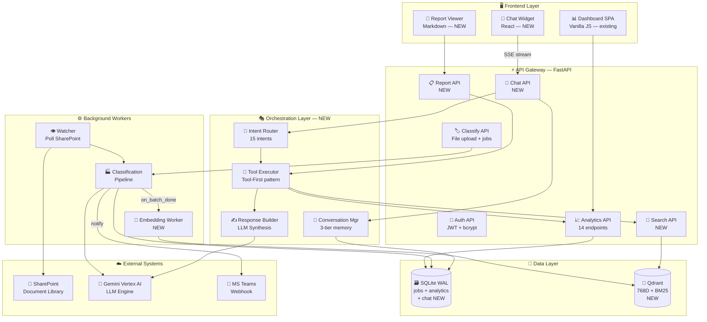
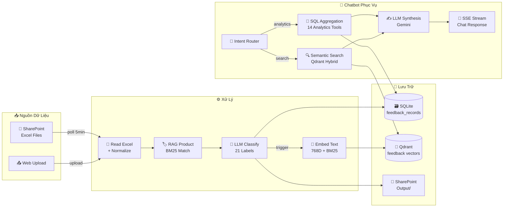
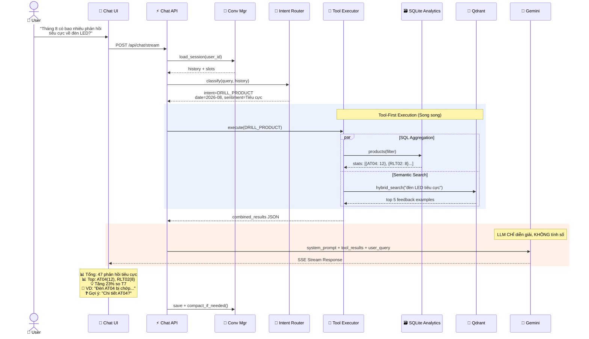
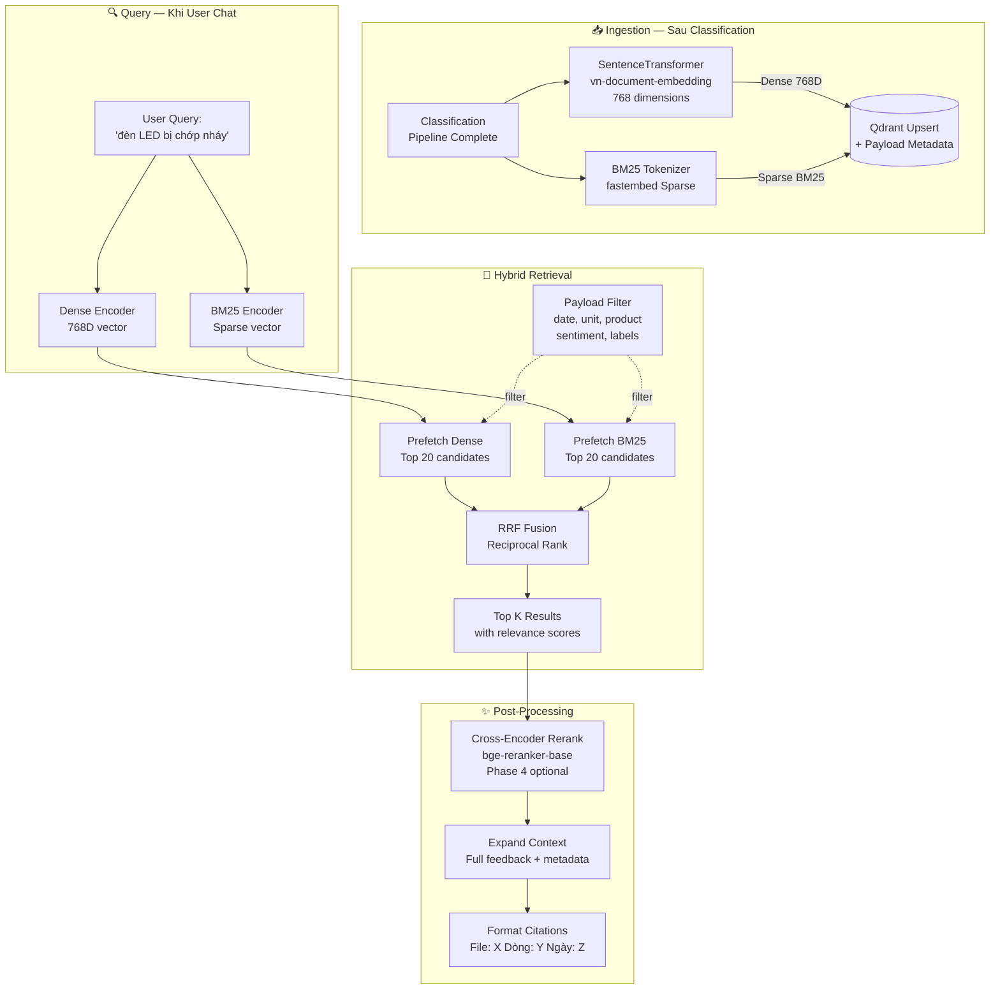
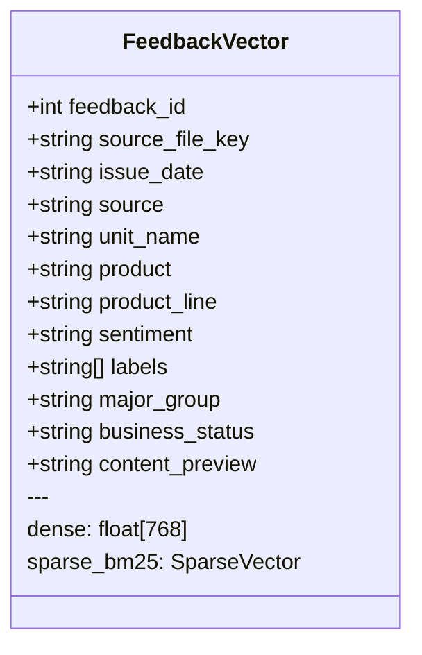
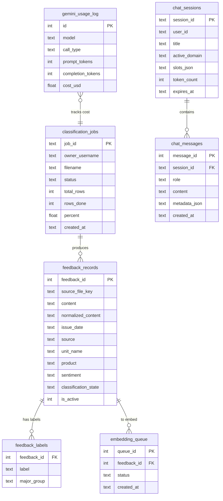
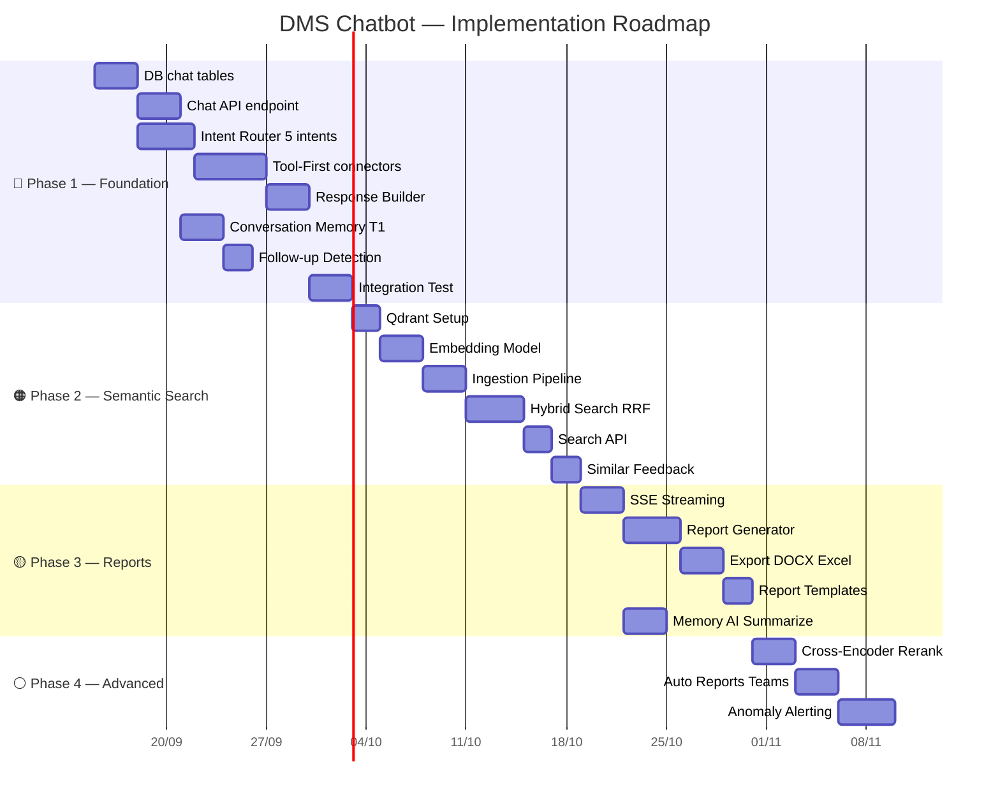
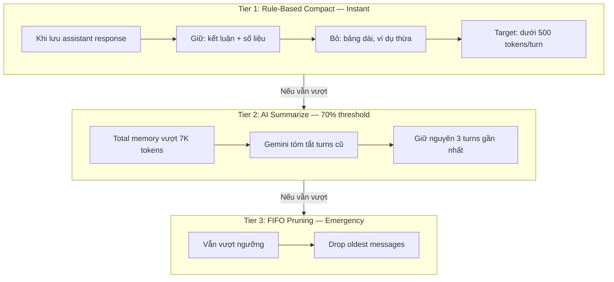

# 📐 DMS Chatbot — Sơ Đồ Kiến Trúc

---

## 1. 🏗️ C4 Container — Kiến trúc Tổng quan TO-BE

> [!NOTE]
> **Xanh dương** = module hiện có (giữ nguyên) · **Cam** = module mới cần xây · **Xám** = hệ thống ngoài

### Chú giải các Module Mới

| Module | Chức năng | Ưu tiên |
|:--|:--|:-:|
| 🤖 **Chat API** | `POST /api/chat`, `/api/chat/stream` — endpoint chat chính | 🔴 P0 |
| 🧭 **Intent Router** | Phân loại 15 intent (overview, trend, drill-down, lookup, report...) | 🔴 P0 |
| 🔧 **Tool Executor** | Gọi analytics service + Qdrant, trả JSON số liệu chính xác | 🔴 P0 |
| ✍️ **Response Builder** | Gemini tổng hợp tool results → Markdown response có trích dẫn | 🔴 P0 |
| 💭 **Conversation Mgr** | 3-tier memory compaction + follow-up detection | 🔴 P0 |
| 🔮 **Qdrant** | Vector DB: Dense 768D + BM25 Sparse, Hybrid RRF search | 🟠 P1 |
| 📐 **Embedding Worker** | Hook sau classification → encode + upsert vào Qdrant | 🟠 P1 |
| 🔎 **Search API** | `/api/search/semantic` — tìm feedback bằng ngôn ngữ tự nhiên | 🟠 P1 |
| 📋 **Report API** | Tạo báo cáo tổng hợp LLM + export DOCX/Excel | 🟡 P2 |
| 💬 **Chat Widget** | React component tích hợp vào Dashboard hoặc standalone | 🟡 P2 |

---

## 2. 🔄 Data Flow — Luồng Dữ Liệu Toàn Hệ Thống

---

## 3. 🤖 Chat Engine — Sequence Diagram

> [!IMPORTANT]
> **Pattern cốt lõi: Tool-First, LLM Assessment**
> - LLM **TUYỆT ĐỐI KHÔNG** tính toán số liệu
> - Python tool chạy SQL aggregation chính xác → LLM chỉ diễn giải

---

## 4. 🔍 Hybrid RAG Pipeline — Dense + BM25 + RRF

> Tham khảo kiến trúc **TLA HD V2**: Reciprocal Rank Fusion kết hợp ngữ nghĩa + keyword chính xác

### Qdrant Vector Payload Schema

---

## 5. 🗄️ Database Schema — ERD

> **Xanh** = bảng hiện có · **Cam** = bảng mới cho chatbot

### Chi tiết 3 Bảng Mới

| Bảng | Mục đích | Rows ước tính |
|:--|:--|:--|
| `chat_sessions` | Phiên hội thoại, TTL 7 ngày, lưu active_domain + filter slots | ~100-500 |
| `chat_messages` | Tin nhắn user/assistant, metadata (tool_used, sources, latency) | ~1K-10K |
| `embedding_queue` | Hàng đợi batch embedding, status pending/done/error | ~10K-100K |

---

## 6. 🚀 Lộ Trình Triển Khai — 4 Giai Đoạn

### Tổng kết Timeline

| Phase | Thời gian | Deliverables chính |
|:--|:-:|:--|
| 🔴 **Phase 1** | 2-3 tuần | Chat API + Intent Router + Tool-First + Memory → **chatbot hoạt động cơ bản** |
| 🟠 **Phase 2** | 1-2 tuần | Qdrant + Embedding + Hybrid Search → **tìm kiếm ngữ nghĩa trên feedback** |
| 🟡 **Phase 3** | 1-2 tuần | SSE Streaming + Report Generator + Export → **báo cáo tự động** |
| ⚪ **Phase 4** | Tùy chọn | Re-ranking + Auto Reports + Alerting → **nâng cao chất lượng** |

---

## 7. ⚖️ Ma Trận So Sánh → Quyết Định Thiết Kế

| Khía cạnh | 🔵 DMS (AS-IS) | 🟢 Ralli AI | 🟣 TLA HD | 🟠 **DMS Chatbot (TO-BE)** |
|:--|:--|:--|:--|:--|
| **Database** | SQLite WAL | MongoDB | PostgreSQL 16 | **SQLite WAL** ← giữ nguyên |
| **Vector DB** | ❌ | Qdrant 384D | Qdrant 768D+BM25 | **Qdrant 768D+BM25** ← TLA HD |
| **RAG** | BM25 product | Hybrid RRF | Hybrid V2+Rerank | **Hybrid RRF** → +Rerank P4 |
| **Chat Memory** | ❌ | 4-Tier Compact | 2-Tier RAM+DB | **3-Tier** ← hybrid cả hai |
| **Anti-Hallucination** | CoT prompt | Tool-First | Grounding Rules | **Tool-First + Grounding** |
| **Domain Router** | ❌ | 5 domains | Per-session | **15 intents** ← Ralli-inspired |
| **Report Gen** | Excel only | Excel+Zalo | DOCX+Excel | **Markdown+DOCX+Excel** |
| **Streaming** | WebSocket | HTTP stream | Polling | **SSE** ← modern standard |
| **Embedding** | ❌ | MiniLM 384D | vn-doc-embed 768D | **vn-doc-embed 768D** |
| **Token Budget** | Usage tracker | Per-user | Per-user+unit | **Per-user** ← existing tracker |

---

## 8. 🧠 Memory Architecture — 3 Tier Compaction

---

## 9. 🛡️ Anti-Hallucination Rules

> [!CAUTION]
> **5 Quy tắc Bất biến cho DMS Chatbot:**
>
> 1. **LLM TUYỆT ĐỐI KHÔNG tính số.** Mọi con số từ Tool → SQLite/Analytics Service.
> 2. **Mọi số liệu phải có nguồn.** `"123 phản hồi (analytics/overview, 01-31/08/2026)"`
> 3. **Không suy diễn ngoài dữ liệu.** → `"Dữ liệu này chưa có trong hệ thống."`
> 4. **Trích dẫn gốc chính xác.** Copy text từ DB, kèm `[File: X, Dòng: Y, Ngày: Z]`
> 5. **Phân biệt dữ liệu vs nhận định.** 📊 = số liệu thực, 💡 = nhận xét AI

---

## 10. 🔧 API Routes Mới

### Chat Endpoints (Phase 1)
| Method | Path | Mô tả |
|:--|:--|:--|
| `POST` | `/api/chat` | Gửi câu hỏi, nhận JSON response |
| `POST` | `/api/chat/stream` | SSE streaming response |
| `GET` | `/api/chat/sessions` | Danh sách phiên chat |
| `GET` | `/api/chat/sessions/{id}` | Chi tiết + lịch sử |
| `DELETE` | `/api/chat/sessions/{id}` | Xóa phiên |

### Search Endpoints (Phase 2)
| Method | Path | Mô tả |
|:--|:--|:--|
| `POST` | `/api/search/semantic` | Tìm feedback ngôn ngữ tự nhiên |
| `POST` | `/api/search/similar/{id}` | Phản hồi tương tự |
| `GET` | `/api/search/embedding-status` | Trạng thái indexing |

### Report Endpoints (Phase 3)
| Method | Path | Mô tả |
|:--|:--|:--|
| `POST` | `/api/reports/generate` | Tạo báo cáo LLM |
| `GET` | `/api/reports/{id}` | Lấy báo cáo |
| `POST` | `/api/reports/{id}/export` | Xuất DOCX/Excel |
