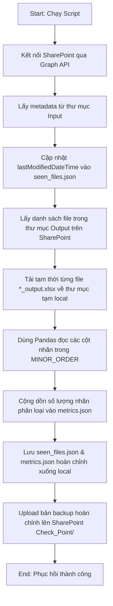

# Hướng dẫn vận hành DMS

Tài liệu tiếng Việt. Bản tiếng Anh: [OPERATIONS.md](OPERATIONS.md).

## 1. Tổng quan dịch vụ

DMS service là một Python watcher chạy bằng Docker. Dịch vụ chạy trong `service/` với:

```text
python -m dms
```

Nhiệm vụ chính:

- poll SharePoint `Input/`
- tải file `.xlsx` mới
- phân loại từng dòng bằng local baseline model, keyword/product assets, và Gemini
- upload workbook kết quả lên SharePoint `Output/`
- upload checkpoint lên SharePoint `Check_Point/`
- ghi health, metrics, và state files tại local
- dọn file tạm sau khi xử lý thành công

## 2. Thư mục runtime

```text
service/
  src/dms/                 source code
  Keyword/                 keyword/product asset gốc, có commit
  Model/                   artifact model baseline gốc, có commit
  work/                    state runtime, không commit
  logs/                    log runtime, không commit
  .env                     secret và cấu hình thật, không commit
  testvertex.json          GCP service account key, không commit
```

Docker mount:

| Đường dẫn host | Đường dẫn container | Chế độ | Mục đích |
|----------------|---------------------|--------|----------|
| `./Keyword` | `/app/data/Keyword` | read-only | fallback keyword/product assets |
| `./Model` | `/app/data/Model` | read-only | fallback model artifacts |
| `./testvertex.json` | `/app/data/sa-key.json` | read-only | Vertex AI service account key |
| `./work` | `/app/data/work` | read-write | runtime state |
| `./logs` | `/app/data/logs` | read-write | service logs |

## 3. Cấu hình bắt buộc

Tất cả cấu hình runtime nằm trong `service/.env` và một số giá trị cố định trong `docker-compose.yml`.

Tạo `.env` từ file mẫu:

```powershell
cd dms-feedback-classification\service
copy .env.example .env
```

### Azure AD

Bắt buộc:

```env
AZURE_TENANT_ID=...
AZURE_CLIENT_ID=...
AZURE_CLIENT_SECRET=...
```

Azure app registration cần permissions:

- `Files.ReadWrite.All` để đọc/ghi SharePoint files
- `Mail.Send` nếu có gửi email

Hai permission này phải là application permissions và đã admin consent.

### SharePoint

Bắt buộc:

```env
SHAREPOINT_DRIVE_ID=...
SHAREPOINT_ROOT_FOLDER_ID=...
```

Thư mục dưới `SHAREPOINT_ROOT_FOLDER_ID` nên có:

```text
Input/
Output/
Check_Point/
Keyword/
Model/
```

`Input/`, `Output/`, và `Check_Point/` dùng cho xử lý file.

`Keyword/` và `Model/` dùng cho SharePoint config sync nếu bật.

### Gemini backend: Vertex AI

Khuyến nghị dùng cho production.

`.env`:

```env
GEMINI_BACKEND=vertex
GEMINI_MODEL=gemini-2.5-flash-lite
GCP_PROJECT_ID=your-project-id
GCP_LOCATION=global
GCP_SERVICE_ACCOUNT_JSON=/app/data/sa-key.json
```

File local bắt buộc:

```text
service/testvertex.json
```

GCP project phải bật Vertex AI API, và service account phải có quyền gọi model Gemini đã chọn.

### Gemini backend: API key

Chế độ tùy chọn.

`.env`:

```env
GEMINI_BACKEND=apikey
GEMINI_MODEL=gemini-2.5-flash-lite
GEMINI_API_KEY=your-api-key
```

Trong chế độ này, Gemini client không dùng `testvertex.json`.

### Cấu hình xử lý

```env
POLL_INTERVAL_SECONDS=300
LLM_BATCH_SIZE=20
CKPT_EVERY=50
```

Ý nghĩa:

- `POLL_INTERVAL_SECONDS`: bao lâu watcher check SharePoint một lần
- `LLM_BATCH_SIZE`: số dòng Excel trong một batch gọi Gemini
- `CKPT_EVERY`: tần suất ghi checkpoint khi pipeline đang xử lý

### SharePoint config sync

```env
ENABLE_SHAREPOINT_CONFIG_SYNC=true
SHAREPOINT_KEYWORD_FOLDER=Keyword
SHAREPOINT_MODEL_FOLDER=Model
```

Khi bật:

- service check SharePoint `Keyword/` và `Model/` trước mỗi poll cycle
- asset nào đổi thì tải về staging folder trong `work/config_assets/`
- asset hợp lệ được publish vào `work/config_assets/active/`
- runtime dependency được reload giữa các cycle

### Runtime cleanup

```env
ENABLE_RUNTIME_CLEANUP=true
CLEANUP_OUTPUT_TTL_DAYS=7
CLEANUP_LOG_TTL_DAYS=7
CLEANUP_STAGING_TTL_HOURS=24
```

Cleanup xóa file tạm, nhưng giữ state cần cho service chạy liên tục.

## 4. Các file state runtime

Service tự tạo các file này.

| Đường dẫn | Tạo khi nào | Mục đích |
|-----------|-------------|----------|
| `work/seen_files.json` | khi watcher save lần đầu | nhớ SharePoint item ID đã xử lý |
| `work/metrics.json` | khi metrics flush lần đầu | counters, thời gian, tỉ lệ thành công |
| `work/health.json` | khi health update lần đầu | trạng thái hiện tại của service |
| `work/config_assets_state.json` | khi config sync lần đầu | metadata remote của `Keyword/` và `Model/` |
| `work/config_assets/active/` | khi config sync thành công lần đầu | snapshot runtime tốt nhất gần nhất |

Không cần tạo tay các file JSON này nếu chạy mới. Khởi động service là nó sẽ tự tạo.

Cần phân biệt:

- `Keyword/` và `Model/` là source fallback được commit
- `work/config_assets/active/` là snapshot đang được runtime dùng khi SharePoint config sync bật

## 5. Deploy VM mới từ đầu

Dùng khi VM mới được phép bắt đầu như một instance mới.

```powershell
git clone https://github.com/ThanhDT127/dms-feedback-classification.git
cd dms-feedback-classification\service
copy .env.example .env
```

Sau đó:

1. điền `.env`
2. đặt `testvertex.json` nếu dùng Vertex AI
3. kiểm tra có `Keyword/`
4. kiểm tra có `Model/`
5. start Docker

```powershell
docker compose up -d
docker compose ps
docker compose logs -f
```

Rủi ro:

- nếu không có `work/seen_files.json`, VM mới không biết file SharePoint nào đã xử lý trước đó
- các file cũ trong SharePoint `Input/` có thể bị xử lý lại

## 6. Chuyển VM mà không xử lý lại file cũ

Dùng khi thay máy hoặc chuyển service đang chạy sang VM mới.

Từ máy cũ, copy:

```text
service/.env
service/testvertex.json
service/work/
```

Đặt vào repo đã clone trên VM mới:

```text
dms-feedback-classification/service/.env
dms-feedback-classification/service/testvertex.json
dms-feedback-classification/service/work/
```

Sau đó start:

```powershell
cd dms-feedback-classification\service
docker compose up -d
docker compose logs -f
```

State tối thiểu nên giữ:

- `work/seen_files.json`
- `work/config_assets_state.json`
- `work/config_assets/active/`

Tốt nhất:

- copy cả thư mục `service/work/`

Lý do:

- `seen_files.json` ngăn file SharePoint cũ bị xử lý lại
- `config_assets_state.json` giữ metadata asset remote
- `config_assets/active/` giữ snapshot asset tốt nhất gần nhất

## 7. Checkpoint và resume

Checkpoint theo từng file nằm ở:

```text
work/checkpoint/
```

Nó hữu ích khi một file đang xử lý dở hoặc đang retry.

Sau khi file đã xử lý thành công, upload thành công, và được đánh dấu `done`, file tạm local sẽ bị cleanup:

- `work/input/<file>.xlsx`
- `work/output/<file>_output.xlsx`
- `work/checkpoint/<file>.json`

Vì vậy với file đã xong, resume chủ yếu dựa vào:

```text
work/seen_files.json
```

Muốn ép một file chạy lại:

1. dừng container
2. mở `work/seen_files.json`
3. tìm entry theo `name`
4. xóa entry đó hoặc đổi `status` thành `retry`
5. start container lại

Lệnh xem state:

```powershell
Get-Content .\work\seen_files.json
```

## 8. Cập nhật asset từ SharePoint

Khi file keyword hoặc model trên SharePoint được cập nhật:

1. watcher phát hiện metadata thay đổi ở poll cycle tiếp theo
2. file đổi được tải về `work/config_assets/cfgsync-*`
3. asset được validate
4. active snapshot được cập nhật trong `work/config_assets/active/`
5. pipeline dependencies được reload trước khi xử lý file

File source local trong `service/Keyword/` và `service/Model/` không bị ghi đè.

Kiểm tra keyword snapshot đang chạy:

```powershell
Get-Content .\work\config_assets\active\Keyword\kw_map.json
```

## 9. Monitoring

Lệnh hay dùng trong `service/`:

```powershell
docker compose ps
docker compose logs -f
Get-Content .\work\health.json
Get-Content .\work\metrics.json
Get-Content .\work\config_assets_state.json
```

Dấu hiệu khỏe:

- container `Up`
- log có `Composition root ready`
- log có poll cycle
- `health.json` cập nhật `last_poll`
- list SharePoint `Input/` thành công

## 10. Lỗi thường gặp

### Container không start

Kiểm tra:

- có `.env`
- có `testvertex.json` nếu dùng Vertex AI
- có `Keyword/`
- có `Model/`
- Azure client secret còn đúng
- SharePoint IDs đúng

### `No such container: dms-feedback-watcher`

Service chưa chạy.

```powershell
cd dms-feedback-classification\service
docker compose up -d
docker compose ps
```

### Asset SharePoint đã đổi nhưng `service/Keyword/` không đổi

Đây là đúng thiết kế.

Runtime đọc snapshot sync ở:

```text
work/config_assets/active/
```

`Keyword/` và `Model/` local chỉ là fallback source read-only.

### VM mới xử lý lại file cũ

Nguyên nhân:

- chưa copy `work/seen_files.json` từ máy cũ

Cách sửa:

- dừng container trên VM mới
- copy `service/work/` từ máy cũ sang
- start container lại

## 11. Ghi chú bảo mật

Không bao giờ commit:

- `.env`
- `testvertex.json`
- Azure client secrets
- API keys
- `work/`
- `logs/`

Nếu secret đã bị lộ, rotate secret trong Azure hoặc GCP trước khi tiếp tục dùng môi trường đó.

## 12. Cơ chế thống kê & Phục hồi lịch sử từ SharePoint (Reconstruct History)

### 12.1. Cơ chế lưu trữ và hiển thị thống kê
Hệ thống sử dụng hai file state cục bộ trong thư mục `service/work/` để quản lý việc theo dõi file và hiển thị số liệu trên Dashboard:
1. **`seen_files.json`**: Lưu danh sách các file đầu vào từ SharePoint đã được xử lý hoặc đang xử lý.
   - Định dạng: `{"<sharepoint_item_id>": {"name": "<file_name>", "status": "done", "lastModifiedDateTime": "2026-05-14T08:30:00Z", "processed_at": "2026-05-14T08:35:00Z", ...}}`
   - Biểu đồ **"Số file theo ngày"** trên giao diện dựa vào trường `lastModifiedDateTime` (thời gian sửa đổi gốc của file trên SharePoint) hoặc trường `processed_at` (thời gian hệ thống xử lý file) làm phương án dự phòng.
2. **`metrics.json`**: Lưu trữ các chỉ số hoạt động tổng quát (uptime, tỷ lệ thành công, số file đã xử lý) và đặc biệt là phân bổ số lượng của từng nhãn phân loại trong trường `label_distribution`.
   - Biểu đồ **"Phân bổ nhãn"** trên giao diện được vẽ trực tiếp từ `label_distribution` này.

### 12.2. Nguyên nhân dữ liệu thống kê bị sai lệch hoặc trống trên Production
Khi triển khai ứng dụng trên máy chủ Production mới hoặc khởi động lại container bằng cấu trúc thư mục sạch, bạn có thể gặp tình trạng:
- **Biểu đồ số file theo ngày bị gom cụm:** Tất cả các file đã xử lý trước đó đột ngột hiển thị chung một ngày (ngày triển khai hệ thống mới).
- **Biểu đồ phân bổ nhãn trống:** Báo lỗi `Không có dữ liệu` hoặc trống trơn.

**Nguyên nhân cụ thể:**
1. **Docker Container Không Lưu Output Excel:** Để tối ưu hóa tài nguyên và tuân thủ nguyên tắc stateless, Docker container không lưu trữ vĩnh viễn các file kết quả Excel dạng `*_output.xlsx` ở local sau khi đã upload thành công lên SharePoint. Do đó, cơ chế quét local lúc khởi động không tìm thấy file Excel nào để đếm và tính toán lại phân bổ nhãn, dẫn đến biểu đồ nhãn bị trống.
2. **Thiếu metadata `lastModifiedDateTime` trong cache cũ:** Cache `seen_files.json` của phiên bản cũ hoặc cache tạo tạm thời trước đó không lưu trường `lastModifiedDateTime`. Khi hệ thống đọc cache này, nó không xác định được ngày sửa đổi gốc và phải dùng ngày xử lý thực tế `processed_at` làm fallback. Kết quả là toàn bộ lịch sử bị dồn vào ngày chạy đầu tiên của container.
3. **Cơ chế tự động khôi phục bỏ qua nếu file đã tồn tại:** Khi container khởi động (hoặc web server start), hệ thống có cơ chế tự động kiểm tra SharePoint thư mục `Check_Point/` để tải về `seen_files.json` và `metrics.json` dự phòng. Tuy nhiên, **nếu trên thư mục host local của Production đã tồn tại sẵn hai file này (dù dữ liệu bị cũ hoặc thiếu trường), hệ thống sẽ bỏ qua bước tải từ SharePoint**, dẫn đến dữ liệu hiển thị bị sai lệch.

### 12.3. Hoạt động chi tiết của Script Reconstruct History
Để giải quyết triệt để các vấn đề trên mà không cần xử lý lại các file Excel gốc từ đầu (gây tốn chi phí gọi API Gemini), script `service/scripts/reconstruct_history.py` hoạt động theo quy trình tự động hóa sau:



1. **Khôi phục mốc thời gian file:** Quét thư mục `Input/` trên SharePoint, lấy mốc thời gian sửa đổi chính xác (`lastModifiedDateTime`) của từng file Excel và cập nhật vào `seen_files.json`.
2. **Tính toán phân bổ nhãn:** Tải tạm thời toàn bộ các file kết quả `*_output.xlsx` từ SharePoint `Output/` về thư mục tạm, dùng thư viện `pandas` mở file Excel từ dòng header thứ 2 (dòng 1 là ghi chú/tiêu đề cột), đếm số lượng dòng được phân loại thuộc các nhãn định nghĩa trong `MINOR_ORDER` và lưu tổng số liệu này vào `metrics.json`.
3. **Sao lưu tập trung:** Tự động upload hai file cache đã được dựng lại hoàn hảo này lên thư mục `Check_Point/` trên SharePoint làm điểm khôi phục gốc cho bất kỳ VM hay môi trường Dev nào khác.

### 12.4. Quy trình đồng bộ và khôi phục trên Production (Từng bước chi tiết)

Để cập nhật và sửa lỗi hiển thị biểu đồ trên máy chủ Production, hãy thực hiện theo đúng các bước sau:

#### Bước 1: Cập nhật mã nguồn mới nhất trên máy host
Truy cập thư mục dự án trên máy Production của bạn và kéo code mới từ Git:
```bash
git pull origin master
```
*Lưu ý: Bước này đảm bảo bạn có đầy đủ các bản vá lỗi giao diện, cấu hình docker mount static UI và script `reconstruct_history.py`.*

#### Bước 2: Dừng dịch vụ Docker hiện tại
Dừng toàn bộ các container để tránh xung đột ghi đè dữ liệu khi đang thao tác file:
```bash
cd service
docker compose down
```

#### Bước 3: Xóa file cache cũ bị lỗi ở local
Xóa hai file cache cũ trên máy host để kích hoạt cơ chế tự động đồng bộ (auto-healing) từ SharePoint khi khởi động:
```bash
# Trên Windows PowerShell:
Remove-Item -Path .\work\seen_files.json -ErrorAction Ignore
Remove-Item -Path .\work\metrics.json -ErrorAction Ignore

# Hoặc trên Linux/macOS:
rm -f work/seen_files.json work/metrics.json
```

#### Bước 4: Khởi động lại dịch vụ Docker
Khởi chạy lại các container ở chế độ nền (detached mode):
```bash
docker compose up -d
```
Khi khởi động, do không tìm thấy hai file cache local, web server và watcher sẽ tự động tải phiên bản cache hoàn chỉnh đã được reconstruct trước đó (nằm trên SharePoint `Check_Point/`) về thư mục `work/` cục bộ.

#### Bước 5: Thực thi script Phục hồi trực tiếp (Nếu SharePoint chưa có Checkpoint tốt)
Nếu bạn muốn tự quét lại lịch sử trực tiếp trên Production để đảm bảo dữ liệu mới nhất:
1. Chạy script khôi phục trực tiếp bên trong container `watcher`:
   ```bash
   docker compose exec watcher python scripts/reconstruct_history.py
   ```
2. Sau khi script thông báo thành công (`Successfully uploaded...`), khởi động lại container `web` để giao diện web đọc lại cache mới:
   ```bash
   docker compose restart web
   ```

#### Bước 6: Xác minh kết quả
Truy cập vào giao diện Web Dashboard (ví dụ: `http://<production-ip>:8501/#/metrics`) và kiểm tra:
- Biểu đồ **"Số file theo ngày"** hiển thị phân bổ file rải đều theo lịch sử ngày sửa đổi thực tế.
- Biểu đồ **"Phân bổ nhãn"** hiển thị đầy đủ các lát bánh doughnut với số lượng tương ứng.
- Xem log của container để xác minh không có lỗi:
  ```bash
  docker compose logs -f watcher
  ```

