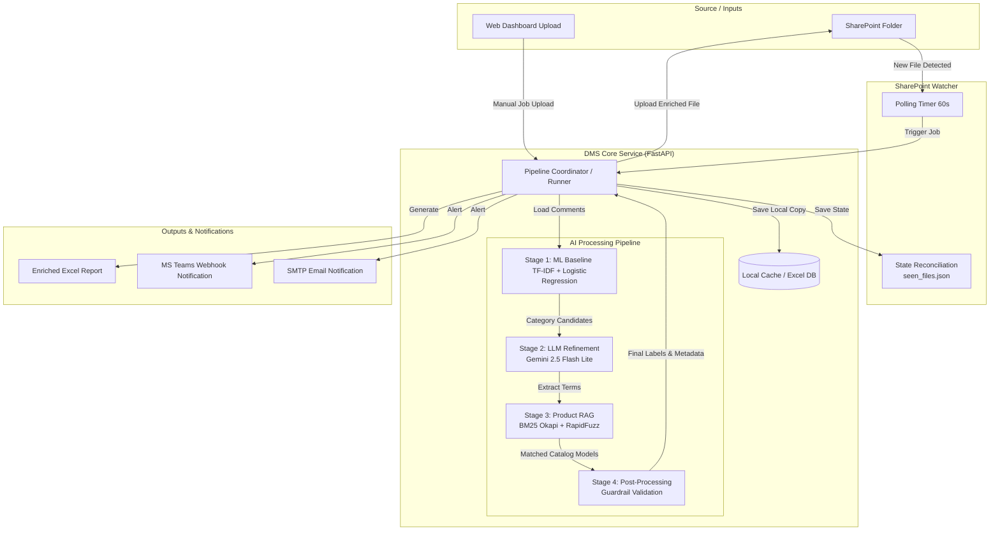

# ⚡ DMS Feedback Classification Service

<p align="center">
  <a href="#readme"></a>
</p>

<p align="center">
  <a href="https://github.com/ThanhDT127/dms-feedback-classification/actions/workflows/ci.yml"></a>
  <a href="#readme"></a>
  <a href="#readme"></a>
  <a href="#readme"></a>
  <a href="LICENSE"></a>
  <a href="#readme"></a>
</p>

<p align="center">
  English documentation. Vietnamese version: <a href="README.vi.md">README.vi.md</a>.
</p>

**DMS Feedback Classification Service** is an enterprise-grade hybrid Machine Learning and Large Language Model (Gemini) feedback classification pipeline. It automatically pulls Excel sheets from Microsoft SharePoint, extracts product metadata, matches models using a custom RAG system, groups feedback issues into 21 categories, sends Microsoft Teams/email alerts, and serves an interactive real-time operations dashboard.

---

## 📌 Table of Contents

* [About The Project](#about-the-project)
* [Built With](#built-with)
* [Directory Structure](#directory-structure)
* [Label Taxonomy (21 Categories)](#label-taxonomy-21-categories)
* [Spreadsheet Schema & Column Mapping](#spreadsheet-schema--column-mapping)
* [Getting Started](#getting-started)
* [Local Testing with Sample Data](#local-testing-with-sample-data)
* [Technical Design & Architecture](#technical-design--architecture)
* [Testing & Quality Assurance](#testing--quality-assurance)
* [Data Privacy & Sanitization](#data-privacy--sanitization)
* [Detailed Operations](#detailed-operations)

---

## <a name="about-the-project"></a>📖 About The Project

Processing raw market and customer feedback at scale presents two core challenges: maintaining high accuracy across complex domain-specific terminology (e.g. lighting and electrical products) and integrating seamlessly with corporate storage systems like Microsoft SharePoint. 

The **DMS Feedback Classification Service** addresses this by deploying a containerized poller that watches for new uploads, runs them through a dual-stage ML/LLM classifier, writes the enriched data into a styled spreadsheet, and pushes checkpoints and email/Teams alerts to users. It features an integrated Vanilla JS Single Page Application (SPA) dashboard to track telemetry, view running jobs, sync remote configs, and dry-run sentences.

---

## <a name="built-with"></a>🛠️ Built With

<p align="left">
  <a href="#built-with"></a>
</p>

* **Backend Framework:** FastAPI & Uvicorn (async REST API endpoints, WebSockets log streaming).
* **AI & LLM SDKs:** Google GenAI (Gemini 2.5 Flash Lite Vertex/API support), scikit-learn (TF-IDF + OvR Logistic Regression).
* **Data Processing & IR:** pandas, openpyxl, rank-bm25 (BM25 Okapi), rapidfuzz (Levenshtein match fallbacks).
* **OAuth & Integration:** Microsoft MSAL (Microsoft Authentication Library for Graph API requests).
* **DevOps:** Docker Multi-stage builds, Docker Compose.

---

## <a name="directory-structure"></a>📂 Directory Structure

```text
DMS/
├── LICENSE                    # MIT License
├── README.md                  # English Documentation
├── README.vi.md               # Vietnamese Documentation
├── docs/                      # Documentation Folder
│   ├── OPERATIONS.md          # Detailed Operations & Troubleshooting Guide
│   ├── OPERATIONS.vi.md       # Detailed Operations (Vietnamese)
│   ├── TECHNICAL_DOCUMENT.md  # System Architecture & Technical Specifications
│   └── USER_GUIDE.md          # User Guide & Operational Manual
├── openspec/                  # Architectural Specs (31 detailed BDD specs)
│   └── specs/
│       ├── issue-llm-classification/spec.md
│       ├── sharepoint-watcher/spec.md
│       └── ...
├── sample_data/               # Sample data for offline verification
│   └── sample_feedback.xlsx   # 10 mock customer feedback rows
└── service/                   # Main Service Root
    ├── Dockerfile             # Production container definition
    ├── docker-compose.yml     # Multi-container orchestration (Watcher & Web UI)
    ├── pyproject.toml         # PEP 518 packaging and tool configuration
    ├── requirements.txt       # Hardened pip requirements
    ├── Keyword/               # Committed product catalogs & keyword maps
    ├── Model/                 # Pre-trained ML baseline model artifacts (TF-IDF, LogReg)
    ├── src/
    │   └── dms/               # Main Application Package
    │       ├── pipeline/      # Core AI Processing Pipeline
    │       │   ├── issue_classifier.py  # Structured LLM + post-processors
    │       │   ├── rag_product.py       # BM25 + LLM RAG extraction
    │       │   └── runner.py            # Execution coordinator & checkpointing
    │       ├── web/           # FastAPI backend
    │       │   ├── api/       # REST API endpoints (Files, Settings, Classify)
    │       │   └── app.py     # FastAPI application lifecycle
    │       ├── watcher.py     # SharePoint polling & self-healing sync
    │       └── settings.py    # Pydantic-settings configuration
    ├── static/                # Web Dashboard Frontend (Vanilla JS SPA)
    └── tests/                 # Unit & Integration Test Suite (93 test cases)
```

---

## <a name="label-taxonomy-21-categories"></a>🏷️ Label Taxonomy (21 Categories)

The classification pipeline maps market and customer feedback into **21 minor categories** grouped under **7 major categories**:

| Major Category | Minor Category | Business Description / Guidelines |
| :--- | :--- | :--- |
| **Sản phẩm** | Báo lỗi | Physical errors, failures, burnt, broken components. |
| | Báo CL tốt | Praises for good quality, brightness, durability. |
| | Y/c cải tiến | Feature requests, design/structural complaints (e.g. casing thickness). |
| | Đề xuất SPM | Proposals for entirely new products/models not currently manufactured. |
| **Yêu cầu công cụ BH** | Bảng giá, Catalogue | Requests for catalogs, brochures, pricing tables. |
| | Bảng biển | Requests for outdoor store signs, advertising boards. |
| | Kệ bóng, thử đèn,… | Requests for demonstration boards, test racks, display shelves. |
| | Khác | Other POSM/sale tools (e.g. uniforms, notebooks). |
| **Giá, cơ chế RD** | Tốt/ ko tốt | Price competitiveness, margins, discounts of Rạng Đông. |
| | Trả thưởng | Queries or issues regarding bonuses, lucky draws, C2TD rewards. |
| | Đề xuất | Policy proposals for generic price adjustments or promos. |
| **Dịch vụ** | Bảo hành | Warranty process, return policy speed, after-sales service. |
| | HTPP | Distribution system issues, territorial conflicts, dealer disputes. |
| | Hàng hoá | Logistics, delivery delays, packaging, inventory shortages. |
| **Hàng giả** | Hàng giả | Counterfeit/fake products suspect reports. |
| **Website** | Website | App/web platform bugs, portal login errors, DMS failures. |
| **Đối thủ cạnh tranh** | Hãng | Competitor name tracking (populated with competitor name). |
| | Hoạt động | Competitor marketing events, store roadshows. |
| | CTKM, giá, cơ chế | Competitor promotional campaigns, discounts, pricing policies. |
| | TT SP | Competitor catalog releases, product specifications. |
| **Tin trung lập** | Tin trung lập | Neutral texts (no praise, complaints, or specific requests). |

---

## <a name="spreadsheet-schema--column-mapping"></a>📊 Spreadsheet Schema & Column Mapping

The pipeline automatically scans and enriches input workbooks:
1. **Input Column Detection:** The script auto-detects the column containing customer comments (scans headers for aliases like `Nội dung phản hồi`, `Nội dung`, etc.).
2. **Output Column Placement:**
   * **Product Metadata (Inserted beside the text column):**
     * `Sản phẩm`: Product category (e.g. LED bulb).
     * `Dòng SP`: Product line (e.g. Bulb).
     * `Model`: Catalog model code (e.g. AT10 9W).
     * `Lớp` & `Điểm`: Internal ML baseline score outputs.
   * **Telemetry (Appended at the end):**
     * `Sentiment`: Value mapped to `Tích cực`, `Tiêu cực`, or empty.
     * `LLM_Extracted`: raw terms extracted by LLM.
     * `BM25_Score`: RAG confidence match score.
   * **Labels (Appended at the end):** 21 separate columns matching the **Minor Categories** above, populated with `x` if triggered (or the competitor name under the `Hãng` column).

---

## <a name="getting-started"></a>🚀 Getting Started

### Prerequisites
* [Docker & Docker Compose](https://www.docker.com/) (recommended)
* Python 3.11+ (if running bare metal)

### Local Environment Setup

#### Bare Metal Setup (using Makefile)
If you want to run or test the pipeline locally on your host machine:
1. Clone the repository:
   ```bash
   git clone https://github.com/ThanhDT127/dms-feedback-classification.git
   cd dms-feedback-classification
   ```
2. Set up dependencies (make sure your virtual environment is active or use standard setup):
   ```bash
   make setup
   ```
3. Create your local config file at the root:
   ```bash
   cp .env.example .env
   ```
   Edit `.env` with your credentials (SharePoint Drive IDs, GCP Client IDs, or Gemini API keys).
4. If using Google Vertex AI, place your service account key file at `testvertex.json` at the root.
5. Manage and run your development tasks:
   * **Run Tests:** `make test`
   * **Format Code:** `make format`
   * **Run Pipeline:** `make run FILE=sample_feedback.xlsx` (Requires placing files in `Input/` folder)
   * **Clean Caches:** `make clean`

#### Docker Setup (Recommended)
To run the SharePoint polling watcher service and the operations web dashboard:
1. Clone the repository:
   ```bash
   git clone https://github.com/ThanhDT127/dms-feedback-classification.git
   cd dms-feedback-classification/service
   ```
2. Copy the sample environment file:
   ```bash
   cp .env.example .env
   ```
3. Edit `service/.env` and place your service account key file (if using Vertex AI) at `service/testvertex.json`.

### Running with Docker Compose
To boot up the watcher and the web dashboard:
```bash
docker compose up -d
```
Check running services:
```bash
docker compose ps
```
Stream logs:
```bash
docker compose logs -f
```
The Web Dashboard will be available at: **http://localhost:8501**

---

## <a name="local-testing-with-sample-data"></a>🧪 Local Testing with Sample Data

To verify the classification flow offline without connecting to SharePoint:
1. Ensure your `.env` has a valid `GEMINI_API_KEY` (or `testvertex.json` is set).
2. Open the Web Dashboard at **http://localhost:8501**.
3. Navigate to the **File Management** tab and upload the mock file:
   * [service/sample_data/sample_feedback.xlsx](sample_data/sample_feedback.xlsx)
4. Go to the **Classify** tab, trigger a manual run, and watch the live progress bar and classification logs.
5. Download the final enriched workbook once processing completes.

---

## <a name="technical-design--architecture"></a>📐 Technical Design & Architecture

The following diagram illustrates the dataflow and architecture of the feedback classification service:



### 1. Hybrid ML & LLM Classification
The service implements a hybrid classification model:
* **Stage 1 (ML Baseline):** Uses local TF-IDF vectorizers (character & word n-grams) combined with a One-Vs-Rest Logistic Regression classifier to calculate preliminary probability scores.
* **Stage 2 (LLM Refinement):** Sends the comment and baseline candidates to Gemini 2.5 Flash Lite. The LLM evaluates semantic boundary rules (e.g. "Báo lỗi" vs "Y/c cải tiến") and outputs structured JSON.
* **Stage 3 (Post-Processing):** Python-based guardrails validate the JSON output (e.g. stripping competitor labels if no competitor brand is found, and removing "Tin trung lập" if any other issue label is triggered).

### 2. Custom BM25 + LLM RAG Matching
To match slang, abbreviations, or misspelled product names in comments to Rạng Đông's product catalog:
1. **LLM Extraction:** Gemini extracts raw product and model terms from the comment (using a batch-processed prompt to minimize token count).
2. **Dual-Index BM25 Search:** Performs lookup in the product catalog using two BM25 indexes: one on raw text and another on unaccented text (`unidecode`).
3. **Keyword Fallback:** If BM25 scores fall below the safety threshold, Level 2 and Level 3 regex search rules are used as a fallback to match general product categories.

### 3. Self-Healing State Reconciliation
To prevent reprocessing files on container restart or VM migration:
* On startup, the watcher polls SharePoint for processed outputs in the `Output/` folder.
* It cross-references file metadata with local caches (`seen_files.json`) and registers missing entries, creating a robust, distributed state sync.

---

## <a name="testing-quality-assurance"></a>🧪 Testing & Quality Assurance

Unit and integration tests are managed via `pytest`. All external HTTP calls and Gemini APIs are cleanly mocked.

To run the test suite:
1. Navigate to the service folder:
   ```bash
   cd service
   ```
2. Run pytest:
   ```bash
   python -m pytest
   ```
The test suite consists of **93 test cases** verifying watcher logic, settings validation, path security, Excel parsing, and pipeline runtimes.

---

## <a name="data-privacy--sanitization"></a>🔒 Data Privacy & Sanitization

> [!IMPORTANT]
> All customer comments, model numbers, distributor lists, and GCP/Azure credentials present in this repository are synthetic, mocked, or fully sanitized to comply with enterprise data protection and privacy policies.

---

## <a name="detailed-operations"></a>📖 Detailed Operations & Documentation

* [docs/OPERATIONS.md](docs/OPERATIONS.md) - Complete instructions for production deployment, config asset synchronization, history reconstruction scripts, and troubleshooting.
* [docs/TECHNICAL_DOCUMENT.md](docs/TECHNICAL_DOCUMENT.md) - Detailed Technical Document covering system architecture, database layout, and backend workflows.
* [docs/USER_GUIDE.md](docs/USER_GUIDE.md) - Full end-user manual for running classification, operating the dashboard, and uploading files.
* [service/README.md](service/README.md) - Deep dive into developer setup, dependency injection details, and API design.
