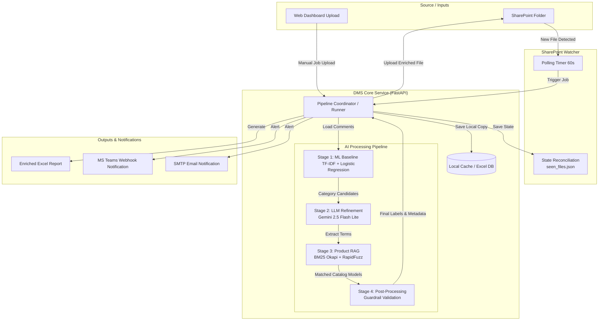

# ⚡ Dịch vụ phân loại phản hồi DMS

<p align="center">
  <a href="#readme"></a>
</p>

<p align="center">
  <a href="https://github.com/ThanhDT127/dms-feedback-classification/actions/workflows/ci.yml"></a>
  <a href="#readme"></a>
  <a href="#readme"></a>
  <a href="#readme"></a>
  <a href="LICENSE"></a>
  <a href="#readme"></a>
</p>

<p align="center">
  Tài liệu tiếng Việt. Bản tiếng Anh: <a href="README.md">README.md</a>.
</p>

**Dịch vụ phân loại phản hồi DMS** là một hệ thống phân loại phản hồi thị trường và khách hàng hybrid Machine Learning & LLM (Gemini) chuẩn doanh nghiệp. Dịch vụ tự động quét các file Excel mới từ Microsoft SharePoint, trích xuất thông tin sản phẩm và đối chiếu model bằng luồng RAG tùy chỉnh, phân loại 21 nhãn vấn đề phản hồi, gửi thông báo qua Teams/Email và cung cấp một giao diện Web Dashboard quản trị thời gian thực trực quan.

---

## 📌 Mục lục

* [Giới thiệu dự án](#gioi-thieu-du-an)
* [Công nghệ sử dụng](#cong-nghe-su-dung)
* [Cấu trúc thư mục](#cau-truc-thu-muc)
* [Danh mục nhãn phân loại (21 Phân loại con)](#danh-muc-nhan-phan-loai)
* [Cấu trúc Cột và Dữ liệu Excel](#cau-truc-cot-va-du-lieu-excel)
* [Khởi động nhanh](#khoi-dong-nhanh)
* [Chạy thử cục bộ với dữ liệu mẫu](#chay-thu-cuc-bo-voi-du-lieu-mau)
* [Thiết kế kỹ thuật & Kiến trúc](#thiet-ke-ky-thuat-kien-truc)
* [Kiểm thử & Bảo đảm chất lượng](#kiem-thu-bao-dam-chat-luong)
* [Bảo mật và Làm sạch Dữ liệu](#bao-mat-va-lam-sach-du-lieu)
* [Tài liệu vận hành chi tiết](#tai-lieu-van-hanh-chi-tiet)

---

## <a name="gioi-thieu-du-an"></a>📖 Giới thiệu dự án

Xử lý phản hồi thị trường trên quy mô lớn gặp phải hai thách thức chính: duy trì độ chính xác cao đối với các thuật ngữ chuyên ngành (như lĩnh vực chiếu sáng, thiết bị điện) và tích hợp mượt mà với hệ thống lưu trữ doanh nghiệp như Microsoft SharePoint.

**Dịch vụ phân loại phản hồi DMS** giải quyết bài toán này bằng cách triển khai một container chạy nền (watcher) liên tục quét thư mục, chạy dữ liệu qua bộ phân loại kép ML/LLM, xuất kết quả ra file Excel đã được định dạng và gửi cảnh báo qua Email/Teams. Hệ thống cũng đi kèm một giao diện Web UI Dashboard (FastAPI backend + Vanilla JS frontend) để giám sát tài nguyên, chạy phân loại thủ công và quản lý file.

---

## <a name="cong-nghe-su-dung"></a>🛠️ Công nghệ sử dụng

<p align="left">
  <a href="#cong-nghe-su-dung"></a>
</p>

* **Framework Backend:** FastAPI & Uvicorn (REST API không đồng bộ, WebSockets stream log thời gian thực).
* **Mô hình AI & LLM:** Google GenAI (Gemini 2.5 Flash Lite Vertex/API support), scikit-learn (TF-IDF + OvR Logistic Regression).
* **Xử lý dữ liệu & IR:** pandas, openpyxl, rank-bm25 (BM25 Okapi), rapidfuzz (so khớp khoảng cách Levenshtein dự phòng).
* **Ủy quyền & Tích hợp:** Microsoft MSAL (Microsoft Authentication Library để gửi yêu cầu Graph API).
* **DevOps:** Docker Multi-stage builds, Docker Compose.

---

## <a name="cau-truc-thu-muc"></a>📂 Cấu trúc thư mục

```text
DMS/
├── LICENSE                    # File giấy phép MIT
├── README.md                  # Tài liệu tiếng Anh
├── README.vi.md               # Tài liệu tiếng Việt
├── docs/                      # Thư mục Tài liệu
│   ├── OPERATIONS.md          # Hướng dẫn deploy & vận hành chi tiết
│   ├── OPERATIONS.vi.md       # Hướng dẫn vận hành (Tiếng Việt)
│   ├── TECHNICAL_DOCUMENT.md  # Tài liệu kiến trúc hệ thống & Thiết kế kỹ thuật
│   └── USER_GUIDE.md          # Tài liệu hướng dẫn sử dụng vận hành
├── openspec/                  # Thư mục chứa đặc tả kiến trúc (31 spec BDD)
│   └── specs/
│       ├── issue-llm-classification/spec.md
│       ├── sharepoint-watcher/spec.md
│       └── ...
├── sample_data/               # Thư mục chứa dữ liệu mẫu để test offline
│   └── sample_feedback.xlsx   # 10 dòng phản hồi mẫu
└── service/                   # Thư mục gốc dịch vụ
    ├── Dockerfile             # Định nghĩa container production
    ├── docker-compose.yml     # Điều phối watcher & Web UI
    ├── pyproject.toml         # Cấu hình đóng gói PEP 518 và linting
    ├── requirements.txt       # Danh sách dependencies thư viện
    ├── Keyword/               # Hệ từ khóa và danh mục sản phẩm mẫu được commit
    ├── Model/                 # Các artifact model baseline (TF-IDF, LogReg)
    ├── src/
    │   └── dms/               # Package ứng dụng chính
    │       ├── pipeline/      # Đường ống xử lý AI cốt lõi
    │       │   ├── issue_classifier.py  # Phân loại LLM + post-processors
    │       │   ├── rag_product.py       # Trích xuất RAG BM25 + LLM
    │       │   └── runner.py            # Quản lý chạy file & ghi checkpoint
    │       ├── web/           # Backend FastAPI
    │       │   ├── api/       # API endpoints (Files, Settings, Classify)
    │       │   └── app.py     # Vòng đời ứng dụng FastAPI
    │       ├── watcher.py     # Poller SharePoint & tự động phục hồi state
    │       └── settings.py    # Cấu hình Pydantic-settings
```

---

## <a name="danh-muc-nhan-phan-loai"></a>🏷️ Danh mục nhãn phân loại (21 Phân loại con)

Đường ống AI phân loại phản hồi thị trường thành **21 phân loại con** thuộc **7 nhóm lớn**:

| Nhóm lớn | Phân loại con | Mô tả nghiệp vụ / Hướng dẫn gắn nhãn |
| :--- | :--- | :--- |
| **Sản phẩm** | Báo lỗi | Lỗi vật lý, linh kiện cháy/hỏng, lỗi hoạt động của thiết bị. |
| | Báo CL tốt | Khen ngợi sản phẩm chất lượng tốt, độ sáng cao, bền bỉ. |
| | Y/c cải tiến | Đề xuất sửa đổi thiết kế, thay đổi cấu trúc sản phẩm (ví dụ: vỏ mỏng). |
| | Đề xuất SPM | Đề xuất sản xuất model hoàn toàn mới hiện Rạng Đông chưa làm. |
| **Yêu cầu công cụ BH** | Bảng giá, Catalogue | Yêu cầu gửi catalogue sản phẩm mới, tờ rơi, bảng báo giá. |
| | Bảng biển | Yêu cầu làm biển quảng cáo ngoài trời cho cửa hàng, đại lý. |
| | Kệ bóng, thử đèn,… | Yêu cầu cấp kệ trưng bày, bảng thử đèn LED, giá treo demo. |
| | Khác | Công cụ POSM/bán hàng khác (ví dụ: áo đồng phục, sổ tay). |
| **Giá, cơ chế RD** | Tốt/ ko tốt | Cạnh tranh về giá bán, biên lợi nhuận, chiết khấu của Rạng Đông. |
| | Trả thưởng | Thắc mắc hoặc khiếu nại về tiền thưởng, chương trình quay số C2TD. |
| | Đề xuất | Đề xuất thay đổi chính sách khuyến mãi hoặc điều chỉnh giá chung. |
| **Dịch vụ** | Bảo hành | Quy trình và tốc độ trả bảo hành, thái độ phục vụ sau bán hàng. |
| | HTPP | Tranh chấp địa bàn, xung đột kênh phân phối giữa các đại lý. |
| | Hàng hoá | Logistics, giao hàng trễ, thiếu hụt tồn kho, hỏng hóc do vận chuyển. |
| **Hàng giả** | Hàng giả | Báo cáo nghi ngờ hàng nhái, hàng giả thương hiệu Rạng Đông. |
| **Website** | Website | Lỗi ứng dụng/web, lỗi đăng nhập portal đại lý, sự cố phần mềm DMS. |
| **Đối thủ cạnh tranh** | Hãng | Ghi nhận tên hãng đối thủ xuất hiện trong bình luận. |
| | Hoạt động | Sự kiện tiếp thị, roadshow, hội nghị khách hàng của đối thủ. |
| | CTKM, giá, cơ chế | Chương trình khuyến mãi, chiết khấu, chính sách giá của đối thủ. |
| | TT SP | Ra mắt catalogue, thông số kỹ thuật sản phẩm mới của đối thủ. |
| **Tin trung lập** | Tin trung lập | Tin nhắn không chứa lời khen, khiếu nại hay yêu cầu cụ thể. |

---

## <a name="cau-truc-cot-va-du-lieu-excel"></a>📊 Cấu trúc Cột và Dữ liệu Excel

Hệ thống tự động quét và làm giàu thông tin cho các file Excel:
1. **Tự động nhận diện cột:** Watcher tự tìm cột chứa nội dung bình luận (quét tiêu đề cột khớp với các alias như `Nội dung phản hồi`, `Nội dung`, v.v.).
2. **Điền thông tin làm giàu:**
   * **Thông tin sản phẩm (Chèn ngay cạnh cột văn bản gốc):**
     * `Sản phẩm`: Loại sản phẩm (ví dụ: Đèn LED bulb).
     * `Dòng SP`: Dòng sản phẩm (ví dụ: Bulb).
     * `Model`: Mã model tra cứu theo danh mục (ví dụ: AT10 9W).
     * `Lớp` & `Điểm`: Lớp phân loại và điểm tự tin của mô hình ML baseline.
   * **Thông tin Telemetry (Thêm vào cuối bảng):**
     * `Sentiment`: Sắc thái bình luận (`Tích cực`, `Tiêu cực`, hoặc trống).
     * `LLM_Extracted`: Từ khóa sản phẩm thô do LLM trích xuất.
     * `BM25_Score`: Điểm độ tin cậy đối sánh RAG.
   * **Phân loại nhãn (Thêm vào cuối bảng):** 21 cột riêng biệt tương ứng với các nhãn con ở trên, đánh dấu `x` nếu thuộc nhóm đó (riêng cột `Hãng` sẽ điền tên đối thủ).

---

## <a name="khoi-dong-nhanh"></a>🚀 Khởi động nhanh

### Điều kiện bắt buộc
* [Docker & Docker Compose](https://www.docker.com/) (khuyên dùng)
* Python 3.11+ (nếu chạy trực tiếp không qua container)

### Thiết lập môi trường local

#### Chạy trực tiếp cục bộ (Bare Metal - dùng Makefile)
Nếu bạn muốn phát triển, chạy hoặc kiểm thử pipeline trực tiếp trên máy chủ:
1. Clone repository mã nguồn:
   ```bash
   git clone https://github.com/ThanhDT127/dms-feedback-classification.git
   cd dms-feedback-classification
   ```
2. Cài đặt các thư viện phụ thuộc (đảm bảo virtual environment đã kích hoạt hoặc dùng lệnh make):
   ```bash
   make setup
   ```
3. Tạo file cấu hình môi trường local tại thư mục gốc:
   ```bash
   cp .env.example .env
   ```
   Chỉnh sửa tệp `.env` và điền thông tin xác thực (SharePoint Drive IDs, GCP Client IDs, hoặc Gemini API keys).
4. Nếu sử dụng Google Vertex AI, đặt tệp khóa tài khoản dịch vụ tại `testvertex.json` ở thư mục gốc.
5. Quản lý dự án thông qua các lệnh `make` tiện ích:
   * **Chạy kiểm thử (pytest):** `make test`
   * **Định dạng code (ruff):** `make format`
   * **Chạy pipeline offline:** `make run FILE=sample_feedback.xlsx` (Cần đặt file Excel vào thư mục `Input/` trước)
   * **Dọn dẹp cache:** `make clean`

#### Chạy bằng Docker (Khuyên dùng)
Để chạy watcher tự động đồng bộ SharePoint và giao diện quản lý web dashboard:
1. Clone repository mã nguồn:
   ```bash
   git clone https://github.com/ThanhDT127/dms-feedback-classification.git
   cd dms-feedback-classification/service
   ```
2. Sao chép tệp cấu hình mẫu:
   ```bash
   cp .env.example .env
   ```
3. Chỉnh sửa tệp `service/.env` và đặt tệp khóa Vertex AI (nếu dùng) vào `service/testvertex.json`.

### Chạy bằng Docker Compose
Để khởi động watcher chạy nền và giao diện web dashboard:
```bash
docker compose up -d
```
Kiểm tra trạng thái container:
```bash
docker compose ps
```
Theo dõi log hệ thống:
```bash
docker compose logs -f
```
Giao diện Web Dashboard sẽ chạy tại: **http://localhost:8501**

---

## <a name="chay-thu-cuc-bo-voi-du-lieu-mau"></a>🧪 Chạy thử cục bộ với dữ liệu mẫu

Cách xác minh nhanh quy trình phân loại mà không cần kết nối với SharePoint:
1. Đảm bảo `.env` đã được cấu hình khóa `GEMINI_API_KEY` hợp lệ (hoặc đã cấu hình `testvertex.json`).
2. Mở trình duyệt truy cập Web Dashboard tại **http://localhost:8501**.
3. Chuyển sang tab **File Management** và tải lên tệp dữ liệu mẫu:
   * [service/sample_data/sample_feedback.xlsx](sample_data/sample_feedback.xlsx)
4. Chuyển sang tab **Classify**, bấm nút trigger khởi chạy phân loại thủ công và theo dõi tiến trình trực quan cũng như log xử lý.
5. Tải file kết quả sau khi hệ thống xử lý hoàn tất.

---

## <a name="thiet-ke-ky-thuat-kien-truc"></a>📐 Thiết kế kỹ thuật & Kiến trúc

Sơ đồ dưới đây mô tả luồng xử lý dữ liệu và kiến trúc của dịch vụ DMS:



### 1. Phân loại Hybrid ML & LLM
Dịch vụ triển khai mô hình phân loại kép:
* **Giai đoạn 1 (ML Baseline):** Sử dụng các vector hóa TF-IDF cục bộ kết hợp với mô hình One-Vs-Rest Logistic Regression để dự đoán nhanh các nhãn ứng cử viên tiềm năng.
* **Giai đoạn 2 (LLM Tinh chỉnh):** Gửi phản hồi kèm danh sách nhãn dự phòng từ ML sang Gemini 2.5 Flash Lite. LLM đánh giá các biên giới ngữ nghĩa (như phân biệt giữa "Báo lỗi" và "Y/c cải tiến") và trả về kết quả JSON có cấu trúc.
* **Giai đoạn 3 (Hậu xử lý):** Các quy tắc Python (guardrails) làm sạch kết quả JSON (loại bỏ nhãn đối thủ nếu không nhắc tới hãng nào, xóa nhãn "Tin trung lập" nếu bất kỳ nhãn lỗi/yêu cầu nào khác được kích hoạt).

### 2. Luồng đối chiếu RAG BM25 + LLM
Để ánh xạ các từ lóng, viết tắt, hoặc tên model viết sai chính tả trong comment về danh mục sản phẩm chính thức của Rạng Đông:
1. **Trích xuất thực thể:** Gemini trích xuất các từ khóa sản phẩm thô từ comment.
2. **Tìm kiếm chỉ mục kép BM25:** Tra cứu danh mục sản phẩm qua hai chỉ mục BM25: một trên văn bản gốc và một trên văn bản không dấu (`unidecode`).
3. **Regex dự phòng:** Nếu điểm BM25 dưới ngưỡng an toàn, hệ thống dùng tập luật regex cấp 2 và cấp 3 để đối chiếu dòng sản phẩm chung.

### 3. Đồng bộ trạng thái tự phục hồi (Self-Healing)
Tránh việc cào lại các file đã xử lý khi khởi động lại container:
* Khi khởi động, watcher sẽ quét SharePoint tại thư mục `Output/` để tìm các file kết quả.
* Nó đối chiếu metadata file với file cache cục bộ (`seen_files.json`) để tự khôi phục các bản ghi trạng thái bị thiếu.

---

## <a name="kiem-thu-bao-dam-chat-luong"></a>🧪 Kiểm thử & Bảo đảm chất lượng

Toàn bộ các test suite được quản lý qua `pytest`. Các yêu cầu HTTP bên ngoài và Gemini API đều được giả lập (mock).

Để chạy bộ kiểm thử:
1. Di chuyển vào thư mục gốc của dịch vụ:
   ```bash
   cd service
   ```
2. Chạy lệnh pytest:
   ```bash
   python -m pytest
   ```
Bộ test bao gồm **93 test cases** tự động bao phủ toàn bộ watcher logic, cấu hình, xử lý Excel và pipeline.

---

## <a name="bao-mat-va-lam-sach-du-lieu"></a>🔒 Bảo mật và Làm sạch Dữ liệu

> [!IMPORTANT]
> Toàn bộ các bình luận khách hàng, mã model, danh sách nhà phân phối, thông tin xác thực GCP/Azure có trong repository này đều là dữ liệu giả lập hoặc đã được làm sạch hoàn toàn để tuân thủ chính sách bảo vệ dữ liệu doanh nghiệp.

---

## <a name="tai-lieu-van-hanh-chi-tiet"></a>📖 Tài liệu vận hành & Hướng dẫn chi tiết

* [docs/OPERATIONS.vi.md](docs/OPERATIONS.vi.md) - Hướng dẫn chi tiết cách triển khai production, cấu hình đồng bộ asset, script phục hồi lịch sử và khắc phục sự cố (Tiếng Việt).
* [docs/TECHNICAL_DOCUMENT.md](docs/TECHNICAL_DOCUMENT.md) - Tài liệu thiết kế kỹ thuật, kiến trúc hệ thống chi tiết và luồng xử lý backend (Tiếng Anh).
* [docs/USER_GUIDE.md](docs/USER_GUIDE.md) - Tài liệu hướng dẫn sử dụng chi tiết cho người vận hành dashboard và quản lý file Excel (Tiếng Anh).
* [service/README.md](service/README.md) - Chi tiết thiết lập phát triển, mô tả cơ chế Dependency Injection và thiết kế API cho lập trình viên.
