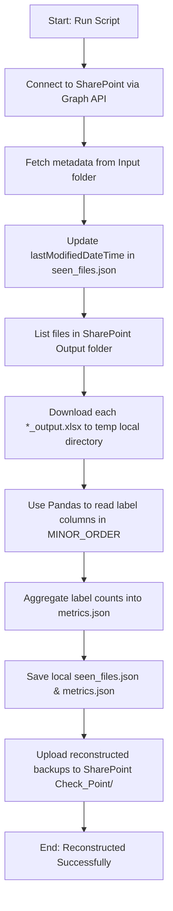

# DMS Operations Guide

English documentation. Vietnamese version: [OPERATIONS.vi.md](OPERATIONS.vi.md).

## 1. Service Overview

The DMS service is a Dockerized Python watcher. It runs from `service/` with:

```text
python -m dms
```

Main responsibilities:

- poll SharePoint `Input/`
- download new `.xlsx` files
- classify feedback rows using local baseline model, keyword/product assets, and Gemini
- upload output workbooks to SharePoint `Output/`
- upload checkpoints to SharePoint `Check_Point/`
- write local health, metrics, and state files
- clean temporary local artifacts after confirmed success

## 2. Runtime Directories

```text
service/
  src/dms/                 source code
  Keyword/                 source keyword/product assets, committed
  Model/                   source baseline model artifacts, committed
  work/                    runtime state, ignored by git
  logs/                    runtime logs, ignored by git
  .env                     local secrets and config, ignored by git
  testvertex.json          GCP service account key, ignored by git
```

Docker mounts:

| Host path | Container path | Mode | Purpose |
|-----------|----------------|------|---------|
| `./Keyword` | `/app/data/Keyword` | read-only | fallback keyword/product assets |
| `./Model` | `/app/data/Model` | read-only | fallback model artifacts |
| `./testvertex.json` | `/app/data/sa-key.json` | read-only | Vertex AI service account key |
| `./work` | `/app/data/work` | read-write | runtime state |
| `./logs` | `/app/data/logs` | read-write | service logs |

## 3. Required Configuration

All runtime configuration comes from `service/.env` plus fixed values in `docker-compose.yml`.

Create `.env` from the template:

```powershell
cd dms-feedback-classification\service
copy .env.example .env
```

### Azure AD

Required:

```env
AZURE_TENANT_ID=...
AZURE_CLIENT_ID=...
AZURE_CLIENT_SECRET=...
```

Azure app registration permissions:

- `Files.ReadWrite.All` for SharePoint file access
- `Mail.Send` if email notifications are used

Both must be application permissions with admin consent.

### SharePoint

Required:

```env
SHAREPOINT_DRIVE_ID=...
SHAREPOINT_ROOT_FOLDER_ID=...
```

Expected folder structure under `SHAREPOINT_ROOT_FOLDER_ID`:

```text
Input/
Output/
Check_Point/
Keyword/
Model/
```

`Input/`, `Output/`, and `Check_Point/` are used for file processing.

`Keyword/` and `Model/` are used for SharePoint config sync when enabled.

### Gemini backend: Vertex AI

Recommended for production.

`.env`:

```env
GEMINI_BACKEND=vertex
GEMINI_MODEL=gemini-2.5-flash-lite
GCP_PROJECT_ID=your-project-id
GCP_LOCATION=global
GCP_SERVICE_ACCOUNT_JSON=/app/data/sa-key.json
```

Required local file:

```text
service/testvertex.json
```

The GCP project must have Vertex AI API enabled, and the service account must have permission to call the selected Gemini model.

### Gemini backend: API key

Optional mode.

`.env`:

```env
GEMINI_BACKEND=apikey
GEMINI_MODEL=gemini-2.5-flash-lite
GEMINI_API_KEY=your-api-key
```

In this mode, the Gemini client does not use `testvertex.json`.

### Processing settings

```env
POLL_INTERVAL_SECONDS=300
LLM_BATCH_SIZE=20
CKPT_EVERY=50
```

Meaning:

- `POLL_INTERVAL_SECONDS`: how often the watcher checks SharePoint
- `LLM_BATCH_SIZE`: number of Excel rows per Gemini batch
- `CKPT_EVERY`: checkpoint frequency during pipeline processing

### SharePoint config sync

```env
ENABLE_SHAREPOINT_CONFIG_SYNC=true
SHAREPOINT_KEYWORD_FOLDER=Keyword
SHAREPOINT_MODEL_FOLDER=Model
```

When enabled:

- the service checks SharePoint `Keyword/` and `Model/` before each poll cycle
- changed tracked assets are downloaded into staging folders under `work/config_assets/`
- validated assets are published into `work/config_assets/active/`
- runtime dependencies are reloaded between cycles

### Runtime cleanup

```env
ENABLE_RUNTIME_CLEANUP=true
CLEANUP_OUTPUT_TTL_DAYS=7
CLEANUP_LOG_TTL_DAYS=7
CLEANUP_STAGING_TTL_HOURS=24
```

Cleanup removes temporary files but preserves state needed for continuity.

## 4. Runtime State Files

The service creates these automatically.

| Path | Created when | Purpose |
|------|--------------|---------|
| `work/seen_files.json` | first watcher save | remembers processed SharePoint item IDs |
| `work/metrics.json` | first metrics flush | counters, durations, success rate |
| `work/health.json` | first health update | current service status |
| `work/config_assets_state.json` | first config sync | remote `Keyword/` and `Model/` metadata |
| `work/config_assets/active/` | first successful config sync | last known good runtime asset snapshot |

You do not create these JSON files manually for a fresh runtime. Start the service and it will create them.

Important distinction:

- `Keyword/` and `Model/` are committed fallback source assets
- `work/config_assets/active/` is the live synced snapshot when SharePoint config sync is active

## 5. Fresh VM Deployment

Use this when a new VM is allowed to start as a new runtime instance.

```powershell
git clone https://github.com/ThanhDT127/dms-feedback-classification.git
cd dms-feedback-classification\service
copy .env.example .env
```

Then:

1. Fill `.env`
2. Place `testvertex.json` if using Vertex AI
3. Confirm `Keyword/` exists
4. Confirm `Model/` exists
5. Start Docker

```powershell
docker compose up -d
docker compose ps
docker compose logs -f
```

Risk:

- if `work/seen_files.json` is absent, the VM does not know which SharePoint files were processed earlier
- old files in SharePoint `Input/` may be processed again

## 6. VM Migration Without Reprocessing

Use this when replacing or moving the current running service.

From the old machine, copy:

```text
service/.env
service/testvertex.json
service/work/
```

Place them into the cloned repo on the new VM:

```text
dms-feedback-classification/service/.env
dms-feedback-classification/service/testvertex.json
dms-feedback-classification/service/work/
```

Then start:

```powershell
cd dms-feedback-classification\service
docker compose up -d
docker compose logs -f
```

Minimum state to preserve:

- `work/seen_files.json`
- `work/config_assets_state.json`
- `work/config_assets/active/`

Best practice:

- copy the whole `service/work/` directory

Why:

- `seen_files.json` prevents old SharePoint files from being processed again
- `config_assets_state.json` preserves remote asset metadata
- `config_assets/active/` preserves the last known good synced asset snapshot

## 7. Checkpoint And Resume

Per-file checkpoints live under:

```text
work/checkpoint/
```

They are useful while a file is actively processing or retrying.

After a file has successfully completed, uploaded, and been marked `done`, local temporary artifacts are cleaned:

- `work/input/<file>.xlsx`
- `work/output/<file>_output.xlsx`
- `work/checkpoint/<file>.json`

So for completed files, resume is primarily controlled by:

```text
work/seen_files.json
```

To force one file to run again:

1. Stop the container
2. Open `work/seen_files.json`
3. Find the entry by `name`
4. Remove the entry or change `status` to `retry`
5. Start the container again

Example PowerShell status check:

```powershell
Get-Content .\work\seen_files.json
```

## 8. Config Asset Updates From SharePoint

When a keyword or model file is updated on SharePoint:

1. watcher detects remote metadata change at the next poll cycle
2. changed file is downloaded to `work/config_assets/cfgsync-*`
3. assets are validated
4. active snapshot is updated under `work/config_assets/active/`
5. pipeline dependencies are reloaded before processing files

The local source files under `service/Keyword/` and `service/Model/` are not overwritten.

To inspect active synced keyword data:

```powershell
Get-Content .\work\config_assets\active\Keyword\kw_map.json
```

## 9. Monitoring

Useful commands from `service/`:

```powershell
docker compose ps
docker compose logs -f
Get-Content .\work\health.json
Get-Content .\work\metrics.json
Get-Content .\work\config_assets_state.json
```

Expected healthy signs:

- container is `Up`
- logs show `Composition root ready`
- logs show poll cycles
- `health.json` updates `last_poll`
- SharePoint `Input/` is listed successfully

## 10. Troubleshooting

### Container does not start

Check:

- `.env` exists
- `testvertex.json` exists when using Vertex AI
- `Keyword/` exists
- `Model/` exists
- Azure client secret is valid
- SharePoint IDs are correct

### `No such container: dms-feedback-watcher`

The service is not running.

```powershell
cd dms-feedback-classification\service
docker compose up -d
docker compose ps
```

### SharePoint asset changed but `service/Keyword/` did not change

This is expected.

Runtime reads the synced snapshot from:

```text
work/config_assets/active/
```

The source `Keyword/` and `Model/` directories are read-only fallbacks.

### New VM processes old files

Cause:

- `work/seen_files.json` was not copied from the old machine

Fix:

- stop the VM container
- copy the old `service/work/` directory
- start the container again

## 11. Security Notes

Never commit:

- `.env`
- `testvertex.json`
- Azure client secrets
- API keys
- `work/`
- `logs/`

If a secret was exposed, rotate it in Azure or GCP before relying on the environment.

## 12. Metrics Mechanism & Historical Data Reconstruction (Reconstruct History)

### 12.1. Statistics Storage and Display Mechanism
The system utilizes two local state files in the `service/work/` directory to track file processing and power the Dashboard charts:
1. **`seen_files.json`**: Tracks input files from SharePoint that are completed or currently processing.
   - Format: `{"<sharepoint_item_id>": {"name": "<file_name>", "status": "done", "lastModifiedDateTime": "2026-05-14T08:30:00Z", "processed_at": "2026-05-14T08:35:00Z", ...}}`
   - The **"Files by Date"** bar chart in the UI displays data grouped by the `lastModifiedDateTime` field (the actual modification date of the file on SharePoint) with a fallback to the `processed_at` field (when the container processed the file).
2. **`metrics.json`**: Stores overall operational metrics (uptime, success rate, processed counts) and specifically tracks category count distribution in the `label_distribution` attribute.
   - The **"Label Distribution"** doughnut chart is plotted directly from this `label_distribution` object.

### 12.2. Root Causes of Missing/Incorrect Stats on Production
When deploying to a clean VM or restarting containers from scratch, you may observe the following issues:
- **Files by Date lumped together:** All historical files appear under a single date (the day the new VM was launched).
- **Empty Label Distribution chart:** The chart displays `No data available` or remains empty.

**Specific Causes:**
1. **Stateless Output Files:** Docker containers do not permanently store output Excel files (`*_output.xlsx`) locally. After uploading them successfully to SharePoint, they are deleted to optimize space. Therefore, the startup check cannot scan local Excel outputs to calculate label distributions, resulting in an empty doughnut chart.
2. **Missing `lastModifiedDateTime` in Old Caches:** Older versions of the service or temporary caches did not save the `lastModifiedDateTime` attribute in `seen_files.json`. Fallback to `processed_at` makes all historical entries group under the new container's launch day.
3. **Local Cache Presence Prevents Auto-Healing Sync:** At startup, both the web server and watcher attempt to download `seen_files.json` and `metrics.json` from SharePoint's `Check_Point/` directory if they are missing or empty. However, **if these files already exist in the local `work/` directory on the host (even if outdated or incomplete), the download is skipped**, leaving the system with incorrect/stale data.

### 12.3. Detailed Workflow of the Reconstruct History Script
To resolve these display anomalies without reprocessing the original Excel sheets (which would incur high Vertex AI/Gemini API costs), the `service/scripts/reconstruct_history.py` script automates the recovery workflow:



1. **Restore Modification Timestamps:** Queries the SharePoint `Input/` folder, retrieves the correct `lastModifiedDateTime` for all recognized files, and updates `seen_files.json`.
2. **Recalculate Label Distributions:** Temporarily downloads all completed `*_output.xlsx` files from SharePoint `Output/` to a temporary directory. It reads the Excel sheets from header row 2 (skipping descriptions), counts categorizations for all columns specified in `MINOR_ORDER`, and merges them into the `metrics.json` file.
3. **Centralized Backup:** Automatically uploads these updated state files to SharePoint's `Check_Point/` folder. Consequently, any new VM or developer instance starting up will download these corrected states and render correct charts immediately.

### 12.4. Production Sync & Recovery Procedure (Step-by-Step)

Follow these steps on your Production VM to sync changes and restore metrics:

#### Step 1: Pull the latest codebase
Navigate to the repository folder on your production host and pull the latest changes:
```bash
git pull origin master
```
*Note: This brings in the UI layout fixes, docker compose static mounts, and the `reconstruct_history.py` script.*

#### Step 2: Shut down the running Docker containers
Stop the current containers to prevent file lock issues:
```bash
cd service
docker compose down
```

#### Step 3: Remove stale local cache files
Delete the local JSON caches to trigger auto-healing sync from SharePoint upon startup:
```bash
# On Windows PowerShell:
Remove-Item -Path .\work\seen_files.json -ErrorAction Ignore
Remove-Item -Path .\work\metrics.json -ErrorAction Ignore

# On Linux/macOS:
rm -f work/seen_files.json work/metrics.json
```

#### Step 4: Restart the Docker containers
Start the containers in detached mode:
```bash
docker compose up -d
```
Upon startup, the missing local cache files will trigger the web and watcher services to download the complete reconstructed `seen_files.json` and `metrics.json` directly from SharePoint `Check_Point/`.

#### Step 5: Force Reconstruction (Optional - if SharePoint checkpoint is outdated)
If you need to manually force a fresh scan of all files on the production server:
1. Execute the script inside the running `watcher` container:
   ```bash
   docker compose exec watcher python scripts/reconstruct_history.py
   ```
2. Restart the `web` container to reload the newly updated cache:
   ```bash
   docker compose restart web
   ```

#### Step 6: Verify the charts
Open the Web UI Dashboard (e.g., `http://<production-ip>:8501/#/metrics`) and verify:
- The **"Files by Date"** bar chart lists items on their actual historical modification dates.
- The **"Label Distribution"** doughnut chart is populated with distinct category slices.
- Verify container logs for any errors:
  ```bash
  docker compose logs -f watcher
  ```

---

## 13. Manual Classification Job Operations

Manual uploads from the Web UI are tracked in a durable SQLite database at:

```text
<WORK_DIR>/classification_jobs.db
```

The web API initializes this database automatically with WAL mode. Do not delete it during routine cleanup unless you intentionally want to remove historical manual job metadata. Input/output workbooks remain separate files under `WORK_DIR/input` and `WORK_DIR/output`.

### 13.1. Lifecycle

| Status | Operational meaning | Action |
| --- | --- | --- |
| `queued` | Job has been accepted and is waiting to run. If `retry_count > 0`, it is waiting after an admin retry. | Admin may cancel. |
| `running` | A classification worker has claimed the workbook and is processing it with heartbeat updates. | Admin may request cancellation; the worker stops at the next safe batch boundary. |
| `completed` | Output file is available for download or SharePoint upload. | No retry needed. |
| `error` | Pipeline failed. | Admin may retry if the original input file still exists. |
| `cancelled` | Job was explicitly cancelled. | Admin may retry if the original input file still exists. |

### 13.2. Admin Operations UI

Open **Phân loại > Jobs** as an admin. The view shows:

- Queue health counts: queued, running, failed, retrying, and average wait/run duration.
- Job metadata: owner, filename, status, queued/started/completed timestamps, retry count, and short error summary.
- Actions:
  - **Hủy** for `queued` or `running` jobs.
  - **Retry** for `error` or `cancelled` jobs.

The same data is available through:

```text
GET  /api/classify/jobs
GET  /api/classify/jobs/metrics
POST /api/classify/jobs/{job_id}/retry
DELETE /api/classify/jobs/{job_id}
```

Metrics and retry are admin-only. Normal users can only see and cancel their own authorized jobs through the classify page.

### 13.3. Concurrency And Limits

Manual uploads are executed by the classification worker queue. The web upload request only saves the workbook and creates a durable `queued` job; worker loops claim jobs when capacity is available.

| Setting | Default | Purpose |
| --- | ---: | --- |
| `CLASSIFICATION_WORKER_CONCURRENCY` | `1` | Maximum user-uploaded classification jobs running globally. |
| `CLASSIFICATION_PER_USER_RUNNING_LIMIT` | `1` | Maximum running jobs owned by one normal user. |
| `CLASSIFICATION_PER_USER_QUEUED_LIMIT` | `3` | Maximum queued jobs owned by one normal user before uploads are rejected with HTTP 429. |
| `CLASSIFICATION_RETRY_COUNT` | `2` | Automatic retries for recoverable provider/network-style worker failures. |
| `CLASSIFICATION_STALE_RUNNING_TIMEOUT_SECONDS` | `900` | Startup recovery threshold for running jobs left behind by an unclean shutdown. |
| `CLASSIFICATION_WORKER_POLL_INTERVAL_SECONDS` | `1.0` | How often idle worker loops check for queued jobs. |
| `CLASSIFICATION_WORKER_HEARTBEAT_SECONDS` | `15.0` | Minimum heartbeat update cadence while a job is running. |

Recommended first deployment: keep concurrency at `1` until Gemini quota and server memory are observed under real workbook sizes. Increase to `2` only if queue wait time is consistently too high and provider quota headroom is clear.

### 13.4. Troubleshooting

- **Retry returns 404 input missing**: the job metadata remains, but the original workbook under `WORK_DIR/input` was deleted. Ask the user to upload the workbook again.
- **Queued job does not start**: check web container logs for worker startup errors, verify `CLASSIFICATION_WORKER_CONCURRENCY` is at least `1`, and check whether another job is consuming the global or per-user running slot.
- **Running job stays running after restart**: on startup, stale running jobs are requeued or failed according to retry policy after `CLASSIFICATION_STALE_RUNNING_TIMEOUT_SECONDS`.
- **Completed job cannot download**: the output path in metadata points to a file that was removed from `WORK_DIR/output`; rerun the job if the input is still available.
- **Metrics look stale**: refresh the Jobs tab. Metrics are computed from `classification_jobs.db`, not from `metrics.json`.
