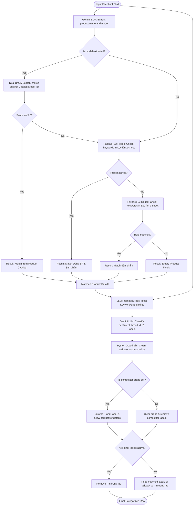
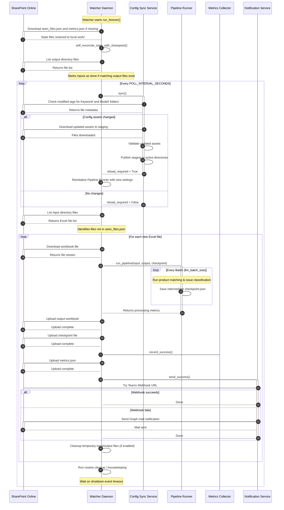
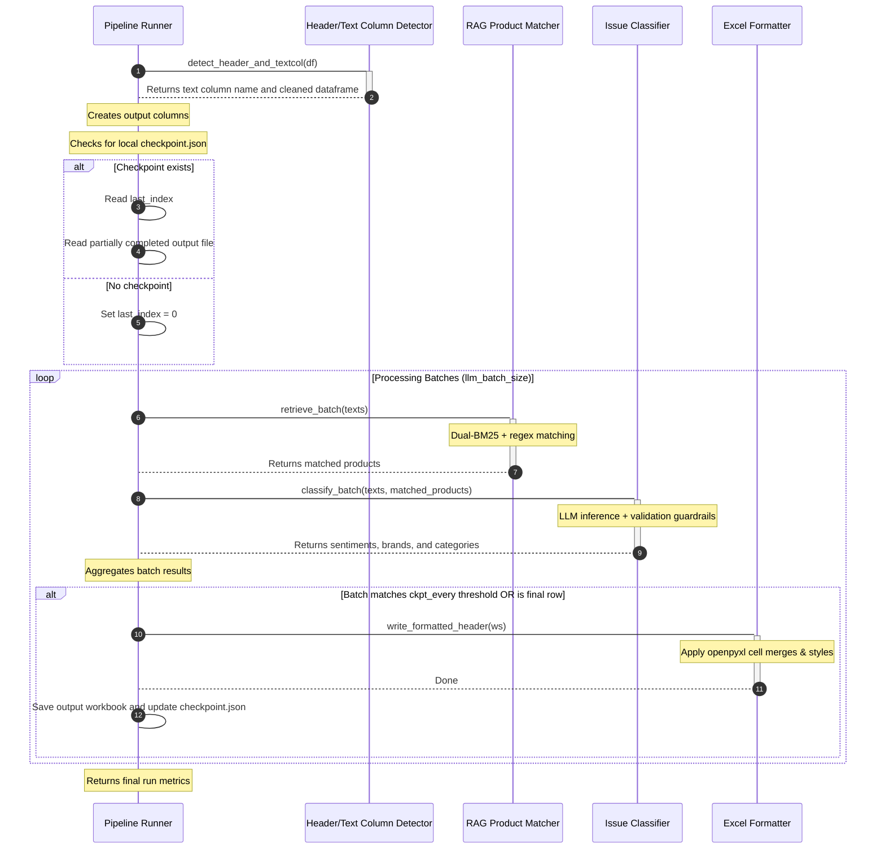
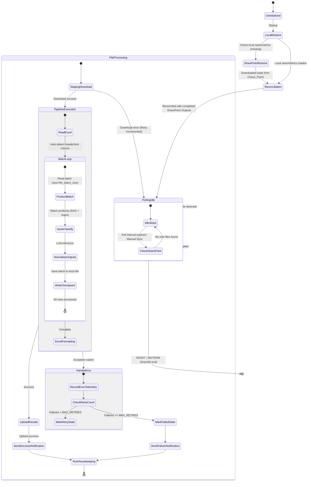

# Technical Document: DMS Feedback Classification Service

This document provides a comprehensive technical overview of the DMS Feedback Classification Service, including its architecture, code structure, data formats, API specifications, and classification pipeline details.

---

## 1. System Architecture Overview

The DMS Feedback Classification Service is structured as an automated, asynchronous dual-component system designed to process marketing, sales, and product feedback. It operates on top of a containerized environment (Docker Compose) split into:
1. **Background Watcher (Daemon Service)**
2. **FastAPI Web Server (API & Management Web UI)**

```mermaid
graph TB
    subgraph SharePoint Online (Office 365)
        SP_Input[Input/ Folder]
        SP_Output[Output/ Folder]
        SP_Checkpoint[Check_Point/ Folder]
        SP_Keyword[Keyword/ Configs]
        SP_Model[Model/ Configs]
    end

    subgraph Watcher Service (dms-feedback-watcher Container)
        Watcher[Watcher Daemon]
        ConfigSync[Config Asset Sync Service]
        Pipeline[Pipeline Runner]
        RAG[RAG Product Matcher]
        Classifier[Issue Classifier]
        Metrics[Metrics Collector]
        Notifier[Notification Service]
        Cleanup[Runtime Cleanup]
    end

    subgraph Web Service (dms-feedback-web Container)
        FastAPI[FastAPI Web Server]
        WebUI[Static HTML/JS Web UI]
        WSLogs[WebSocket Log Server]
        WSProgress[WebSocket Progress Server]
    end

    %% Watcher Data Flow
    Watcher --> ConfigSync
    Watcher --> Metrics
    Watcher --> Notifier
    Watcher --> Cleanup
    Watcher --> Pipeline
    Pipeline --> RAG
    Pipeline --> Classifier
    
    %% Connections to SharePoint
    Watcher <--> SP_Input
    Watcher --> SP_Output
    Watcher <--> SP_Checkpoint
    ConfigSync <--> SP_Keyword
    ConfigSync <--> SP_Model
    
    %% Web interactions
    FastAPI --> Pipeline
    FastAPI --> Metrics
    FastAPI <--> SP_Output
    FastAPI <--> SP_Input
    Client([Browser Client]) <--> WebUI
    Client <--> WSLogs
    Client <--> WSProgress
    Client <--> FastAPI
```

### 1.1 The Background Watcher (Daemon)
The Watcher is the core scheduling pipeline, executing in a continuous loop using an `Event`-based polling mechanism (`Watcher.run_forever`).
* **SharePoint Polling**: Periodically queries SharePoint via the Microsoft Graph API at a user-defined interval (`POLL_INTERVAL_SECONDS`, default 300s/5 min).
* **Sequential Queue Processing**: Discovers new input workbooks, downloads them to a local work directory (`work/input/`), and processes them one-by-one.
* **Checkpoint & State Recovery**: Restores progress at startup. If the service restarts, it reads `seen_files.json` and `metrics.json` locally or downloads them from SharePoint's `Check_Point/` directory.
* **Self-Healing Reconciliation**: If files are missing from the local registry but matching processed outputs exist in SharePoint `Output/`, it automatically registers those inputs as `"done"` in `seen_files.json`.
* **Config Asset Synchronization**: Tracks Excel-based product catalogs (`Phân Chia Nhóm Sản Phẩm V2.xlsx`), keyword rules (`Hệ từ khóa Lọc 3 lần.xlsx`), and manual map settings (`kw_map.json`) on SharePoint. Changes trigger a hot reload of the classification pipeline.
* **Graceful Shutdown**: Intercepts `SIGINT` (Ctrl+C) and `SIGTERM` (Docker container stop) signals, setting a shutdown event which halts the loop cleanly after completing the current workbook's active row batch.
* **Alerting Fallback**: Pushes processing statistics and errors to Microsoft Teams via Adaptive Cards. If the webhook fails, it falls back to email notifications using the Microsoft Graph `/sendMail` endpoint.
* **Retention-based Housekeeping**: Cleans up expired input/output files and logs based on retention settings (e.g., `CLEANUP_OUTPUT_TTL_DAYS`, `CLEANUP_LOG_TTL_DAYS`).

### 1.2 FastAPI Web UI & API Server
Serves a clean HTML/JS Dashboard interface for manual processing, operational monitoring, and configuration tuning.
* **Logical Folder Routing**: Lists, previews, and deletes files in local directories or SharePoint folders (Inputs, Outputs, Checkpoints, Keywords, and Models).
* **Real-time Log Streaming**: Uses WebSockets to read the active JSONLines logging file (`logs/dms-service.jsonl`) and stream filtered outputs directly to the UI console.
* **Asynchronous Background Processing**: Allows users to upload custom feedback spreadsheets and trigger classification jobs in background threads while tracking execution progress via WebSockets.
* **Hot Config Updates**: Exposes endpoints to inspect and modify `kw_map.json` or update prompt templates directly.

---

## 2. Codebase Directory Map

The service codebase is organized under `src/dms`, separating pipeline execution from HTTP endpoints and daemon logic.

```
service/src/dms/
│
├── __init__.py                # Package declaration
├── __main__.py                # Composition root / Watcher entry point
├── auth.py                    # Microsoft Graph OAuth Authentication Provider
├── cleanup.py                 # Retention housekeeping utility
├── config_assets.py           # SharePoint config assets synchronization
├── exceptions.py              # Application-specific exceptions
├── gemini_client.py           # Vertex AI / Gemini API Client wrapper
├── http_client.py             # HTTP session creator with timeout/retry rules
├── logging_config.py          # Rotating JSONLines logging configuration
├── metrics.py                 # Real-time metrics aggregator and database
├── notification.py            # MS Teams and MS Graph Mail notification helper
├── settings.py                # Pydantic Settings validation framework
├── sharepoint.py              # SharePoint REST API wrapper
├── utils.py                   # Atomic file-writing helpers
├── watcher.py                 # Polling schedule, self-healing, & loop manager
│
├── pipeline/                  # core classification logic
│   ├── __init__.py            # Pipeline initialization
│   ├── excel_formatter.py     # openpyxl grouped double-header formatting
│   ├── issue_classifier.py    # Gemini-based category classification & validation
│   ├── rag_product.py         # BM25 product index & keyword fallback matcher
│   └── runner.py              # Single-file coordinate and checkpoint wrapper
│
└── web/                       # FastAPI Web UI & Server API
    ├── __init__.py            # Web package declaration
    ├── __main__.py            # Web server launcher (uvicorn)
    ├── app.py                 # FastAPI application factory and mounts
    ├── deps.py                # Shared thread-safe lazy singleton container
    │
    ├── api/                   # API routers
    │   ├── classify.py        # Real-time text & file classification background jobs
    │   ├── files.py           # Physical/SharePoint file storage explorer
    │   ├── metrics_api.py     # Health dashboard, daily analytics and logs
    │   ├── pipeline_api.py    # Rules, keyword hints, and catalog configuration
    │   └── settings_api.py    # Env variable updates, prompt views, and test suites
    │
    └── ws/                    # WebSocket routers
        ├── logs.py            # Log tail streaming WebSocket
        └── progress.py        # Active job progress dashboard WebSocket
```

### 2.1 File-by-File Codebase Inventory

| File Path | Description |
| :--- | :--- |
| `src/dms/__init__.py` | Declares package exports and sets baseline variables. |
| `src/dms/__main__.py` | The composition root. Bootstraps Pydantic configurations, config asset sync services, starts the logging environment, hooks `SIGINT`/`SIGTERM` handlers, and starts `Watcher.run_forever`. |
| `src/dms/auth.py` | Connects to Azure Active Directory via Client Credentials flow (tenant, client ID, client secret) to retrieve access tokens for SharePoint and Mail APIs. |
| `src/dms/cleanup.py` | Scans temporary staging directories, output sheets, and log files. Automatically unlinks items exceeding configured TTL thresholds. |
| `src/dms/config_assets.py` | Syncs assets like `kw_map.json` and model files from SharePoint to local disk. Updates cached settings paths when changes are detected. |
| `src/dms/exceptions.py` | Standardizes errors across modules (e.g. `ConfigurationError`, `PipelineError`, `ConfigAssetSyncError`). |
| `src/dms/gemini_client.py` | Wraps Google GenAI API calling strategies. Provides structured responses, fallbacks, model mapping, and rate-limiting retry protocols. |
| `src/dms/http_client.py` | Creates configured `requests.Session` instances with customized HTTP retries and timeout boundaries. |
| `src/dms/logging_config.py` | Generates stdout stream formatters and JSONLines file loggers (`JsonFormatter`) containing transaction tags like `rows`, `duration_s`, `poll_cycle`, and `error_type`. |
| `src/dms/metrics.py` | Stores operational metrics like process durations, poll counts, and error distributions. Saves outputs to `metrics.json`. Can reconstruct state on startup by parsing `seen_files.json`. |
| `src/dms/notification.py` | Packages HTML emails and MS Teams JSON adaptive cards to report pipeline results or system failures. |
| `src/dms/settings.py` | Parses and validates environment variables and `.env` properties using Pydantic Settings. Normalizes model parameters and paths. |
| `src/dms/sharepoint.py` | Implements SharePoint integrations (folder item lists, file downloads, output uploads, checkpoint tracking) using Graph REST requests. |
| `src/dms/utils.py` | Implements atomic text/JSON writing (`atomic_write_text`, `atomic_write_json`) by writing to a temporary file and performing an OS replacement (`os.replace`) to prevent corruption. |
| `src/dms/watcher.py` | Manages the watcher daemon. Handles folder polling, SharePoint synchronization, state healing, hot-reloading configurations, and daily summaries. |
| `src/dms/pipeline/excel_formatter.py` | Applies styling to the output workbook, creating a grouped double-header design (Row 1: Major Category, Row 2: Minor Category) with custom background fills. |
| `src/dms/pipeline/issue_classifier.py` | Orchestrates LLM classification using structured templates. Compiles prompt inputs (glossaries, labels, definitions) and validates outputs. |
| `src/dms/pipeline/rag_product.py` | Implements the product matching system. Uses a dual BM25 indexing model (raw and accentless tokens) coupled with regex search guidelines to resolve product catalog matches. |
| `src/dms/pipeline/runner.py` | Coordinates the processing of a single Excel file. Manages header/text-column detection, batch iteration, checkpoint writes, and output formatting. |
| `src/dms/web/app.py` | Constructs the FastAPI application instance. Configures CORS, mounts static paths, and performs state recovery tasks during the startup event. |
| `src/dms/web/deps.py` | Implements a thread-safe dependency injection container. Caches singletons like the SharePoint client, pipeline runner, and metrics collector. |
| `src/dms/web/api/classify.py` | Exposes endpoints to process single text samples and run file-level background jobs. |
| `src/dms/web/api/files.py` | Exposes endpoints to explore folders (local and SharePoint), upload input files, verify schema structures, trigger manual syncs, and serve template Excel spreadsheets. |
| `src/dms/web/api/metrics_api.py` | Exposes endpoints to monitor service health, retrieve metrics history, parse logs, and construct analytics charts. |
| `src/dms/web/api/pipeline_api.py` | Exposes endpoints to retrieve labels, query keywords, extract brand maps, and update hints. |
| `src/dms/web/api/settings_api.py` | Exposes endpoints to update environment settings, review prompts, and check API client connections. |
| `src/dms/web/ws/logs.py` | Streams log updates from the current active service logger. |
| `src/dms/web/ws/progress.py` | Streams real-time progress updates for background classification jobs. |

---

## 3. Data Models & Schemas

### 3.1 Input Spreadsheet Schema
The input workbook must be a single-sheet Excel file. It does not require a rigid structure, but it must contain a header row and a column containing the raw feedback text.
* **Auto-detection rules**: The service scans the first 10 rows of the sheet.
  * It searches for a column header containing any of these keywords: `nội dung`, `noi dung`, `nội dung vấn đề`, `noi dung van de`, `nội dung phản hồi`, `noi dung phan hoi`.
  * If a header isn't found, it scores the columns based on a heuristic:
    $$\text{Score} = (\text{Mean length} \times 0.7) + (\text{Space ratio} \times 20) + (\text{Non-numeric ratio} \times 30)$$
    The column with the highest score is selected as the source text column.

### 3.2 Output Spreadsheet Schema
The output file preserves the original input structure without modifying existing column indices or values. This ensures that downstream automation flows do not break.
New columns are inserted directly after the detected text column, and classification results are appended to the end of the sheet:

```
[Original Input Columns 1..N]
    └── [Text Column]
            ├── [Sản phẩm]             <-- Matched product category (from RAG)
            ├── [Dòng SP]              <-- Matched product line (from RAG)
            ├── [Model]                <-- Matched product model (from RAG)
            ├── [Lớp]                  <-- Legacy placeholder, always ""
            ├── [Điểm]                 <-- Legacy placeholder, always ""
            ├── [Original Input Columns N+2..M]
            ├── [21 Label Columns]      <-- "x" if label is active, otherwise ""
            ├── [Sentiment]            <-- "Tích cực", "Tiêu cực", or ""
            ├── [LLM_Extracted]        <-- Raw text matched by Gemini
            └── [BM25_Score]           <-- BM25 search similarity score
```

The output layout includes a grouped double-header structure (Rows 1 and 2), with individual data records beginning on Row 3. Major and Minor categories are color-coded based on the theme definitions in `excel_formatter.py`:

| Major Group (Row 1) | Minor Label (Row 2) | Color Fill (Hex) | Description |
| :--- | :--- | :--- | :--- |
| **Sản phẩm** | Báo lỗi | `FFE699` | Physical defects, failures, cracks. |
| | Báo CL tốt | `FFE699` | Compliments on quality and stability. |
| | Y/c cải tiến | `FFE699` | Requests to adjust designs of existing products. |
| | Đề xuất SPM | `FFE699` | Requests to develop new products. |
| **Yêu cầu công cụ BH** | Bảng giá, Catalogue | `C6E0B4` | Requests for catalog materials or price lists. |
| | Bảng biển | `C6E0B4` | Requests for store signage or POSMs. |
| | Kệ bóng, thử đèn,… | `C6E0B4` | Requests for demonstration boards or demo kits. |
| | Khác | `C6E0B4` | Other sales supports (apparel, flyers). |
| **Giá, cơ chế RD** | Tốt/ ko tốt | `BDD7EE` | Rạng Đông pricing feedback. |
| | Trả thưởng | `BDD7EE` | Specific payout or rewards queries. |
| | Đề xuất | `BDD7EE` | Broad pricing policy change proposals. |
| **Dịch vụ** | Bảo hành | `F8CBAD` | Warranty policy feedback or delays. |
| | HTPP | `F8CBAD` | Distribution channel conflicts (dumping, regions). |
| | Hàng hoá | `F8CBAD` | Delivery delays or inventory shortages. |
| **Hàng giả** | Hàng giả | `F4B183` | Suspected counterfeit products. |
| **Website** | Website | `D9E1F2` | DMS system or portal software errors. |
| **Đối thủ cạnh tranh**| Hãng | `C9C9C9` | Competitor brand names. |
| | Hoạt động | `C9C9C9` | Competitor advertising campaigns. |
| | CTKM, giá, cơ chế | `C9C9C9` | Competitor pricing promotions. |
| | TT SP | `C9C9C9` | Competitor technical product details. |
| **Tin trung lập** | Tin trung lập | `FFD966` | Neutral logs matching no other classes. |

### 3.3 State and Configuration JSON Schemas

#### 3.3.1 `seen_files.json`
Acts as the central registry tracking files detected during SharePoint poll cycles.
```json
{
  "remote_file_graph_id_101": {
    "name": "Feedback_Thang6_2026.xlsx",
    "status": "done",
    "processed_at": "2026-06-29T15:00:23.123456",
    "lastModifiedDateTime": "2026-06-29T08:00:00Z",
    "total_rows": 150,
    "duration_seconds": 45.2,
    "label_distribution": {
      "Báo lỗi": 12,
      "Y/c cải tiến": 4,
      "Tin trung lập": 134
    }
  }
}
```

#### 3.3.2 `metrics.json`
Maintains operational telemetry counters. Reconstructed automatically from `seen_files.json` if deleted.
```json
{
  "total_polls": 1204,
  "files_processed": 45,
  "files_failed": 1,
  "files_skipped": 0,
  "total_rows_processed": 5420,
  "total_processing_seconds": 2210.5,
  "gemini_calls": 312,
  "gemini_retries": 4,
  "errors_by_type": {
    "PipelineError": 1
  },
  "last_success": {
    "file": "Feedback_Thang6_2026.xlsx",
    "at": "2026-06-29T15:00:23",
    "rows": 150,
    "duration": 45.2
  },
  "last_error": {
    "file": "Failed_Book.xlsx",
    "at": "2026-06-28T10:12:00",
    "error_type": "PipelineError",
    "error": "Cannot find text column in Failed_Book.xlsx"
  },
  "label_distribution": {
    "Báo lỗi": 432,
    "Báo CL tốt": 89,
    "Tin trung lập": 4899
  }
}
```

#### 3.3.3 `config_assets_state.json`
Maintains synchronization statuses of SharePoint configuration assets.
```json
{
  "assets": {
    "keyword/Phân Chia Nhóm Sản Phẩm V2.xlsx": {
      "item_id": "sp_item_id_991",
      "e_tag": "\"{88172BA-19A2-4B22-871B-CE019182}\",2",
      "last_modified": "2026-06-29T03:00:00Z",
      "size": "154320"
    }
  },
  "last_success_at": "2026-06-29T15:40:00.992120"
}
```

#### 3.3.4 `health.json`
Exposes system health status for monitoring checks.
```json
{
  "status": "healthy",
  "last_poll": "2026-06-29T15:50:00.123000",
  "uptime": "5 days, 4 hours",
  "current_cycle": 1204,
  "poll_interval": 300,
  "files_in_queue": 0,
  "last_success": "2026-06-29T15:00:23",
  "last_error": null,
  "metrics_summary": {
    "processed_24h": 3,
    "failed_24h": 0,
    "success_rate": "100.0%"
  },
  "model": "gemini-2.5-flash-lite",
  "config_assets": {
    "checked_at": "2026-06-29T15:50:02",
    "reload_required": false,
    "changed_assets": [],
    "downloaded_assets": [],
    "errors": []
  }
}
```

#### 3.3.5 Local Job Checkpoint File
Saved to `work/checkpoint/{filename_stem}.json`. Stores the index of the next row to process.
```json
{
  "last_index": 50,
  "timestamp": "2026-06-29T15:42:01.992100"
}
```

---

## 4. Web API Specifications

The FastAPI web application exposes REST endpoints and WebSockets under `/api` and `/ws` prefixes to control classification jobs, manage settings, modify system prompts, edit local and SharePoint files, and stream operational logs.

### 4.1 HTTP Status Codes and Error Handling
All API endpoints return JSON-formatted errors when operations fail. Standard HTTP status codes used:
* **200 OK**: The request succeeded, and data is returned.
* **201 Created**: A resource was successfully created.
* **202 Accepted**: A background job was successfully queued.
* **400 Bad Request**: Input validation failed (e.g. missing fields, invalid format, path traversal).
* **404 Not Found**: File, folder, or job ID not found.
* **413 Content Too Large**: Uploaded file exceeds the `50MB` size limit.
* **422 Unprocessable Entity**: The file content is invalid (e.g., corrupted Excel sheet).
* **500 Internal Server Error**: An unhandled pipeline or system error occurred.
* **502 Bad Gateway**: Communication failure with downstream APIs (e.g. SharePoint, Vertex AI).
* **503 Service Unavailable**: A required client singleton (e.g., GeminiClient, SharePointClient) is unconfigured or unavailable.

---

### 4.2 Classification Endpoints

* **POST `/api/classify/text`**
  * **Description**: Runs real-time RAG product matching and Issue classification on a single text string.
  * **Request Body** (`application/json`):
    ```json
    {
      "text": "Khách báo bóng led bulb 9w Rạng Đông sáng chập chờn, đổi bảo hành hơi lâu",
      "model": "gemini-2.5-flash-lite"
    }
    ```
  * **Response** (`200 OK`):
    ```json
    {
      "text": "Khách báo bóng led bulb 9w Rạng Đông sáng chập chờn, đổi bảo hành hơi lâu",
      "product": {
        "llm_extracted": "led bulb 9w",
        "model": "LED BU B22/9W",
        "dong_sp": "Đèn LED Búp",
        "san_pham": "Đèn LED Thông dụng",
        "score": 8.5,
        "src": "RAG"
      },
      "labels": {
        "Báo lỗi": true,
        "Báo CL tốt": false,
        "Y/c cải tiến": false,
        "Đề xuất SPM": false,
        "Bảng giá, Catalogue": false,
        "Bảng biển": false,
        "Kệ bóng, thử đèn,…": false,
        "Khác": false,
        "Tốt/ ko tốt": false,
        "Trả thưởng": false,
        "Đề xuất": false,
        "Bảo hành": true,
        "HTPP": false,
        "Hàng hoá": false,
        "Hàng giả": false,
        "Website": false,
        "Hãng": false,
        "Hoạt động": false,
        "CTKM, giá, cơ chế": false,
        "TT SP": false,
        "Tin trung lập": false
      },
      "sentiment": "Tiêu cực",
      "brand": "",
      "decision_log": [
        {
          "minor": "Báo lỗi",
          "action": "ADD",
          "why": "Phản ánh lỗi vật lý bóng led bulb 9w chập chờn"
        },
        {
          "minor": "Bảo hành",
          "action": "ADD",
          "why": "Đề cập đến việc đổi trả bảo hành lâu"
        }
      ]
    }
    ```
  * **Errors**: `503 Service Unavailable` if `GeminiClient` or `IssueClassifier` are uninitialized.

* **POST `/api/classify/file`**
  * **Description**: Uploads a spreadsheet and triggers an asynchronous background thread execution.
  * **Form Data** (`multipart/form-data`):
    * `file`: Binary file upload (`.xlsx` only, max 50MB).
    * `mode`: Job mode (e.g. `single` - default).
  * **Response** (`202 Accepted`):
    ```json
    {
      "job_id": "job_3f4b2670_e092_4c64_a5cc_293231182390",
      "filename": "feedback_june.xlsx",
      "status": "queued",
      "message": "Đã tạo job phân loại: job_3f4b2670_e092_4c64_a5cc_293231182390"
    }
    ```
  * **Errors**: `400 Bad Request` if not a `.xlsx` file, `413 Content Too Large` if >50MB.

* **GET `/api/classify/jobs`**
  * **Description**: Lists all active and historically completed in-memory background jobs.
  * **Response** (`200 OK`):
    ```json
    [
      {
        "job_id": "job_3f4b2670_...",
        "status": "completed",
        "filename": "feedback_june.xlsx",
        "mode": "single",
        "input_path": "/app/data/work/input/job_3f4b2670_..._feedback_june.xlsx",
        "output_path": "/app/data/work/output/job_3f4b2670_..._output_feedback_june.xlsx",
        "total_rows": 200,
        "rows_done": 200,
        "percent": 100,
        "error": null,
        "created_at": "2026-06-29T15:40:00",
        "started_at": "2026-06-29T15:40:01",
        "completed_at": "2026-06-29T15:40:45",
        "sp_web_url": "https://example.sharepoint.com/..."
      }
    ]
    ```

* **GET `/api/classify/jobs/{job_id}`**
  * **Description**: Returns detail status for a specific background classification job.
  * **Response** (`200 OK`): Returns the specific job status dictionary (similar to `/jobs` array items).
  * **Errors**: `404 Not Found` if the job ID is missing.

* **DELETE `/api/classify/jobs/{job_id}`**
  * **Description**: Cancels a currently running classification job. Sets job status to `"cancelled"`.
  * **Response** (`200 OK`):
    ```json
    {
      "message": "Đã hủy job: job_3f4b2670_..."
    }
    ```

* **GET `/api/classify/jobs/{job_id}/download`**
  * **Description**: Downloads the processed output workbook spreadsheet from disk.
  * **Response** (`200 OK`): Binary stream with `application/vnd.openxmlformats-officedocument.spreadsheetml.sheet` content type.
  * **Errors**: `400 Bad Request` if the job is not completed, `404 Not Found` if the output file was cleared from disk.

* **POST `/api/classify/jobs/{job_id}/sharepoint`**
  * **Description**: Manually uploads both input and completed output workbooks of a finished job to SharePoint.
  * **Response** (`200 OK`):
    ```json
    {
      "message": "Đã tải thành công file input và output lên SharePoint",
      "sp_web_url": "https://example.sharepoint.com/..."
    }
    ```
  * **Errors**: `503 Service Unavailable` if SharePoint is offline or credentials are missing.

---

### 4.3 Settings & Prompt Management

* **GET `/api/settings`**
  * **Description**: Returns all currently active configuration parameters. Sensitive variables like `azure_client_secret` and `gemini_api_key` are masked with asterisks (`****`).
  * **Response** (`200 OK`):
    ```json
    {
      "AZURE_TENANT_ID": "xxxx-xxxx-xxxx",
      "AZURE_CLIENT_ID": "yyyy-yyyy-yyyy",
      "AZURE_CLIENT_SECRET": "********",
      "GEMINI_BACKEND": "vertex",
      "GEMINI_MODEL": "gemini-2.5-flash-lite",
      "GCP_PROJECT_ID": "my-gcp-project-123",
      "GCP_LOCATION": "us-central1",
      "POLL_INTERVAL_SECONDS": 300,
      "LLM_BATCH_SIZE": 20,
      "CKPT_EVERY": 50,
      "RATE_LIMIT_GAP": "4.0"
    }
    ```

* **PUT `/api/settings`**
  * **Description**: Validates and updates configuration parameters in the `.env` file and processes environment variables. Triggers a hot-reload of cached singletons. Auto-rolls back to the original `.env` if validations fail.
  * **Request Body** (`application/json`):
    ```json
    {
      "gemini_backend": "vertex",
      "gemini_model": "gemini-2.5-flash",
      "llm_batch_size": 15,
      "checkpoint_every": 50,
      "rate_gap": 4.5
    }
    ```
  * **Response** (`200 OK`):
    ```json
    {
      "success": true,
      "message": "Đã lưu cấu hình thành công."
    }
    ```
  * **Errors**: `400 Bad Request` containing validation errors (e.g. missing project ID for Vertex).

* **GET `/api/settings/prompt`**
  * **Description**: Retrieves the active System Prompt template. Checks first for `Keyword/system_prompt.txt` overrides; otherwise extracts the default prompt embedded in `issue_classifier.py`.
  * **Response** (`200 OK`):
    ```json
    {
      "prompt_template": "Bạn là hệ thống phân loại phản hồi...",
      "raw_template": "Bạn là hệ thống phân loại phản hồi... {minor_order_json}...",
      "word_count": 1205,
      "estimated_tokens": 1566,
      "source_file": "issue_classifier.py",
      "is_custom": false
    }
    ```

* **PUT `/api/settings/prompt`**
  * **Description**: Saves a customized system prompt template override to `Keyword/system_prompt.txt`. Validates that all required f-string placeholders are preserved.
  * **Request Body**:
    ```json
    {
      "prompt": "Bạn là hệ thống phân loại phản hồi... {minor_order_json} {label_defs} {hints_json} {brand_json} {input_json}"
    }
    ```
  * **Response** (`200 OK`):
    ```json
    {
      "success": true,
      "message": "Đã lưu System Prompt tùy chỉnh thành công."
    }
    ```
  * **Errors**: `400 Bad Request` if any of the mandatory placeholders are omitted.

* **GET `/api/settings/prompt/rag`**
  * **Description**: Extracts and returns the prompt template utilized by the product matcher in `rag_product.py`.
  * **Response** (`200 OK`):
    ```json
    {
      "prompt_template": "...",
      "word_count": 350,
      "estimated_tokens": 455,
      "source_file": "pipeline/rag_product.py"
    }
    ```

* **GET `/api/settings/models`**
  * **Description**: Lists pre-approved Gemini LLM versions.
  * **Response** (`200 OK`): List of available models with descriptive names and notes.

* **POST `/api/settings/test-connection`**
  * **Description**: Sends a lightweight request (`"Trả lời đúng 1 từ: xin chào"`) to the Gemini client backend to verify connection status.
  * **Response** (`200 OK`):
    ```json
    {
      "success": true,
      "message": "Kết nối thành công. Phản hồi: Xin chào",
      "response_time_ms": 312
    }
    ```

---

### 4.4 Keyword and Product Pipeline Configurations

* **GET `/api/pipeline/labels`**
  * **Description**: Returns labels, major mappings, and definitions.
  * **Response** (`200 OK`):
    ```json
    {
      "minor_order": ["Báo lỗi", ...],
      "minor_to_major": { "Báo lỗi": "Sản phẩm", ... },
      "label_definitions": { "Báo lỗi": "Sản phẩm vật lý...", ... }
    }
    ```

* **GET `/api/pipeline/keywords/raw`**
  * **Description**: Returns the exact contents of `kw_map.json`.
  * **Response** (`200 OK`): Raw JSON mapping object.

* **GET `/api/pipeline/keywords`**
  * **Description**: Returns keyword hints mapped by minor category (first 12 keywords for each minor).
  * **Response** (`200 OK`):
    ```json
    {
      "Báo lỗi": ["hỏng", "cháy", "không sáng"],
      "Bảo hành": ["đổi trả", "trả bảo hành"]
    }
    ```

* **PUT `/api/pipeline/keywords`**
  * **Description**: Overwrites `kw_map.json` locally and invalidates settings cache.
  * **Response** (`200 OK`):
    ```json
    {
      "success": true,
      "message": "Đã lưu từ khóa gợi ý thành công."
    }
    ```

* **GET `/api/pipeline/brands`**
  * **Description**: Extracts the lists of brand names registered under `manual_brand_alias` inside `kw_map.json`.
  * **Response** (`200 OK`): `["Sopoka", "Philips", "Asia", "Paragon", ...]`

* **GET `/api/pipeline/products`**
  * **Description**: Returns a statistical summary of the Excel product catalog (`Phân Chia Nhóm Sản Phẩm V2.xlsx`).
  * **Response** (`200 OK`):
    ```json
    {
      "total_products": 2542,
      "categories": ["Đèn LED Thông dụng", "Đèn LED Dự án"],
      "product_lines": ["Đèn LED Búp", "Đèn LED Tuýp"],
      "sample_models": ["LED BU B22/9W", "LED TR120/40W"],
      "file_path": "/app/data/Keyword/Phân Chia Nhóm Sản Phẩm V2.xlsx"
    }
    ```

* **GET `/api/pipeline/products/list`**
  * **Description**: Parses all sheets within `Phân Chia Nhóm Sản Phẩm V2.xlsx` and returns their complete content records.
  * **Response** (`200 OK`): Lists sheet names, columns, and product item records.

* **PUT `/api/pipeline/products`**
  * **Description**: Modifies a specific sheet within `Phân Chia Nhóm Sản Phẩm V2.xlsx` while preserving other sheets intact. Hot-reloads the RAG indexes.
  * **Request Body**:
    ```json
    {
      "sheet_name": "Danh mục Model",
      "products": [
        { "Sản phẩm": "Đèn LED Thông dụng", "Dòng SP": "Đèn LED Búp", "Model": "LED BU B22/9W" }
      ]
    }
    ```
  * **Response** (`200 OK`): Success message.
  * **Errors**: `400 Bad Request` if file is open/locked (PermissionError) on the host machine.

* **POST `/api/pipeline/sync-keywords-to-sp`**
  * **Description**: Uploads local `kw_map.json` up to SharePoint `Keyword/` and updates the sync etag state file.
  * **Response** (`200 OK`): Success response including SharePoint item ID.

* **POST `/api/pipeline/sync-products-to-sp`**
  * **Description**: Uploads local `Phân Chia Nhóm Sản Phẩm V2.xlsx` up to SharePoint `Keyword/` and updates sync state.
  * **Response** (`200 OK`): Success response.

---

### 4.5 File Storage and SharePoint Sync

* **GET `/api/files/tree`**
  * **Description**: Scans and returns logical folders (Input, Output, Checkpoint, Keyword, Model) contents.
  * **Response** (`200 OK`): Grouped object structure containing listings.

* **GET `/api/files/seen`**
  * **Description**: Returns the raw contents of `seen_files.json` tracker file.
  * **Response** (`200 OK`): seen_files JSON object.

* **POST `/api/files/upload`**
  * **Description**: Uploads an Excel sheet to `work/input/` local directory. Checks that the sheet contains a text column header matching `"Nội dung"` or `"noi dung"`.
  * **Response** (`200 OK`):
    ```json
    {
      "filename": "feedback_upload.xlsx",
      "size": 154220,
      "message": "Đã upload thành công: feedback_upload.xlsx"
    }
    ```
  * **Errors**: `400 Bad Request` if missing text column or not a `.xlsx` workbook.

* **GET `/api/files/template`**
  * **Description**: Generates and downloads a clean, ready-to-use template Excel sheet.
  * **Response** (`200 OK`): Streaming workbook file.

* **POST `/api/files/sync`**
  * **Description**: Triggers a manual, two-way sync: downloads unprocessed files from SharePoint `Input/` and uploads local output workbooks to SharePoint `Output/`.
  * **Response** (`200 OK`):
    ```json
    {
      "success": true,
      "synced_downloaded": 2,
      "synced_uploaded": 1,
      "message": "Đồng bộ SharePoint hoàn tất! Tải về 2 file đầu vào mới, tải lên 1 file kết quả mới."
    }
    ```

* **GET `/api/files/{folder}`**
  * **Description**: Lists files in a target logical directory (`input`, `output`, `checkpoint`, `keyword`, `model`). Attempts to list SharePoint cloud items for `input`, `output`, and `checkpoint`; falls back to local listings if SharePoint is unavailable.
  * **Response** (`200 OK`):
    ```json
    [
      {
        "name": "feedback.xlsx",
        "size": 451200,
        "modified": "2026-06-29T08:00:00Z",
        "extension": "xlsx",
        "source_dir": "SharePoint",
        "status": "new",
        "id": "remote_graph_id_xyz",
        "web_url": "https://example.sharepoint.com/..."
      }
    ]
    ```

* **GET `/api/files/{folder}/{filename}/preview`**
  * **Description**: Reads a file snippet (max 20 rows/lines, cap at 500KB) for UI previews. Supports Excel, CSV, JSON, and Text formats (rotates between SharePoint download and local access).
  * **Response** (`200 OK`): Returns typed JSON structure:
    ```json
    {
      "type": "table",
      "filename": "feedback.xlsx",
      "total_columns": 5,
      "preview_rows": 2,
      "columns": ["STT", "Nội dung phản hồi"],
      "data": [
        { "STT": "1", "Nội dung phản hồi": "Bóng hỏng" }
      ]
    }
    ```

* **GET `/api/files/{folder}/{filename}/download`**
  * **Description**: Downloads the requested file (Excel, CSV, JSON, Text, Logs) from SharePoint or local disk.
  * **Response** (`200 OK`): Returns binary FileResponse.

---

### 4.6 Metrics, Logs, and WebSockets

* **GET `/api/health`**
  * **Description**: Verifies service status, poll counters, and config asset sync records.
  * **Response** (`200 OK`): Returns the health state dictionary (identical to `health.json`).

* **GET `/api/metrics`**
  * **Description**: Summarizes system counters, error occurrences, recent file logs, and computes rolling average processing times.
  * **Response** (`200 OK`): Returns `metrics.json` content joined with detailed lists of recent files processed.

* **GET `/api/metrics/daily`**
  * **Description**: Aggregates processed workbook counts by date from `seen_files.json` for frontend charting.
  * **Response** (`200 OK`):
    ```json
    {
      "dates": ["2026-06-27", "2026-06-28", "2026-06-29"],
      "counts": [5, 12, 18]
    }
    ```

* **GET `/api/logs`**
  * **Description**: Retrieves recent log records (JSONLines or plain text) from the active log file.
  * **Query Parameters**:
    * `level`: Log level filter (`DEBUG`, `INFO`, `WARNING`, `ERROR`).
    * `limit`: Max lines to fetch (default: `200`, range `1` to `5000`).
  * **Response** (`200 OK`): Array of parsed JSON objects:
    ```json
    [
      {
        "timestamp": "2026-06-29T15:51:00Z",
        "level": "INFO",
        "message": "Batch 3: rows 40-59",
        "module": "dms-watcher"
      }
    ]
    ```

* **WS `/ws/logs`**
  * **Description**: WebSocket connection to tail log records in real-time. Sends the last 50 log lines initially, then streams updates.
  * **Query Parameter**: `level` (optional level filter).
  * **Message Format**:
    ```json
    { "type": "log", "data": { "timestamp": "...", "level": "...", "message": "...", "module": "..." } }
    ```

* **WS `/ws/classify/{job_id}`**
  * **Description**: WebSocket connection to stream real-time progress of a specific file classification job.
  * **Message Format**:
    * *Progress*: `{"type": "progress", "data": { "status": "running", "percent": 45, "rows_done": 90, "total_rows": 200, "step": 3, "step_status": "running" }}`
    * *Batch Results*: `{"type": "batch_result", "data": { "results": [ ... ] }}`
    * *Complete*: `{"type": "complete", "data": { "job_id": "...", "output_path": "...", "duration_seconds": 45 }}`
    * *Error*: `{"type": "error", "data": { "error": "Error details..." }}`

---

## 5. Hybrid Classification Pipeline

The classification pipeline is a hybrid system combining regex keyword filters, semantic search, and LLM reasoning.



### 5.1 Deprecation of Local ML Baseline
Earlier versions used a local machine learning classifier (TF-IDF + One-Vs-Rest Logistic Regression models stored in `.pkl` files) to pre-filter candidate labels, using LLMs only for refining uncertain outputs.
This local ML baseline has been **deprecated and disabled**:
* **High Maintenance**: Updating category lists or keyword mappings required collecting new training data, retraining the models locally, and redistributing binary pickle files across environments.
* **Accuracy Limits**: Logistic Regression struggled with slang, abbreviations, and spelling errors compared to modern Large Language Models.
* **Transition**: The system has transitioned to a **Pure-LLM classification pipeline** combined with structured prompt logic and Python-based guardrails. To simplify deployment, ML baseline assets (`tfidf_word.pkl`, `tfidf_char.pkl`, `ovr_logreg.pkl`, `best_thresholds.json`, `label_cols.json`) are marked as optional (`required=False`) in the codebase, preventing initialization failures when deploying on new environments.

### 5.2 RAG Product Matcher
The RAG Product Matcher resolves unstructured text mentions into structured catalog entries (Model, Dòng SP, and Sản phẩm) using a three-tiered approach:

1. **Information Extraction**: The system uses Gemini to extract specific model numbers or product names from the text.
2. **Dual-Index BM25 Search**: The extracted terms are matched against the product catalog (loaded from `Phân Chia Nhóm Sản Phẩm V2.xlsx`) using two distinct BM25 indexes:
   * `bm25_raw`: Standard BM25 tokenized on lowercase model strings.
   * `bm25_nodau`: Tokenized on accentless, normalized strings (`unidecode`).
   
   The maximum score of the two indexes is selected:
   
   $$\text{Score}_{\text{final}} = \max\left(\text{BM25}_{\text{raw}}, \text{BM25}_{\text{nodau}}\right)$$
   
   If $\text{Score}_{\text{final}} \ge 5.0$, the matched entry is returned.
3. **Keyword-Based Fallbacks**: If the BM25 search does not find a match, the system falls back to regex rules compiled from the product catalog's keyword sheets:
   * **Lọc lần 2 (L2 Rules)**: Uses exact word boundaries `(?<!\w)keyword(?!\w)` to match terms. If a rule matches, it returns the associated "Dòng SP" and "Sản phẩm".
   * **Lọc lần 3 (L3 Rules)**: Matches remaining unmatched terms to return a high-level "Sản phẩm" group.

### 5.3 Gemini Issue Classifier Prompt Design
The classifier uses a structured prompt template containing key resources:
* **The 21 Target Labels**: The ordered list of categories.
* **Label Definitions**: Detailed descriptions of category boundaries.
* **Keyword Hints**: Pre-mapped keywords from `kw_map.json` to help identify candidate categories.
* **Brand Hints**: Pre-mapped competitor brand names and variations.
* **Spell Guard Glossary**: A translation guide for abbreviations and common typos:
  * `bh` $\rightarrow$ Bảo hành (Warranty)
  * `sp` $\rightarrow$ Sản phẩm (Product)
  * `km` $\rightarrow$ Khuyến mại (Promotion)
  * `npp` $\rightarrow$ Nhà phân phối (Distributor)
  * `đl`/`cl` $\rightarrow$ Đại lý (Agent/Dealer)
  * `c1`/`c2` $\rightarrow$ Cấp 1 / Cấp 2 (HTPP distribution channels)
  * `bgn` $\rightarrow$ Bán nguyệt (Half-moon light model)
  * `at`/`attomat` $\rightarrow$ Aptomat (Circuit breaker)
  * `ch` $\rightarrow$ Cửa hàng (Store)
  * **Spelling Rule**: The word `"tin thưởng"` (or `"tin thưởng"`) is a common Vietnamese typo for `"tin tưởng"` (trust/believe). The prompt instructs the model to ignore it for the `"Trả thưởng"` (rewards/bonus payouts) category to prevent false positives.

### 5.4 Python-Based Guardrails
Raw LLM outputs are processed through validation rules (`normalize_issue_output`) before they are written to the spreadsheet:
1. **Competitor Validation**:
   * If a competitor brand (e.g., *Asia*, *Sopoka*, *Philips*) is detected in the text, the `Hãng` label is automatically added, and competitor-specific categories (`Hoạt động`, `CTKM, giá, cơ chế`, `TT SP`) are permitted.
   * If no competitor brand is found, any brand value is cleared (`""`), and competitor-specific labels are disabled to keep the sheet clean.
2. **Neutral Exclusion**:
   * The `Tin trung lập` label is mutually exclusive with all other categories. If any other label is assigned to a row, `Tin trung lập` is automatically removed.
3. **Empty Output Fallback**:
   * If a row matches no categories, the system applies the default `Tin trung lập` label.

---

## 6. Sequence & Flow Diagrams

### 6.1 Polling Watcher Loop Sequence



### 6.2 Pipeline Processing Flow



---

## 7. Design Decisions & Trade-offs

### 7.1 Zero Row-Shifting
Many downstream business automation flows rely on consistent column coordinates. Inserting columns dynamically in Excel files can easily lead to column shifts and break existing formulas.
* **Solution**: The pipeline uses `openpyxl` to perform an in-place insert directly after the identified text column.
* **Implementation Details**:
  ```python
  insert_pos = list(df_all.columns).index(text_col)
  for idx, col in enumerate(["Sản phẩm", "Dòng SP", "Model", "Lớp", "Điểm"]):
      if col not in df_all.columns:
          df_all.insert(insert_pos + idx, col, "")
  ```
  The system inserts new columns while keeping existing ones in their original positions. Legacy columns (`Lớp`, `Điểm`) are populated with empty strings `""` to maintain compatibility with older dashboard formats.

### 7.2 Two-Row Grouped Headers
The output sheets use a merged, two-row header structure (Row 1: Major categories, Row 2: Minor categories) to make them easier to read.
* **Resuming from checkpoints**: When resuming a partially processed file, the system must avoid parsing the header rows as data records. The pipeline runner handles this by skipping the first two rows when loading intermediate results:
  ```python
  df_resume = pd.read_excel(output_path, header=None, skiprows=2)
  ```
  This ensures that row indices match between the source text and the output target, preventing data alignment issues.

### 7.3 State Serialization & File Operations
* **Atomic Writes**: System state files (e.g. `seen_files.json`, `metrics.json`) are updated frequently. If the process is terminated mid-write, these files can be corrupted. The system prevents this by writing updates to a temporary file first, and then replacing the target file atomically:
  ```python
  fd, tmp_path = tempfile.mkstemp(dir=path.parent, prefix=".tmp_")
  # ... write content ...
  os.replace(tmp_path, path)
  ```
* **Docker Mount Compatibility**: In containerized environments, `os.replace` can fail with `[Errno 16] Device or resource busy` or `[Errno 18] Invalid cross-device link` when writing to single-file volume mounts. The system handles this by falling back to a direct, in-place write if an `OSError` occurs.

---

## 8. Logging, Monitoring & Deployment

### 8.1 Docker Compose Configuration
The service is split into two containers: `watcher` (daemon) and `web` (FastAPI).

```yaml
version: "3.8"

services:
  watcher:
    build:
      context: .
      dockerfile: Dockerfile
    container_name: dms-feedback-watcher
    restart: unless-stopped
    stop_grace_period: 30s
    command: python -m dms
    env_file:
      - .env
    environment:
      - SERVICE_DIR=/app
      - DATA_DIR=/app/data
      - MODEL_DIR=/app/data/Model
      - WORK_DIR=/app/data/work
      - LOG_DIR=/app/data/logs
      - GCP_SERVICE_ACCOUNT_JSON=/app/data/sa-key.json
      - GOOGLE_APPLICATION_CREDENTIALS=/app/data/sa-key.json
    volumes:
      - ./src:/app/src
      - ./scripts:/app/scripts:ro
      - ./.env:/app/.env
      - ./Keyword:/app/data/Keyword
      - ./Model:/app/data/Model:ro
      - ./testvertex.json:/app/data/sa-key.json:ro
      - ./work:/app/data/work
      - ./logs:/app/data/logs
    mem_limit: 4g
    cpus: 2.0
    healthcheck:
      test: ["CMD", "python", "-c", "import json,datetime,time; d=json.load(open('/app/data/work/health.json')); lp=datetime.datetime.fromisoformat(d['last_poll']); assert time.time()-lp.timestamp()<600, 'stale'"]
      interval: 60s
      timeout: 10s
      start_period: 30s
      retries: 3
    logging:
      driver: "json-file"
      options:
        max-size: "10m"
        max-file: "3"

  web:
    build:
      context: .
      dockerfile: Dockerfile
    container_name: dms-feedback-web
    restart: unless-stopped
    command: python -m dms.web
    ports:
      - "8501:8501"
    env_file:
      - .env
    environment:
      - SERVICE_DIR=/app
      - DATA_DIR=/app/data
      - MODEL_DIR=/app/data/Model
      - WORK_DIR=/app/data/work
      - LOG_DIR=/app/data/logs
      - GCP_SERVICE_ACCOUNT_JSON=/app/data/sa-key.json
      - GOOGLE_APPLICATION_CREDENTIALS=/app/data/sa-key.json
    volumes:
      - ./src:/app/src
      - ./scripts:/app/scripts:ro
      - ./static:/app/static
      - ./.env:/app/.env
      - ./Keyword:/app/data/Keyword
      - ./Model:/app/data/Model:ro
      - ./testvertex.json:/app/data/sa-key.json:ro
      - ./work:/app/data/work
      - ./logs:/app/data/logs
    mem_limit: 2g
    cpus: 1.0
    healthcheck:
      test: ["CMD", "python", "-c", "import urllib.request; urllib.request.urlopen('http://localhost:8501/')"]
      interval: 30s
      timeout: 5s
      start_period: 15s
      retries: 3
    logging:
      driver: "json-file"
      options:
        max-size: "10m"
        max-file: "3"
```

### 8.2 Environment Configurations (`.env`)

The service resolves runtime configurations from environment variables or a local `.env` file loaded at startup. Below is the complete synchronized list of all available settings:

```ini
# ==============================================================================
# Microsoft Azure Active Directory (Microsoft Entra ID) & SharePoint
# ==============================================================================
# Tenant ID of your Microsoft 365 organization (Required)
AZURE_TENANT_ID=xxxx-xxxx-xxxx-xxxx
# Application Client ID from Azure App Registration (Required)
AZURE_CLIENT_ID=yyyy-yyyy-yyyy-yyyy
# Application Client Secret Key (Required)
AZURE_CLIENT_SECRET=zzzz-zzzz-zzzz-zzzz
# ID of the SharePoint Document Library Drive (Required)
SHAREPOINT_DRIVE_ID=drive_id_here
# ID of the project root folder in SharePoint (Required)
SHAREPOINT_ROOT_FOLDER_ID=folder_id_here
# SharePoint folder names for tracking config assets (Defaults: Keyword, Model)
SHAREPOINT_KEYWORD_FOLDER=Keyword
SHAREPOINT_MODEL_FOLDER=Model

# ==============================================================================
# Gemini LLM Endpoint Details (Vertex AI or Gemini API Key)
# ==============================================================================
# LLM Backend client type: "vertex" (default) or "apikey"
GEMINI_BACKEND=vertex
# Gemini model name used for processing (Default: gemini-2.5-flash-lite)
GEMINI_MODEL=gemini-2.5-flash-lite
# Gemini API Key (Required only if GEMINI_BACKEND=apikey)
# GEMINI_API_KEY=api_key_here

# GCP Integration details (Required only if GEMINI_BACKEND=vertex)
# Project ID on Google Cloud Platform
GCP_PROJECT_ID=my-gcp-project-123
# API Location for Vertex AI (e.g. global, us-central1)
GCP_LOCATION=global
# Path to GCP Service Account JSON key file
GCP_SERVICE_ACCOUNT_JSON=./testvertex.json

# ==============================================================================
# Watcher Polling, Batches and Checkpoints
# ==============================================================================
# SharePoint Polling loop interval in seconds (Default: 300)
POLL_INTERVAL_SECONDS=300
# Batch size for LLM classification calls (Default: 20)
LLM_BATCH_SIZE=20
# Frequency (number of rows) of saving intermediate checkpoints (Default: 50)
CKPT_EVERY=50
# Gemini API timeout boundary in seconds (Default: 120.0)
GEMINI_TIMEOUT_SECONDS=120.0

# Rate Limiting & Backoff Configuration
# Wait gap (in seconds) between LLM calls to prevent 429 rate limit errors.
# Note: Pydantic Settings reads rate_gap_sec (loaded from env variables). 
# Web Settings UI writes RATE_LIMIT_GAP to .env. Handled case-insensitively.
RATE_GAP_SEC=4.0
RATE_LIMIT_GAP=4.0
# Base exponential backoff wait in seconds (Default: 4.0)
BASE_WAIT=4.0
# Maximum retry attempts on network or rate limit errors (Default: 3)
MAX_RETRY=3
# BM25 RAG product matching score acceptance threshold (Default: 5.0)
BM25_MIN_SCORE=5.0
# HTTP timeout boundary for external requests in seconds (Default: 30.0)
HTTP_TIMEOUT_SECONDS=30.0

# ==============================================================================
# Housekeeping and File Cleanup
# ==============================================================================
# Toggles automatic cleanup of local input/output files (Default: false)
ENABLE_RUNTIME_CLEANUP=true
# Days to retain processed files in work/output/ folder (Default: 7)
CLEANUP_OUTPUT_TTL_DAYS=7
# Days to retain active logs in logs/ folder (Default: 7)
CLEANUP_LOG_TTL_DAYS=7
# Hours to retain temporary SharePoint config assets staging cache (Default: 24)
CLEANUP_STAGING_TTL_HOURS=24
# Hot-reload SharePoint config assets (kw_map.json, catalog) on watcher loop (Default: true)
ENABLE_SHAREPOINT_CONFIG_SYNC=true

# ==============================================================================
# Operations Alerts and Notifications
# ==============================================================================
# Microsoft Teams Channel Incoming Webhook URL (Priority Alerting)
TEAMS_WEBHOOK_URL=https://m365.webhook.office.com/webhookb2/...
# Mailbox address from which notification emails will be sent (Must match Azure AD Tenant)
NOTIFICATION_SENDER_EMAIL=alerts@example.com
# Recipient mail addresses separated by commas (Supports external mailboxes)
NOTIFICATION_RECIPIENTS=operator1@example.com,operator2@example.com
# Toggles email alerts on successful file executions (Default: true)
NOTIFY_ON_SUCCESS=true
# Toggles email alerts on critical pipeline errors (Default: true)
NOTIFY_ON_ERROR=true

# ==============================================================================
# Other Settings
# ==============================================================================
# Allowed CORS origins for FastAPI web endpoints (Default: *)
CORS_ALLOWED_ORIGINS=*
# Directory paths overrides (Default: project root subfolders)
# DATA_DIR=./
# WORK_DIR=./work
# LOG_DIR=./logs
```

### 8.3 Quality Assurance: Ruff & Mypy Configs
Code styling and type safety rules are defined in `pyproject.toml`:
* **Ruff Configuration**:
  ```toml
  [tool.ruff]
  line-length = 100
  target-version = "py311"

  [tool.ruff.lint]
  select = ["E", "F", "I", "B", "UP"]
  ignore = ["E501"]  # Line length checks are managed by the line-length setting
  ```
* **Mypy Type Checking**:
  ```toml
  [tool.mypy]
  python_version = "3.11"
  ignore_missing_imports = true
  warn_unused_ignores = true
  warn_redundant_casts = true
  check_untyped_defs = true
  files = ["src/dms"]
  ```

---

## 9. Operational Lifecycle and State Transitions

The system processes feedback files through a series of structured states to ensure reliability and handle errors:



### 9.1 Core Failure Modes and Fallback Actions
The service is designed to handle common failures automatically to prevent data loss or processing delays:

| Failure Scenario | Impacted Component | Detection Mechanism | Automated Fallback Action |
| :--- | :--- | :--- | :--- |
| **SharePoint API Outage** | Background Watcher | `HTTPError` or connection timeout during poll cycle. | Logs the error, skips the current cycle, and retries in the next scheduled poll. |
| **Gemini API Rate Limit (429)**| Pipeline / LLM | HTTP status code 429 returned from Vertex AI. | Retries the call using exponential backoff: $t_{\text{wait}} = \text{base\_wait} \times \text{attempt}$ (configured up to `max_retry` attempts). |
| **LLM Output Parsing Error** | Issue Classifier | JSON parser failure on LLM response string. | Uses regex fallback to extract JSON block from markdown fences. If both fail, falls back to the `Tin trung lập` label for all rows in the batch. |
| **SharePoint Checkpoint Upload Fail** | Polling Watcher | API error during checkpoint file upload. | Logs a warning but continues processing. System state remains safe locally, and is synced during the next cycle. |
| **Teams Webhook Outage** | Notification Service | Webhook returns a non-200 status code. | Automatically falls back to sending notifications via Microsoft Graph Mail API to target recipients. |
| **Docker Volume Busy Lock (Errno 16)** | atomic_write_json | `OSError` during atomic `os.replace` operation. | Automatically falls back to a direct, in-place write to the target file. |
