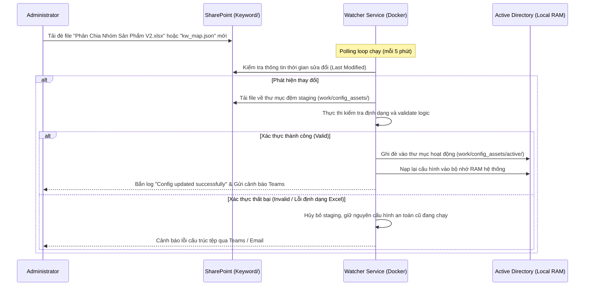

# 📘 HƯỚNG DẪN SỬ DỤNG VÀ QUẢN TRỊ HỆ THỐNG PHÂN LOẠI PHẢN HỒI DMS

Tài liệu này cung cấp hướng dẫn toàn diện từ mức vận hành cơ bản cho người dùng nghiệp vụ đến mức thiết lập nâng cao, cấu hình tích hợp và xử lý sự cố cho quản trị viên hệ thống của **DMS Feedback Classification Service** (Hệ thống tự động phân loại ý kiến phản hồi từ khách hàng và thị trường của Rạng Đông).

---

## 📌 MỤC LỤC
1. [Giới Thiệu Chung & Đối Tượng Sử Dụng](#1-giới-thiệu-chung--đối-tượng-sử-dụng)
   - 1.1. Mục đích hệ thống
   - 1.2. Đối tượng sử dụng
   - 1.3. Giải thích thuật ngữ cốt lõi
2. [Hướng Dẫn Cài Đặt Chi Tiết](#2-hướng-dẫn-cài-đặt-chi-tiết)
   - 2.1. Yêu cầu hệ thống tối thiểu
   - 2.2. Cách 1: Chạy trực tiếp cục bộ (Bare-metal với Makefile)
   - 2.3. Cách 2: Chạy bằng Docker & Docker Compose (Khuyên dùng)
3. [Hướng Dẫn Vận Hành Cho Người Dùng (Normal User Guide)](#3-hướng-dẫn-vận-hành-cho-người-dùng-normal-user-guide)
   - 3.1. Tổng quan giao diện Web Dashboard
   - 3.2. Hướng dẫn phân loại tệp Excel và theo dõi tiến trình trực tiếp
   - 3.3. Hiểu cấu trúc tệp Excel đầu ra và cơ chế chèn cột an toàn
   - 3.4. Định nghĩa chi tiết 8 nhóm lớn và 21 nhãn phân loại con
4. [Hướng Dẫn Dành Cho Quản Trị Viên (Administrator Guide)](#4-hướng-dành-cho-quản-trị-viên-administrator-guide)
   - 4.1. Bảng giải thích chi tiết toàn bộ biến môi trường (.env)
   - 4.2. Thiết lập quyền ứng dụng trên Azure AD (Microsoft Entra ID)
   - 4.3. Cấu hình khóa tài khoản dịch vụ Google Vertex AI
   - 4.4. Cơ chế đồng bộ ngược (Reverse-sync) cấu hình từ SharePoint
   - 4.5. Luật so khớp từ khóa và xử lý ranh giới nhãn
   - 4.6. Thiết lập cảnh báo MS Teams và email dự phòng
5. [Lệnh Vận Hành & Bảo Trì Hệ Thống (Operations & Maintenance)](#5-lệnh-vận-hành--bảo-trì-hệ-thống-operations--maintenance)
   - 5.1. Bảng lệnh Makefile
   - 5.2. Quản lý Docker Containers
   - 5.3. Cơ chế Checkpoint tự phục hồi
   - 5.4. Chính sách dọn dẹp bộ nhớ đệm và lưu trữ logs
   - 5.5. Phục hồi lịch sử thống kê (Reconstruct History)

---

## 1. GIỚI THIỆU CHUNG & ĐỐI TƯỢNG SỬ DỤNG

### 1.1. Mục đích hệ thống
Trong hoạt động kinh doanh của Rạng Đông, lượng ý kiến phản hồi (feedback) gửi về từ thị trường, đại lý và đội ngũ bán hàng là vô cùng lớn. Việc phân loại thủ công tốn nhiều công sức và dễ sai lệch. Hệ thống **DMS Feedback Classification Service** ra đời nhằm tự động hóa quy trình:
1. **Quét dữ liệu nền**: Liên tục kiểm tra thư mục `Input/` trên SharePoint hoặc nhận tệp trực tiếp qua Web UI.
2. **RAG Product Matching**: Trích xuất cụm sản phẩm đề cập trong câu phản hồi và dùng công cụ tìm kiếm thông tin BM25 kết hợp so khớp khoảng cách Levenshtein (`RapidFuzz`) để ánh xạ chính xác về danh mục model chính thức.
3. **Phân loại đa nhãn Pure-LLM**: Sử dụng Gemini 2.5 Flash Lite để phân loại ý kiến phản hồi thành **21 nhãn chi tiết** (thuộc **8 nhóm lớn**) bằng cơ chế lập luận chuỗi suy nghĩ (Chain-of-Thought) bắt buộc đầu ra JSON.
4. **Báo cáo và Cảnh báo**: Trả về tệp kết quả Excel định dạng chuyên nghiệp lên SharePoint, đồng thời bắn cảnh báo tức thời qua Microsoft Teams Webhook hoặc Email tự động.

### 1.2. Đối tượng sử dụng
* **Người dùng nghiệp vụ (Operator / Business User)**: Nhân viên quản lý chất lượng, bộ phận dịch vụ khách hàng hoặc quản trị dữ liệu. Họ sử dụng Web Dashboard để tải tệp lên trực tiếp, kiểm thử nhanh các văn bản phản hồi và giám sát tiến trình.
* **Quản trị viên hệ thống (Sysadmin / DevOps)**: Kỹ sư chịu trách nhiệm duy trì hạ tầng máy chủ, cấu hình biến môi trường, thiết lập khóa bảo mật GCP/Azure và giám sát logs.

### 1.3. Giải thích thuật ngữ cốt lõi
* **Polling (Quét chu kỳ)**: watcher quét định kỳ (mặc định 5 phút) để phát hiện sự thay đổi trên SharePoint.
* **RAG Product Matching (Bộ khớp sản phẩm)**: Kỹ thuật truy xuất kết hợp (Retrieval-Augmented Generation) dùng thuật toán BM25 và Levenshtein để so sánh các tên viết tắt, tên sai chính tả với danh mục sản phẩm chính thức nhằm quy đổi về đúng Model, Dòng SP.
* **Guardrails (Quy tắc kiểm soát)**: Các quy tắc hậu xử lý bằng code Python nhằm đảm bảo tính hợp lệ logic của nhãn (ví dụ: chỉ cho phép nhãn đối thủ khi xác định được brand là đối thủ, hoặc xóa nhãn "Tin trung lập" nếu có bất kỳ nhãn lỗi nào khác được kích hoạt).
* **Checkpoint Recovery (Phục hồi điểm kiểm tra)**: Lưu lại trạng thái xử lý sau mỗi block `CKPT_EVERY` dòng để nếu máy chủ mất điện hay API bị ngắt, watcher có thể chạy tiếp từ dòng bị kẹt mà không cần xử lý lại từ đầu.
* **Reverse-sync (Đồng bộ ngược)**: Khả năng tự động phát hiện cập nhật trong tệp từ khóa sản phẩm trên SharePoint để tải về, validate cấu trúc và tải nóng vào bộ nhớ chạy nền mà không cần restart máy chủ.

---

## 2. HƯỚNG DẪN CÀI ĐẶT CHI TIẾT

### 2.1. Yêu cầu hệ thống tối thiểu
* **Hệ điều hành**: Windows 10/11, Windows Server 2019+ hoặc Linux (Ubuntu 20.04+, CentOS 8+).
* **Python**: Phiên bản **3.11** hoặc **3.12** (bắt buộc đối với cài đặt cục bộ).
* **Docker & Docker Compose**: Phiên bản Engine 24.0+, Compose v2.20+.
* **Phần cứng**: Tối thiểu 2 vCPUs và 4 GB RAM (khuyên dùng 8 GB RAM trở lên).

---

### 2.2. Cách 1: Chạy trực tiếp cục bộ (Bare-metal với Makefile)

Phương pháp này phù hợp cho môi trường kiểm thử (Staging) hoặc phát triển (Development).

#### Bước 1: Tải mã nguồn dự án
Mở terminal (PowerShell hoặc Bash) và chạy lệnh:
```bash
git clone https://github.com/ThanhDT127/dms-feedback-classification.git
cd dms-feedback-classification
```

#### Bước 2: Khởi tạo và kích hoạt môi trường ảo
```powershell
# Trên Windows:
python -m venv .venv
.venv\Scripts\activate

# Trên Linux/macOS:
python3 -m venv .venv
source .venv/bin/activate
```

#### Bước 3: Cài đặt các thư viện phụ thuộc bằng Makefile
```bash
make setup
```
*(Nếu không có công cụ make trên Windows, thực thi thủ công: `pip install -r service/requirements.txt`)*

#### Bước 4: Thiết lập tệp cấu hình `.env`
Sao chép tệp mẫu từ thư mục dự án và chỉnh sửa:
```bash
cp .env.example .env
```
Mở tệp `.env` bằng trình chỉnh sửa (Notepad, VS Code) và điền đầy đủ các thông số thực tế (Xem chi tiết ở mục [4.1](#41-bảng-giải-thích-chi-tiết-toàn-bộ-biến-môi-trường-env)).

#### Bước 5: Chạy thử luồng xử lý cục bộ với tệp mẫu
```bash
# Đảm bảo có sẵn tệp mẫu trong thư mục Input/ hoặc sample_data/
make run FILE=sample_data/sample_feedback.xlsx
```

---

### 2.3. Cách 2: Chạy bằng Docker & Docker Compose (Khuyên dùng)

Đây là phương thức triển khai tiêu chuẩn cho môi trường sản xuất (Production) giúp cách ly môi trường và dễ dàng quản lý dịch vụ chạy ngầm.

#### Sơ đồ ánh xạ tài nguyên từ Host vào Docker Container:
```text
[Máy Chủ Vật Lý Host]                                [Docker Container]
├── service/.env ──────────────────────────────────> /app/.env (Cấu hình hệ thống)
├── service/testvertex.json ───────────────────────> /app/data/sa-key.json (Khóa GCP)
├── service/Keyword/ (Read-only) ──────────────────> /app/data/Keyword/ (Bộ từ khóa sản phẩm)
├── service/Model/ (Read-only) ────────────────────> /app/data/Model/ (Legacy Model pkl)
├── service/work/ (Read-Write) ────────────────────> /app/data/work/ (Checkpoints, states)
└── service/logs/ (Read-Write) ────────────────────> /app/data/logs/ (Logs hoạt động)
```

#### Bước 1: Sao chép tệp cấu hình trong thư mục dịch vụ
Di chuyển vào thư mục `service/` và sao chép cấu hình:
```bash
cd dms-feedback-classification/service
cp .env.example .env
```

#### Bước 2: Thiết lập thông tin xác thực
* Chỉnh sửa tệp `service/.env` (điền các thông số Azure AD, SharePoint và Gemini API).
* Đặt tệp JSON khóa dịch vụ Google Cloud Platform của bạn vào thư mục `service/testvertex.json` (nếu cấu hình `GEMINI_BACKEND=vertex`).

#### Bước 3: Khởi động hệ thống Docker Compose
```bash
docker compose up -d --build
```

#### Bước 4: Kiểm tra trạng thái các Container đang chạy
```bash
docker compose ps
```
Hệ thống sẽ chạy hai container độc lập:
1. `dms-feedback-watcher`: Xử lý quét nền SharePoint, đồng bộ cấu hình và chạy pipeline.
2. `dms-feedback-web`: Cung cấp giao diện Web Dashboard quản lý tại cổng `8501`.

#### Bước 5: Xem log khởi động để xác nhận hoạt động bình thường
```bash
docker compose logs -f
```
Đảm bảo không có lỗi kết nối nào đến SharePoint và log hiển thị `Composition root ready`.

---

## 3. HƯỚNG DẪN VẬN HÀNH CHO NGƯỜI DÙNG (NORMAL USER GUIDE)

### 3.1. Tổng quan giao diện Web Dashboard
Giao diện Web Dashboard được xây dựng bằng thiết kế Single Page App tối giản, chạy tại địa chỉ mặc định **`http://localhost:8501`**.

```text
┌────────────────────────────────────────────────────────────────────────────┐
│  ⚡ DMS Phân Loại Phản Hồi                                   [STATUS: RUNNING] │
├─────────────────┬──────────────────────────────────────────────────────────┤
│ 📊 Tổng quan    │                      TRANG CHỦ HỆ THỐNG                  │
│ 📂 Quản lý file │  ┌────────────────────────────────────────────────────┐  │
│ ⚡ Phân loại    │  │  Uptime: 14 ngày | Files: 1,240 | Success: 99.8%  │  │
│ ⚙️ Cài đặt       │  └────────────────────────────────────────────────────┘  │
│ 📈 Thống kê     │  * Biểu đồ cột: Số lượng tệp Excel đã xử lý theo ngày   │
│ 🔍 Visual QA    │  * Biểu đồ tròn: Tỉ lệ phần trăm phân bố của 21 nhãn     │
└─────────────────┴──────────────────────────────────────────────────────────┘
```

#### Các Tab chức năng chính:
* **📊 Tổng quan (Dashboard)**: Hiển thị các chỉ số sức khỏe hệ thống (Uptime, Tỉ lệ thành công, Tổng số file) và biểu đồ phân bổ nhãn lỗi trên thị trường theo thời gian.
* **📂 Quản lý file (Files)**: Duyệt trực tiếp các thư mục cục bộ của ứng dụng (`input`, `output`, `checkpoint`, `keyword`, `model`). Admin có thể xem trạng thái các file đã quét qua `seen_files.json`, tải xuống hoặc xóa file tạm trên đĩa.
* **⚡ Phân loại (Classify)**:
  * *Single Text*: Nhập một câu nhận xét bất kỳ để chạy phân loại thử nghiệm tức thời, xem log giải thích lý do (decision log) của AI.
  * *Manual Classify*: Kéo thả tệp Excel từ máy tính để phân loại thủ công ngoài luồng SharePoint.
* **⚙️ Cài đặt (Settings)**: Thay đổi trực tiếp các tham số `.env`, chỉnh sửa prompt hệ thống của AI và thực hiện test kết nối tới Gemini API.
* **🔍 Visual QA**: Trực quan hóa các kịch bản kiểm thử, so khớp logic hoạt động của quy luật từ khóa.

---

### 3.2. Hướng dẫn phân loại tệp Excel và theo dõi tiến trình trực tiếp

Khi có nhu cầu phân loại nhanh một tệp Excel mà không muốn chờ chu kỳ Polling SharePoint, người dùng có thể thực hiện trực tiếp trên Web UI:

```text
┌────────────────────────────────────────────────────────┐
│  Kéo thả tệp Excel dữ liệu phản hồi vào đây (.xlsx)     │
│  [ [ 📁 Bao_cao_gop_y_tuan_26.xlsx ] ]                 │
├────────────────────────────────────────────────────────┤
│  ▶️ RUN CLASSIFICATION PIPELINE                         │
├────────────────────────────────────────────────────────┤
│  Tiến độ: ████████████████░░░░░░░░░░ 60% (120/200 dòng) │
│                                                        │
│  Console Logs:                                         │
│  [15:52:10] Đang tải mô hình sản phẩm RAG...           │
│  [15:52:12] Đang xử lý dòng 101 - 120...                │
│  [15:52:14] Đã ghi nhận checkpoint dòng 120 thành công. │
└────────────────────────────────────────────────────────┘
```

#### Quy trình chi tiết:
1. Truy cập trang **⚡ Phân loại** trên Dashboard.
2. Tại khu vực **Manual File Classification**, kéo thả hoặc nhấn chọn tệp Excel của bạn (phải có cột chứa văn bản phản hồi, ví dụ cột có tên `"Nội dung phản hồi"`).
3. Nhấn nút **Trigger Classify / Run Pipeline**.
4. Theo dõi **Thanh tiến trình (Progress Bar)** hiển thị phần trăm hoàn thành và số dòng hiện tại đang xử lý theo thời gian thực.
5. Xem trực tiếp luồng log hệ thống hiển thị trong khung console phía dưới (được stream trực tiếp qua WebSocket từ tiến trình chạy nền).
6. Khi tiến độ đạt 100%, nút **Download Results** màu xanh lá sẽ sáng lên. Click vào nút này để tải tệp Excel đã làm giàu thông tin về máy.

---

#### Ý nghĩa trạng thái job phân loại thủ công

Khi tải file Excel lên ở tab **Phân loại > Một file**, hệ thống tạo một job bền vững. Nếu tải lại trình duyệt hoặc chuyển tab, UI sẽ khôi phục trạng thái job từ máy chủ.

| Trạng thái | Ý nghĩa | Người dùng cần làm gì |
| --- | --- | --- |
| `queued` | File đã được nhận và đang chờ tới lượt xử lý. Nếu `retry_count > 0`, đây là job đang chờ chạy lại. | Chờ hệ thống chuyển sang `running`; không cần upload lại file. |
| `running` | Pipeline đang xử lý workbook. | Theo dõi progress bar, số dòng đã xử lý, step hiện tại và các batch kết quả. |
| `completed` | Job đã hoàn tất và file output đã sẵn sàng. | Bấm **Tải file kết quả**; nếu có link SharePoint thì có thể mở trực tiếp. |
| `error` | Job thất bại trong quá trình xử lý. | Đọc thông báo lỗi ngắn. Người dùng thường nên thử lại với file khác hoặc liên hệ admin để retry job. |
| `cancelled` | Job đã bị hủy trước khi hoàn tất. | Progress sẽ dừng. Có thể chọn file khác; admin có thể retry nếu file input vẫn còn. |

Nút **Dừng/Hủy** trên job đang chờ sẽ hủy ngay. Với job đang chạy, hệ thống ghi nhận yêu cầu hủy và worker sẽ dừng ở ranh giới batch an toàn kế tiếp rồi chuyển sang `cancelled`. Job đã `completed`, `error`, hoặc `cancelled` không tiếp tục nhận progress WebSocket cũ; trạng thái terminal từ máy chủ luôn được ưu tiên.

---

### 3.3. Hiểu cấu trúc tệp Excel đầu ra và cơ chế chèn cột an toàn
Để bảo toàn cấu trúc tệp Excel ban đầu của người dùng nghiệp vụ và tránh hiện tượng lệch hàng dữ liệu, hệ thống áp dụng cơ chế **Zero Row-Shifting**:

1. **Định vị cột gốc**: Hệ thống tự động quét và định vị cột chứa văn bản phản hồi thô (ví dụ: cột số 3).
2. **Chèn cột an toàn**: Hệ thống chèn thêm các cột thông tin sản phẩm (`Sản phẩm`, `Dòng SP`, `Model`, `Lớp`, `Điểm`) ngay bên cạnh cột văn bản phản hồi này. Cột `Lớp` và `Điểm` được giữ lại trống để đảm bảo tương thích cấu trúc.
3. **Thêm cột nhãn lỗi**: Hệ thống bổ sung 21 cột tương ứng với các nhãn lỗi và các cột bổ trợ (`Sentiment`, `LLM_Extracted`, `BM25_Score`) vào cuối bảng Excel.
4. **Vị trí hàng không đổi**: Các phản hồi ở hàng $N$ của file gốc sẽ nằm chính xác ở hàng $N$ trong file kết quả, không bị dịch chuyển lên xuống.

#### Định dạng Header trực quan:
Header của tệp Excel kết quả sử dụng thiết kế 2 dòng gộp (Merged Header), trong đó dòng trên hiển thị **Nhóm lớn** (tô màu nhận diện riêng biệt) và dòng dưới hiển thị **Nhãn phân loại chi tiết**:

* Cột nhãn phân loại nào được kích hoạt sẽ được đánh dấu chữ **`x`** viết thường. Cột nào không kích hoạt sẽ được bỏ trống giúp lọc và xem dữ liệu cực kỳ dễ dàng.

---

### 3.4. Định nghĩa chi tiết 8 nhóm lớn và 21 nhãn phân loại con

Dưới đây là bảng đặc tả ranh giới ngữ nghĩa của 21 nhãn phân loại theo thiết kế chuẩn của hệ thống:

| Nhóm lớn (Major Class) | Nhãn chi tiết (Minor Class) | Định nghĩa & Ranh giới áp dụng | Từ khóa gợi ý tiêu biểu |
| :--- | :--- | :--- | :--- |
| **Sản phẩm** | Báo lỗi | Sản phẩm vật lý bị lỗi kỹ thuật, hỏng hóc, cháy, chập, không sáng, rò điện, nứt vỡ. Không dùng cho phàn nàn thiết kế vỏ mỏng/chân phích vướng. | *hỏng, cháy, không sáng, chập, nứt vỡ, đứt bóng, lệch ren* |
| | Báo CL tốt | Khen ngợi chất lượng sản phẩm bền, sáng tốt, ổn định, khách hàng tin dùng. | *tốt, bền, sáng đẹp, chất lượng tốt, hài lòng, tin dùng* |
| | Y/c cải tiến | Góp ý, phàn nàn về thiết kế, kích thước vỏ nhựa, độ dày thanh đồng, bao bì của sản phẩm **HIỆN CÓ** (như làm dây dài thêm, phích cắm nhỏ lại). | *vỏ hơi mỏng, phích to quá, dây ngắn, cải tiến mẫu mã, khó cắm* |
| | Đề xuất SPM | Đề nghị sản xuất hoặc bán thêm dòng sản phẩm **MỚI** chưa từng có trên thị trường. | *sản xuất thêm, ra thêm loại, thêm mã mới, ra mắt thêm* |
| **Yêu cầu công cụ BH** | Bảng giá, Catalogue | Yêu cầu gửi bảng giá, catalogue giấy/file mềm để gửi khách xem. | *catalogue, bảng giá, xin báo giá, catalogue mới* |
| | Bảng biển | Yêu cầu hỗ trợ làm biển quảng cáo, biển hiệu cửa hàng, POSM treo. | *làm biển, lắp biển, biển hiệu, bảng hiệu, biển led* |
| | Kệ bóng, thử đèn,… | Yêu cầu cung cấp kệ trưng bày sản phẩm, tủ thử bóng, bảng demo. | *kệ bóng, tủ thử, kệ trưng bày, bảng thử đèn, kệ thử* |
| | Khác | Yêu cầu công cụ bán hàng khác ngoài 3 loại trên (áo phông, tờ rơi, sổ...). | *áo đồng phục, tờ rơi, poster, sổ tay ghi chép* |
| **Giá, cơ chế RD** | Tốt/ ko tốt | Nhận xét về mức giá/chiết khấu của Rạng Đông (đắt, rẻ, khó bán do giá cao). | *giá đắt, giá cao, khó bán, chiết khấu thấp, giá tốt, cạnh tranh* |
| | Trả thưởng | Phàn nàn hoặc hỏi về tiền thưởng, chương trình quay số, tích điểm C2TD, nợ thưởng. | *tiền thưởng, nợ thưởng, c2td, trả thưởng chậm, tích điểm* |
| | Đề xuất | Đề nghị thay đổi chính sách chiết khấu, chương trình khuyến mãi chung của RĐ. | *tăng chiết khấu, có thêm khuyến mãi, đổi cơ chế giá* |
| **Dịch vụ** | Bảo hành | Phàn nàn về quy trình đổi trả, trả hàng bảo hành chậm, thái độ nhân viên bảo hành (tập trung vào chất lượng dịch vụ bảo hành). | *đổi trả chậm, bảo hành lâu, chưa thấy trả bảo hành, thủ tục bh* |
| | HTPP | Tranh chấp kênh phân phối, đại lý C1/C2 bán lấn vùng, phá giá sản phẩm. | *phá giá, lấn vùng, c1 phá giá, tràn vùng, tranh giành khách* |
| | Hàng hoá | Vấn đề kho vận: giao thiếu hàng, giao chậm, đóng gói vỡ hỏng trong lúc ship. | *giao chậm, thiếu hàng, giao nhầm mã, móp hộp khi vận chuyển* |
| **Hàng giả** | Hàng giả | Nghi ngờ hoặc phát hiện sản phẩm nhái thương hiệu, giả danh Rạng Đông. | *hàng nhái, giả mạo, hàng giả, giống nhái, làm giả* |
| **Website** | Website | Lỗi phần mềm quản lý, app DMS, trang portal của đại lý bị đơ, không lên đơn. | *lỗi app, dms bị lỗi, portal đơ, không đăng nhập được* |
| **Đối thủ cạnh tranh** | Hãng | Đề cập đến tên thương hiệu đối thủ cạnh tranh. | *Sopoka, Philips, Asia, Paragon, Duhal, Điện Quang* |
| | Hoạt động | Hoạt động marketing, sự kiện, tặng quà của đối thủ. | *đối thủ roadshow, hãng khác tặng quà, đối thủ tặng tủ* |
| | CTKM, giá, cơ chế | Giá bán, chiết khấu hoặc khuyến mại của đối thủ. | *hãng khác giá rẻ hơn, chiết khấu của đối thủ cao* |
| | TT SP | Thông tin sản phẩm, mẫu mã, thông số kỹ thuật của đối thủ. | *bóng của hãng khác mỏng hơn, thiết kế đối thủ đẹp* |
| **Tin trung lập** | Tin trung lập | Câu nói không chứa thông tin phản hồi nghiệp vụ, câu chào hỏi hoặc câu vô nghĩa. | *chào em, cảm ơn, không có ý kiến gì, bình thường* |

---

## 4. HƯỚNG DẪN DÀNH CHO QUẢN TRỊ VIÊN (ADMINISTRATOR GUIDE)

### 4.1. Bảng giải thích chi tiết toàn bộ biến môi trường (.env)

Tất cả các thiết lập của dịch vụ được kiểm soát bởi tệp cấu hình `.env` đặt tại thư mục chạy dự án. Dưới đây là danh sách đầy đủ tất cả các biến môi trường cấu hình:

| Tên biến cấu hình | Giá trị mặc định | Bắt buộc? | Mô tả chi tiết chức năng và các bí danh (alias) |
| :--- | :--- | :---: | :--- |
| **AZURE_TENANT_ID** | *(Trống)* | Có | Tenant ID của tài khoản Microsoft Azure Entra ID doanh nghiệp. |
| **AZURE_CLIENT_ID** | *(Trống)* | Có | Client ID của ứng dụng (App Registration) đăng ký trên Azure AD. |
| **AZURE_CLIENT_SECRET**| *(Trống)* | Có | Client Secret Key dùng để lấy Token kết nối Graph API. |
| **SHAREPOINT_DRIVE_ID**| *(Trống)* | Có | ID của Document Library SharePoint nơi lưu trữ tài nguyên và dữ liệu. |
| **SHAREPOINT_ROOT_FOLDER_ID**| *(Trống)* | Có | ID thư mục gốc của dự án trên SharePoint. |
| **SHAREPOINT_KEYWORD_FOLDER**| `Keyword` | Không | Tên thư mục trên SharePoint chứa cấu hình từ khóa và catalog sản phẩm. |
| **SHAREPOINT_MODEL_FOLDER**| `Model` | Không | Tên thư mục trên SharePoint chứa các mô hình phân loại (nếu có). |
| **GEMINI_BACKEND** | `vertex` | Không | Chọn thư viện API: `vertex` (Google Cloud Vertex AI) hoặc `apikey` (Gemini API Key). |
| **GEMINI_API_KEY** | *(Trống)* | Không | Khóa API cá nhân (Bắt buộc nếu thiết lập `GEMINI_BACKEND=apikey`). |
| **GEMINI_MODEL** | `gemini-2.5-flash-lite` | Không | Phiên bản mô hình Gemini sử dụng để phân tích dữ liệu. |
| **GCP_PROJECT_ID** | *(Trống)* | Không | Project ID trên GCP (Bắt buộc nếu thiết lập `GEMINI_BACKEND=vertex`). |
| **GCP_LOCATION** | `global` | Không | Phân vùng máy chủ gọi API Vertex AI (ví dụ: `global`, `us-central1`). |
| **GCP_SERVICE_ACCOUNT_JSON**| `/app/data/sa-key.json`| Không | Đường dẫn trong container tới tệp key JSON tài khoản dịch vụ của GCP. |
| **POLL_INTERVAL_SECONDS**| `300` | Không | Chu kỳ quét SharePoint (giây). Mặc định 5 phút quét một lần. |
| **LLM_BATCH_SIZE** | `20` | Không | Số dòng phản hồi gửi đồng thời sang Gemini trong một batch (lô). |
| **CKPT_EVERY** | `50` | Không | Tần suất ghi checkpoint và ghi kết quả tạm xuống đĩa (số dòng). |
| **GEMINI_TIMEOUT_SECONDS**| `120.0` | Không | Thời gian timeout tối đa cho một phiên kết nối Gemini API (giây). |
| **RATE_GAP_SEC** / **RATE_LIMIT_GAP**| `4.0` | Không | Thời gian nghỉ bắt buộc giữa các lô gọi API (giây). Lưu ý: Pydantic Settings đọc `RATE_GAP_SEC` hoặc `rate_gap_sec` từ môi trường; giao diện Web UI lưu tham số này vào file `.env` dưới tên `RATE_LIMIT_GAP`. Cả hai đều được chấp nhận. |
| **BASE_WAIT** | `4.0` | Không | Thời gian chờ cơ bản (giây) cho cơ chế exponential backoff khi gọi API lỗi. |
| **MAX_RETRY** | `3` | Không | Số lần thử lại tối đa khi API gặp sự cố hoặc bị giới hạn băng thông (rate limit). |
| **BM25_MIN_SCORE** | `5.0` | Không | Ngưỡng điểm tối thiểu để chấp nhận kết quả trích xuất model của RAG. |
| **HTTP_TIMEOUT_SECONDS**| `30.0` | Không | Thời gian chờ tối đa cho các request HTTP thông thường (giây). |
| **ENABLE_RUNTIME_CLEANUP**| `false` | Không | Tự động xóa file input/output cục bộ sau khi đã đẩy lên SharePoint thành công. |
| **CLEANUP_OUTPUT_TTL_DAYS**| `7` | Không | Số ngày tối đa giữ file Excel kết quả tạm cục bộ trên đĩa. |
| **CLEANUP_LOG_TTL_DAYS**| `7` | Không | Số ngày lưu trữ các tệp logs hoạt động của hệ thống. |
| **CLEANUP_STAGING_TTL_HOURS**| `24` | Không | Thời gian lưu giữ các thư mục staging cấu hình tải về khi cập nhật nóng. |
| **ENABLE_SHAREPOINT_CONFIG_SYNC**| `true` | Không | Bật tính năng quét và tải nóng danh mục từ khóa từ SharePoint trước mỗi chu kỳ. |
| **TEAMS_WEBHOOK_URL** | *(Trống)* | Không | URL Webhook MS Teams để nhận thông báo kết quả qua thẻ Adaptive Cards. |
| **NOTIFICATION_SENDER_EMAIL**| *(Trống)* | Không | Email tài khoản gửi tin nhắn báo cáo (phải thuộc Azure Tenant). |
| **NOTIFICATION_RECIPIENTS**| *(Trống)* | Không | Danh sách các email nhận báo cáo kết quả (ngăn cách bằng dấu phẩy). |
| **NOTIFY_ON_SUCCESS** | `true` | Không | Gửi email báo cáo khi hoàn thành file Excel thành công. |
| **NOTIFY_ON_ERROR** | `true` | Không | Kích hoạt email cảnh báo lập tức nếu watcher phát sinh lỗi đột ngột. |
| **CORS_ALLOWED_ORIGINS**| `*` | Không | Danh sách nguồn gốc CORS được phép truy cập API Web (Default: `*`). |
| **DATA_DIR** | *(Gốc dự án)* | Không | Đường dẫn thư mục lưu trữ dữ liệu chung của ứng dụng. |
| **WORK_DIR** | `work/` | Không | Thư mục cục bộ dùng lưu trữ input/output tạm và checkpoint. |
| **LOG_DIR** | `logs/` | Không | Thư mục cục bộ dùng lưu trữ tệp logs. |

> [!NOTE]
> Các biến môi trường liên quan đến mô hình Machine Learning Baseline cũ (như `ovr_logreg_path`, `label_cols_path`, v.v.) và biến `SHAREPOINT_SITE_URL` hiện tại không còn tham gia vào luồng phân loại chính nhưng được giữ lại trong cấu hình để đảm bảo khả năng tương thích ngược. Mặc dù ML Baseline đã bị loại bỏ để chuyển hoàn toàn sang Pure-LLM, cấu hình vẫn giữ các khai báo này ở dạng tùy chọn (`required=False`) để không gây lỗi khởi tạo hệ thống.

---

### 4.2. Thiết lập quyền ứng dụng trên Azure AD (Microsoft Entra ID)

Dịch vụ chạy ngầm không có sự tương tác trực tiếp của người dùng, do đó luồng xác thực bắt buộc phải sử dụng **Client Credentials Flow** (Application Token).

1. Truy cập trang quản trị [Azure Portal](https://portal.azure.com/).
2. Chọn **Microsoft Entra ID** > **App registrations** > Tạo một đăng ký ứng dụng mới.
3. Đi tới **API permissions** > Click **Add a permission** > Chọn **Microsoft Graph**.
4. Chọn nhóm **Application permissions** (Quyền ứng dụng) và tích chọn 2 quyền sau:
   * **`Files.ReadWrite.All`**: Cho phép đọc/ghi các file Excel trong thư viện SharePoint Document Library.
   * **`Mail.Send`**: Cho phép gửi email báo cáo tiến trình bằng tài khoản người dùng chỉ định.
5. **QUAN TRỌNG**: Sau khi thêm quyền, Admin của Tenant phải click vào nút **"Grant admin consent for [Tên tổ chức]"** để xác nhận cấp quyền cho ứng dụng. Nếu thiếu bước này, ứng dụng sẽ bị từ chối truy cập (Lỗi `Access Denied`).

---

### 4.3. Cấu hình khóa tài khoản dịch vụ Google Vertex AI

Khi chạy backend LLM qua Vertex AI, bạn cần cấu hình tài khoản dịch vụ của Google Cloud:

1. Bật **Vertex AI API** trong dự án GCP của bạn.
2. Tạo một **Service Account** và cấp quyền **Vertex AI User** (`roles/aiplatform.user`).
3. Tạo và tải xuống khóa tài khoản dịch vụ định dạng **JSON**.
4. Đổi tên tệp này thành **`testvertex.json`** và đặt vào thư mục chạy ứng dụng (đối với Docker, nó sẽ tự động được mount thành `/app/data/sa-key.json` như định nghĩa trong `docker-compose.yml`).

---

### 4.4. Cơ chế đồng bộ ngược (Reverse-sync) cấu hình từ SharePoint

Để hỗ trợ cập nhật danh mục sản phẩm hoặc từ khóa loại trừ mà không cần can thiệp vào máy chủ, hệ thống tự động quét và cập nhật nóng (Hot-reload) tài nguyên cấu hình:



---

### 4.5. Luật so khớp từ khóa và xử lý ranh giới nhãn
Hệ thống sử dụng các quy tắc kiểm soát logic nghiêm ngặt (Guardrails) để hạn chế tối đa sai sót của mô hình ngôn ngữ lớn:

* **Logic Thương hiệu và Đối thủ**:
  * Nếu phát hiện tên thương hiệu đối thủ cạnh tranh trong phản hồi (`brand` khác Rạng Đông và không rỗng), hệ thống bắt buộc kích hoạt nhãn **`Hãng`** và cho phép áp dụng các nhãn đối thủ khác (`Hoạt động`, `CTKM, giá, cơ chế`, `TT SP`).
  * Nếu không phát hiện thương hiệu đối thủ, hệ thống sẽ xóa toàn bộ các nhãn đối thủ khỏi kết quả và buộc cột `Brand` trả về rỗng để giữ tệp sạch sẽ.
* **Quy luật Tin trung lập**:
  * Nhãn **`Tin trung lập`** chỉ được phép tồn tại duy nhất. Nếu AI vừa gắn nhãn `Tin trung lập` vừa gắn thêm một nhãn lỗi nào khác (ví dụ: `Báo lỗi`), hệ thống tự động loại bỏ nhãn `Tin trung lập` ra khỏi dòng dữ liệu đó.
* **Spell Guard (Lọc từ viết tắt và sai chính tả)**:
  * Hệ thống tích hợp sẵn bộ kiểm tra từ viết tắt trong prompt để tránh bắt nhầm từ khóa đơn lẻ. Ví dụ: từ `"bh"` được hiểu là bảo hành, `"km"` là khuyến mại. Đặc biệt, từ viết sai chính tả `"tin thưởng"` hoặc `"tin thưởng"` (thực chất là "tin tưởng") được khai báo rõ ràng để hệ thống tuyệt đối không bắt nhầm sang nhãn **`Trả thưởng`**.

---

### 4.6. Thiết lập cảnh báo MS Teams và email dự phòng

Hệ thống có cơ chế cảnh báo thông minh 2 lớp để đảm bảo Admin luôn kiểm soát được trạng thái vận hành:

1. **Kênh ưu tiên - Microsoft Teams Webhook**:
   * Khi hoàn thành một tệp Excel, watcher định kỳ gửi một **Adaptive Card** định dạng đẹp mắt chứa bảng số liệu phân bổ nhãn lỗi và thời gian xử lý tới kênh Teams qua địa chỉ `TEAMS_WEBHOOK_URL`.
2. **Kênh dự phòng - Graph API Email Fallback**:
   * Nếu không cấu hình `TEAMS_WEBHOOK_URL` hoặc kết nối gửi sang Teams bị lỗi, hệ thống tự động chuyển sang cơ chế gửi email thông báo HTML.
   * Email được gửi bằng phương thức POST tới Graph API `/users/{sender}/sendMail` bằng quyền ứng dụng `Mail.Send` từ địa chỉ gửi `NOTIFICATION_SENDER_EMAIL` tới danh sách người nhận trong `NOTIFICATION_RECIPIENTS`.

---

## 5. LỆNH VẬN HÀNH & BẢO TRÌ HỆ THỐNG (OPERATIONS & MAINTENANCE)

### 5.1. Bảng lệnh Makefile
Nếu chạy ứng dụng trên môi trường bare-metal, các lệnh sau đây giúp tối ưu hóa việc quản trị:

| Lệnh thực thi | Mô tả chức năng |
| :--- | :--- |
| `make setup` | Cài đặt toàn bộ dependencies trong file `requirements.txt` vào virtual env. |
| `make test` | Chạy bộ kiểm thử tự động `pytest` kiểm tra các API và logic phân loại. |
| `make run FILE=<path>`| Chạy pipeline phân loại thủ công với file Excel chỉ định cục bộ. |
| `make format` | Tự động định dạng và kiểm tra lỗi cú pháp mã nguồn bằng công cụ `ruff`. |
| `make clean` | Quét sạch các thư mục rác hệ thống phát sinh (`__pycache__`, `.pytest_cache`). |

---

### 5.2. Quản lý Docker Containers
Khi triển khai dịch vụ bằng Docker Compose, quản trị viên sử dụng các câu lệnh sau để vận hành:

```bash
# Khởi động toàn bộ dịch vụ chạy ngầm và thực hiện build lại image
docker compose up -d --build

# Dừng hệ thống container và giải phóng tài nguyên mạng
docker compose down

# Khởi động lại một dịch vụ cụ thể (Ví dụ: Web UI)
docker compose restart web

# Xem log thời gian thực của watcher quét SharePoint
docker compose logs -f watcher

# Kiểm tra mức độ tiêu thụ tài nguyên của các container
docker stats dms-feedback-watcher dms-feedback-web
```

---

### 5.3. Cơ chế Checkpoint tự phục hồi
Khi gặp sự cố (mất điện máy chủ, lỗi kết nối mạng, vượt quá hạn mức rate limit), tệp trạng thái checkpoint sẽ bảo vệ tiến độ xử lý:

* **Tệp Checkpoint cục bộ**: Lưu trữ tại thư mục `work/checkpoint/{job_id}.json` và được đồng bộ lên SharePoint thư mục `Check_Point/`.
* **Cấu trúc lưu trữ**: Lưu trữ chỉ mục dòng đã xử lý hoàn thành gần nhất (`last_index`) và danh sách kết quả tạm thời.
* **Cơ chế khôi phục**: Khi watcher hoặc container khởi động lại, hệ thống phát hiện có tệp checkpoint của file Excel tương ứng sẽ tự động đọc kết quả tạm thời và chỉ gửi các dòng từ `last_index + 1` trở đi sang Gemini API, giúp tránh mất mát dữ liệu và tiết kiệm chi phí Token tối đa.
* **Quản lý thủ công**: Admin có thể xóa tệp checkpoint bị kẹt trực tiếp qua trang **📂 Quản lý file** trên Dashboard để buộc hệ thống chạy lại tệp Excel đó từ đầu nếu cần.

---

### 5.4. Chính sách dọn dẹp bộ nhớ đệm và lưu trữ logs
Để tránh máy chủ bị tràn bộ nhớ đĩa cứng do lưu giữ nhiều file Excel tạm thời và logs lịch sử, hệ thống cung cấp luồng dọn dẹp tự động định kỳ được kiểm soát qua `.env`:

* Để kích hoạt dọn dẹp tự động, đặt biến `ENABLE_RUNTIME_CLEANUP=true`.
* **Logs Retention (`CLEANUP_LOG_TTL_DAYS=7`)**: Các tệp logs trong thư mục `logs/` có tuổi thọ vượt quá 7 ngày sẽ bị xóa tự động.
* **Outputs Retention (`CLEANUP_OUTPUT_TTL_DAYS=7`)**: Các file Excel kết quả trong thư mục cục bộ `work/output/` sẽ bị xóa sau 7 ngày kể từ lúc tạo thành công.
* **Staging Cleanup (`CLEANUP_STAGING_TTL_HOURS=24`)**: Các thư mục đệm staging dùng để tải về cấu hình từ SharePoint sẽ bị dọn sạch sau 24 giờ.

---

### 5.5. Phục hồi lịch sử thống kê (Reconstruct History)

> [!CAUTION]
> Docker container hoạt động ở chế độ **Stateless** (không lưu vĩnh viễn dữ liệu Excel kết quả cục bộ). Khi di chuyển hệ thống sang máy chủ mới hoặc xóa container, các biểu đồ thống kê nhãn lỗi trên Web Dashboard sẽ bị trống.

> [!WARNING]
> Tệp `seen_files.json` lưu giữ danh sách ID của các file Excel đã xử lý để tránh tải lại. Tập lệnh `reconstruct_history.py` đếm nhãn lỗi từ thư mục `Output/` để khôi phục biểu đồ trong `metrics.json`, nhưng **không** thể tự tạo lại danh sách ID tệp Excel gốc trong `seen_files.json` nếu tệp này bị xóa sạch (vì ID tệp được SharePoint sinh ngẫu nhiên). 
> 
> Do đó, **tuyệt đối KHÔNG xóa tệp `seen_files.json`** trừ khi bạn muốn ép hệ thống phân loại lại từ đầu toàn bộ các tệp Excel lịch sử. Nếu tệp cục bộ bị mất, hãy để container khởi động bình thường; watcher sẽ tự động tải checkpoint backup từ SharePoint `Check_Point/seen_files.json` về thư mục cục bộ trước khi chạy.

#### Quy trình phục hồi an toàn:

##### Bước 1: Dừng các container dịch vụ
```bash
cd dms-feedback-classification/service
docker compose down
```

##### Bước 2: Đảm bảo khôi phục tệp trạng thái registry `seen_files.json`
* Đảm bảo tệp `work/seen_files.json` hiện tại đang được giữ lại (hoặc được tải về từ thư mục `Check_Point/` trên SharePoint nếu cấu hình mới).
* Nếu chỉ muốn reset lại bộ đếm chỉ số biểu đồ, bạn chỉ cần xóa tệp `metrics.json` cục bộ:
  ```powershell
  # Trên Windows PowerShell:
  Remove-Item -Path .\work\metrics.json -ErrorAction Ignore
  
  # Trên Linux:
  rm -f work/metrics.json
  ```

##### Bước 3: Khởi động lại dịch vụ container
```bash
docker compose up -d
```
*(Lúc này watcher khởi động, nếu phát hiện thiếu metrics.json hoặc seen_files.json, nó sẽ tự động tải bản backup từ SharePoint về trước).*

##### Bước 4: Thực thi tập lệnh khôi phục lịch sử
Chạy tập lệnh trực tiếp trong container `watcher` để quét SharePoint, tải tạm các tệp kết quả từ thư mục `Output/` về đếm lại và cập nhật tích lũy vào cache:
```bash
docker compose exec watcher python scripts/reconstruct_history.py
```
Tập lệnh sẽ tự động:
1. Đọc registry tệp đã xử lý từ `seen_files.json`.
2. Duyệt thư mục `Output/` của SharePoint và lấy lại thời gian sửa đổi của từng tệp.
3. Tải tạm các tệp `*_output.xlsx`, sử dụng thư viện `pandas` để đếm tần suất xuất hiện của 21 nhãn lỗi trong các cột tương ứng.
4. Cập nhật kết quả đếm cộng dồn vào tệp `metrics.json` và đồng bộ ngược lên thư mục `Check_Point/` của SharePoint để làm điểm backup cho lần sau.

##### Bước 5: Khởi động lại dashboard web để nạp lại cache mới
```bash
docker compose restart web
```
Truy cập trang Web Dashboard, bạn sẽ thấy toàn bộ số liệu thống kê lịch sử và biểu đồ phân bổ nhãn lỗi đã được khôi phục hiển thị đầy đủ và chính xác.

---

## 6. HƯỚNG DẪN XỬ LÝ SỰ CỐ & CÁC CÔNG CỤ BỔ TRỢ (TROUBLESHOOTING & UTILITY TOOLS)

### 6.1. Hướng dẫn xử lý sự cố phổ biến (Troubleshooting)

| Tình huống sự cố | Nguyên nhân khả dĩ | Hướng dẫn khắc phục chi tiết |
| :--- | :--- | :--- |
| **Lỗi Auth Azure AD / SharePoint**<br>*(Logs báo `401 Unauthorized` hoặc `Access Denied`)* | * `AZURE_CLIENT_SECRET` bị hết hạn hoặc sai thông tin cấu hình.<br>* Chưa nhấn nút **"Grant admin consent"** sau khi gán quyền trên Entra ID. | 1. Truy cập Azure Portal, tạo một Client Secret mới và cập nhật biến `AZURE_CLIENT_SECRET` trong `.env`.<br>2. Nhờ quản trị viên Azure AD nhấn nút "Grant admin consent..." tại mục API Permissions của App Registration. |
| **Lỗi gọi Gemini Rate Limit (429)**<br>*(Logs xuất hiện `429 Too Many Requests` hoặc `ResourceExhausted`)* | * Tần suất gửi request vượt ngưỡng quota của tài khoản GCP hoặc AI Studio. | 1. Tăng giá trị `RATE_GAP_SEC` hoặc `RATE_LIMIT_GAP` trong cấu hình lên `5.0` hoặc `6.0` để tạo khoảng nghỉ lớn hơn.<br>2. Hạ `LLM_BATCH_SIZE` xuống `10` hoặc `15` để giảm tải số lượng câu xử lý trong một request. |
| **Lỗi bận ổ đĩa khóa file Docker**<br>*(Cảnh báo `OSError: [Errno 16] Device or resource busy`)* | * Xảy ra khi Docker mount file đơn trực tiếp (như `seen_files.json`) làm lock file khi ghi ghi đè nguyên tử (`os.replace`). | * Hệ thống đã tích hợp sẵn cơ chế tự động chuyển sang chế độ ghi đè trực tiếp (in-place fallback) để tránh treo hoặc dừng container. Quản trị viên không cần can thiệp. |
| **Không nhận diện được cột văn bản**<br>*(Lỗi `PipelineError: Cannot find text column`)* | * File Excel đầu vào không chứa tiêu đề cột nào tương tự các từ khóa trong danh sách tự động nhận diện (nội dung, noi dung...). | * Người vận hành cần mở file Excel gốc, đổi tên cột chứa câu phản hồi của khách hàng thành `"Nội dung"` hoặc `"Nội dung phản hồi"` rồi upload lại. |
| **Lỗi khóa file cấu hình sản phẩm**<br>*(Lỗi `PermissionError` trên Web UI)* | * Tệp Excel danh mục sản phẩm `Phân Chia Nhóm Sản Phẩm V2.xlsx` đang bị mở trực tiếp trên máy chủ Host. | * Hãy đóng tệp Excel này trên máy chủ vật lý và thực hiện lưu lại cấu hình sản phẩm trên Web UI. |
| **Mất kết nối logs thời gian thực**<br>*(Console trên Web UI không cập nhật)* | * Kết nối WebSocket bị ngắt do firewall hoặc timeout của trình duyệt hoặc proxy Nginx/Apache. | * Nhấn F5 để tải lại trang Web UI. Nếu dùng proxy (như Nginx), hãy bổ sung cấu hình chuyển tiếp WebSocket (`proxy_set_header Upgrade $http_upgrade; proxy_set_header Connection "Upgrade";`). |

### 6.2. Danh sách các công cụ bổ trợ (Utility CLI Scripts)

Trong thư mục `service/scripts/` có chứa sẵn các tập lệnh Python chạy bằng dòng lệnh (chạy bên trong virtualenv cục bộ hoặc thông qua `docker compose exec watcher python scripts/<script_name>.py`) để hỗ trợ quản trị và bảo trì:

1. **`setup_deployment.py`**: Khởi tạo và dọn đường cho việc triển khai mới.
   * *Mục đích*: Tạo các thư mục làm việc trống, kiểm tra tính hợp lệ của tệp `.env`, file key Vertex AI JSON, và tệp danh mục sản phẩm Excel.
   * *Tính năng pre-seed*: Quét SharePoint `Input/` và điền trạng thái của các file Excel lịch sử vào `seen_files.json` ở trạng thái `"done"` để hệ thống **không** quét chạy lại các file cũ này trong chu kỳ đầu tiên.
   * *Cách chạy*: `python scripts/setup_deployment.py` (hoặc thêm tham số `--process-all` để bắt chạy lại toàn bộ từ đầu).

2. **`sync_assets.py`**: Đồng bộ cấu hình thủ công.
   * *Mục đích*: Tải nóng toàn bộ tài nguyên cấu hình (như `kw_map.json` và file Excel nhóm sản phẩm) từ SharePoint `Keyword/` về thư mục cục bộ mà không cần chờ chu kỳ chạy của daemon watcher.
   * *Cách chạy*: `python scripts/sync_assets.py`

3. **`test_sharepoint.py`**: Kiểm thử liên thông dịch vụ.
   * *Mục đích*: Chạy kiểm tra nhanh 3 điểm kết nối quan trọng nhất: (1) Xác thực lấy token Azure AD, (2) Ping gọi thử mô hình LLM Gemini Vertex AI, (3) Liệt kê danh sách file trong thư mục SharePoint `Input/`.
   * *Cách chạy*: `python scripts/test_sharepoint.py`

4. **`test_email.py`**: Kiểm thử hệ thống thông báo mail.
   * *Mục đích*: Gửi một email HTML thử nghiệm và các thẻ email thông báo thành công/lỗi mẫu thông qua Microsoft Graph API `/sendMail` để xác nhận quyền hạn `Mail.Send` của ứng dụng hoạt động chính xác.
   * *Cách chạy*: `python scripts/test_email.py`

5. **`test_pipeline.py`**: Chạy thử nghiệm một chu kỳ watcher.
   * *Mục đích*: Chạy thử nghiệm một chu kỳ quét SharePoint đầy đủ. Có thể ép hệ thống phân loại lại một tệp cụ thể bằng cách truyền tên tệp để script tự động xóa registry tệp đó khỏi cache trước khi quét.
   * *Cách chạy*: `python scripts/test_pipeline.py --force-file "Bao_cao_gop_y_tuan_26.xlsx"`

6. **`check_users.py`**: Kiểm tra thông tin người dùng Azure AD.
   * *Mục đích*: Kết nối Graph API để kiểm tra thông tin tài khoản hòm thư gửi tin (`NOTIFICATION_SENDER_EMAIL`) có hợp lệ trong Tenant hay không.
   * *Cách chạy*: `python scripts/check_users.py`

7. **`compress_bg.py`**: Công cụ tối ưu dung lượng Web UI.
   * *Mục đích*: Nén tối ưu các file hình ảnh nền và assets tĩnh của giao diện Web UI trước khi deploy nhằm tăng tốc độ tải trang.
   * *Cách chạy*: `python scripts/compress_bg.py`

---

## 6. TÍNH NĂNG MỚI (Cập nhật Tháng 7/2026)

### 6.1. Tự động Reset trạng thái khi đăng nhập

Khi người dùng đăng nhập bằng tài khoản khác, hệ thống **tự động xóa trạng thái phân loại** của phiên trước (file đang chọn, job đang theo dõi, WebSocket đang kết nối). Điều này đảm bảo mỗi lần đăng nhập luôn bắt đầu từ trạng thái sạch, tránh hiện tượng thấy dữ liệu của người dùng khác.

Lưu ý: nếu bấm **Reset** trên trang Phân loại rồi tải lại trang, job cũ sẽ không được phục hồi.

### 6.2. Tab Thống kê — Giám sát Gemini API (Chỉ Admin)

Tab **📈 Thống kê** trên sidebar nay bao gồm phần **🤖 Giám sát Gemini API** dành riêng cho quản trị viên:

| Thẻ thống kê | Ý nghĩa |
|---|---|
| **Số lần gọi API** | Tổng số lần hệ thống gọi Gemini trong kỳ chọn |
| **Token đầu vào / đầu ra** | Prompt gửi đi (input) và kết quả nhận về (output) |
| **TB token / lần gọi** | Trung bình token mỗi lần gọi, giúp phát hiện bất thường |
| **Chi phí ước tính** | Tính theo giá model hiện tại × số token (USD) |

**Bộ lọc thời gian:** Hôm nay / 7 ngày / 30 ngày / Tuỳ chọn (chọn khoảng ngày tùy ý).

**Biểu đồ:** Stacked bar chart token theo ngày (xanh = input, xanh lá = output).

**Bảng Top 10 file:** Danh sách file tốn token nhiều nhất trong kỳ — hữu ích để kiểm soát chi phí.

Xem hướng dẫn chi tiết: [admin/monitoring.md](admin/monitoring.md)

### 6.3. Trạng thái Cấu hình trên Sidebar

Sidebar nay hiển thị trạng thái đồng bộ cấu hình từ SharePoint:
- **🟢 Bình thường** — cấu hình đang đồng bộ tốt
- **🟠 Có lỗi** — có lỗi khi đồng bộ từ SharePoint
- **⬜ Chưa kết nối** — chưa kết nối được SharePoint

### 6.4. Định dạng Ngày Sửa đổi trong Quản lý File

Cột "Ngày sửa đổi" trong tab **📁 Quản lý File** nay hiển thị theo định dạng thân thiện:
- Cùng năm: `dd/MM HH:mm` (ví dụ: `10/07 14:30`)
- Khác năm: `dd/MM/YYYY HH:mm` (ví dụ: `10/07/2025 08:15`)

### 6.5. Thông báo Toast khi Đồng bộ SharePoint

Khi bấm **Đồng bộ SharePoint** hoặc **Xóa file**, hệ thống hiển thị thông báo nhỏ ở góc màn hình:
- ⏳ **Đang đồng bộ SharePoint...** — trong lúc đang thực hiện
- ✅ **Đồng bộ thành công** — khi hoàn tất
- ❌ **Lỗi đồng bộ** — khi có sự cố

Nút đồng bộ sẽ bị vô hiệu hóa trong thời gian thao tác để tránh bấm trùng.
