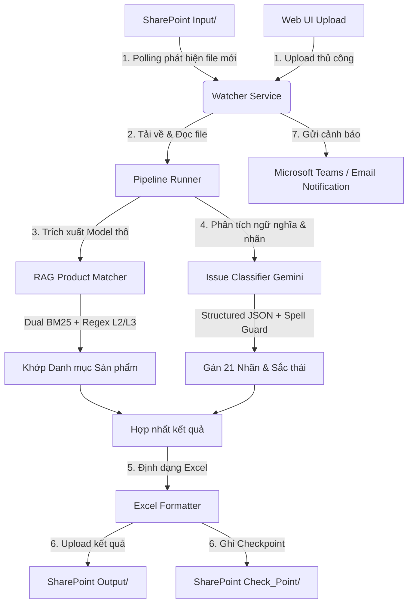

# ⚡ TÀI LIỆU HƯỚNG DẪN SỬ DỤNG & VẬN HÀNH HỆ THỐNG
## HỆ THỐNG PHÂN LOẠI PHẢN HỒI Ý KIẾN KHÁCH HÀNG (DMS FEEDBACK CLASSIFICATION SERVICE)

---

### 📌 THÔNG TIN TÀI LIỆU
* **Tên tài liệu:** Tài liệu Hướng dẫn Sử dụng & Vận hành (User & Admin Manual)
* **Dự án:** DMS Feedback Classification Service
* **Phiên bản hệ thống:** v2.5 (Kiến trúc Pure-LLM Prompt V2)
* **Ngày cập nhật:** 29/06/2026
* **Trạng thái:** Sẵn sàng vận hành (Production Ready)
* **Đối tượng độc giả:** Quản trị viên hệ thống (Admin), Người vận hành nghiệp vụ (Operator/User), Kỹ sư vận hành hệ thống (DevOps/Sysadmin)

---

## 📌 MỤC LỤC

1. [GIAI ĐOẠN 1: TỔNG QUAN HỆ THỐNG & NGHIỆP VỤ](#1-tổng-quan-hệ-thống--nghiệp-vụ)
   - 1.1. Mục tiêu và Bài toán Nghiệp vụ
   - 1.2. Luồng xử lý dữ liệu tổng quan
   - 1.3. Kiến trúc các thành phần hệ thống
2. [GIAI ĐOẠN 2: CẤU HÌNH CHI TIẾT .ENV & CREDENTIALS](#2-cấu-hình-chi-tiết-env--credentials)
   - 2.1. Bảng cấu hình chi tiết các tham số trong tệp `.env`
   - 2.2. Hướng dẫn tạo và cấu hình GCP Vertex AI Service Account (`testvertex.json`)
   - 2.3. Hướng dẫn đăng ký Ứng dụng Azure AD & SharePoint API
3. [GIAI ĐOẠN 3: HƯỚNG DẪN DEPLOY & VẬN HÀNH CHO ADMIN](#3-hướng-dẫn-deploy--vận-hành-cho-admin)
   - 3.1. Sơ đồ ánh xạ thư mục (Mounting) Docker
   - 3.2. Cấu hình tệp `docker-compose.yml` mẫu
   - 3.3. Quy trình triển khai Docker Compose
   - 3.4. Hướng dẫn vận hành cục bộ bằng Makefile (Bare-metal)
   - 3.5. Giám sát Log thời gian thực và Health Check
4. [GIAI ĐOẠN 4: HƯỚNG DẪN SỬ DỤNG WEB DASHBOARD CHO USER (ASCII VISUALIZATION MOCKUPS)](#4-hướng-dẫn-sử-dụng-web-dashboard-cho-user-ascii-visualization-mockups)
   - 4.1. Giao diện Tab Dashboard
   - 4.2. Giao diện Tab File Management
   - 4.3. Giao diện Tab Classify
   - 4.4. Giao diện Tab Settings
5. [GIAI ĐOẠN 5: QUY ĐỊNH CẤU TRÚC FILE EXCEL ĐẦU VÀO & ĐẦU RA MẪU](#5-quy-định-cấu-trúc-file-excel-đầu-vào--đầu-ra-mẫu)
   - 5.1. Cấu trúc File Excel đầu vào mẫu (Header Row 3)
   - 5.2. Cấu trúc File Excel đầu ra mẫu (Zero Row-Shifting)
   - 5.3. Nhận diện cột văn bản tự động (Textiness Score)
   - 5.4. Danh sách 21 nhãn phân loại con và Nhóm lớn thực tế trong Codebase
6. [GIAI ĐOẠN 6: KHẮC PHỤC SỰ CỐ & FAQ (TROUBLESHOOTING)](#6-khắc-phục-sự-cố--faq-troubleshooting)
   - 6.1. Xác thực Azure AD và kết nối SharePoint bị lỗi
   - 6.2. Lỗi quá tải hạn mức Gemini API (429 Rate Limit)
   - 6.3. Khóa quyền ghi tệp Excel cục bộ (Permission Denied)
   - 6.4. Lỗi Excel đầu vào sai dòng/tiêu đề (Thấp Textiness Score)
   - 6.5. Lỗi ngắt kết nối WebSockets (WS Disconnect)
   - 6.6. Lỗi phân quyền Docker Volume trên Linux
   - 6.7. Quy trình phục hồi lịch sử thống kê (Reconstruct History) trên Production

---

## 1. TỔNG QUAN HỆ THỐNG & NGHIỆP VỤ

### 1.1. Mục tiêu và Bài toán Nghiệp vụ
Trong hoạt động phân phối thiết bị chiếu sáng, phích nước và sản phẩm gia dụng của **Công ty Cổ phần Bóng đèn Phích nước Rạng Đông**, việc tiếp nhận thông tin phản hồi (feedback) từ khách hàng, đại lý, nhà phân phối (NPP) và nhân viên tiếp thị thực địa là vô cùng quan trọng. Lượng phản hồi hàng ngày đổ về từ hệ thống DMS dưới dạng bảng tính Excel là rất lớn và đa dạng.

Hệ thống **DMS Feedback Classification Service** ra đời nhằm giải quyết bài toán:
* **Tự động hóa hoàn toàn** khâu đọc, xử lý và phân loại ý kiến phản hồi.
* **Chuẩn hóa thông tin sản phẩm**: Trích xuất tên thiết bị, dòng sản phẩm, mã model thô và đối sánh thông qua cấu phần **RAG Product Matcher** để đưa về danh mục sản phẩm chính thức của Rạng Đông.
* **Phân loại vấn đề chi tiết**: Gán nhãn phản hồi thuộc 21 nhóm lỗi kỹ thuật, dịch vụ hoặc thương mại thông qua mô hình ngôn ngữ lớn (Gemini), kết hợp cơ chế lập luận chuỗi suy nghĩ (Chain-of-Thought - CoT) để đảm bảo tính minh bạch trong mỗi quyết định gán nhãn.
* **Cảnh báo tức thời**: Tải kết quả sau phân loại lên SharePoint và gửi thông báo tổng hợp tới Microsoft Teams/Email cho các phòng ban liên quan (Kỹ thuật, Chăm sóc khách hàng, Kinh doanh).

### 1.2. Luồng xử lý dữ liệu tổng quan
Hệ thống hoạt động theo mô hình dịch vụ chạy nền (Daemon watcher) kết hợp với giao diện Web Dashboard quản lý. Dưới đây là mô hình xử lý dữ liệu khép kín của hệ thống:



### 1.3. Kiến trúc các thành phần hệ thống
Mã nguồn dịch vụ được tổ chức theo kiến trúc modular hóa cao:
* **`watcher.py` (Watcher Daemon)**: Chạy vòng lặp vô hạn theo chu kỳ thời gian (mặc định 5 phút) để tìm kiếm tệp mới trên SharePoint, tải tệp về, gọi Pipeline điều phối và dọn dẹp các tệp tạm.
* **`pipeline/runner.py` (Pipeline Runner)**: Quản lý luồng xử lý của từng tệp Excel, thực hiện phân lô dữ liệu (Batching), gọi các module con và định dạng giao diện Excel đầu ra.
* **`pipeline/rag_product.py` (RAG Product Matcher)**: Trích xuất thực thể sản phẩm thô bằng LLM, sau đó đối sánh tìm kiếm bằng giải thuật BM25 Okapi trên cả chỉ mục tiếng Việt có dấu và không dấu. Nếu kết quả dưới ngưỡng tối thiểu, hệ thống sẽ áp dụng bộ luật Regex L2 (Lọc lần 2) và L3 (Lọc lần 3).
* **`pipeline/issue_classifier.py` (Issue Classifier)**: Sử dụng mô hình ngôn ngữ lớn (Gemini 2.5 Flash Lite) thông qua Prompt thiết kế tối ưu hệ thống (Prompt V2), gán 21 nhãn vấn đề dưới cấu trúc JSON cưỡng bức, loại bỏ nhiễu nhãn bằng bộ luật Spell Guard chính tả và kiểm tra thương hiệu đối thủ.
* **`web/` (FastAPI Server)**: Cung cấp API REST phục vụ cho Web Dashboard, quản lý tệp tin và cài đặt. WebSocket được dùng để stream trực tiếp tiến độ xử lý và logs về giao diện người dùng.

> [!IMPORTANT]
> **Giới hạn vận hành của Watcher Daemon:**
> Watcher Daemon chỉ tự động quét và lập lịch xử lý cho các tệp Excel hoàn toàn mới hoặc các tệp có trạng thái bị lỗi (`retry`) trong `seen_files.json`. 
> Đối với các tệp đã hoàn tất xử lý thành công (trạng thái là `done`), watcher sẽ bỏ qua và không tự động cập nhật lại kết quả ngay cả khi người dùng tải đè tệp hoặc thêm dòng dữ liệu trực tiếp trên SharePoint. Nếu có nhu cầu phân loại lại hoặc chạy phân tích Delta tăng dần cho tệp đã hoàn tất, người dùng bắt buộc phải thực hiện một trong hai cách:
> 1. Truy cập vào **Web Dashboard** (tab Classify/Files) để reset trạng thái tệp về `retry` hoặc kích hoạt chạy thủ công.
> 2. Quản trị viên can thiệp sửa trực tiếp hoặc xóa bản ghi của tệp đó trong tệp lưu vết `seen_files.json` để Watcher phát hiện lại.

---

## 2. CẤU HÌNH CHI TIẾT .ENV & CREDENTIALS

### 2.1. Bảng cấu hình chi tiết các tham số trong tệp `.env`
Tệp cấu hình `.env` được tải thông qua mô hình Pydantic (`settings.py`), hỗ trợ khả năng tải và xác thực cấu hình hệ thống.

Dưới đây là bảng định nghĩa tất cả các tham số cấu hình khả dụng:

| Tên biến môi trường | Kiểu dữ liệu | Giá trị mặc định | Trạng thái | Ý nghĩa / Hướng dẫn cấu hình |
| :--- | :--- | :--- | :--- | :--- |
| **AZURE_TENANT_ID** | String | `""` | **Bắt buộc** | ID thư mục Microsoft Entra ID của tổ chức (Tenant ID). |
| **AZURE_CLIENT_ID** | String | `""` | **Bắt buộc** | ID ứng dụng (Client ID) đã đăng ký trên Azure AD Portal. |
| **AZURE_CLIENT_SECRET**| String | `""` | **Bắt buộc** | Khóa bí mật (Client Secret Value) của ứng dụng Azure AD. |
| **GEMINI_BACKEND** | String | `"vertex"` | Tùy chọn | Chọn cổng gọi API: `vertex` (Vertex AI) hoặc `apikey` (Gemini API Key). |
| **GEMINI_API_KEY** | String | `""` | Tùy chọn | Khóa API cá nhân từ Google AI Studio (Bắt buộc nếu backend là `apikey`). |
| **GEMINI_MODEL** | String | `"gemini-2.5-flash-lite"`| Tùy chọn | Mô hình Gemini thực thi phân loại (`gemini-2.5-flash`, `gemini-2.5-pro`, ...). |
| **GCP_PROJECT_ID** | String | `""` | Tùy chọn | ID của dự án Google Cloud Platform (Bắt buộc nếu backend là `vertex`). |
| **GCP_LOCATION** | String | `"global"` | Tùy chọn | Phân vùng tài nguyên Vertex AI (Ví dụ: `global`, `us-central1`). |
| **GCP_SERVICE_ACCOUNT_JSON**| String| `"/app/data/sa-key.json"`| Tùy chọn | Đường dẫn tệp khóa Service Account JSON cục bộ của GCP trong container. |
| **SHAREPOINT_DRIVE_ID**| String | `""` | **Bắt buộc** | ID của ổ đĩa tài liệu SharePoint (Drive ID) cần quét. |
| **SHAREPOINT_ROOT_FOLDER_ID**| String| `""` | **Bắt buộc** | ID thư mục gốc dự án trên hệ thống SharePoint. |
| **HOST** | String | `"0.0.0.0"` | Tùy chọn | IP lắng nghe của FastAPI Web Server (Mặc định lắng nghe mọi IP). |
| **PORT** | Integer | `8501` | Tùy chọn | Cổng kết nối của FastAPI Web Server (Uvicorn). |
| **LOG_LEVEL** | String | `"INFO"` | Tùy chọn | Mức độ logs tối thiểu trên Console/File (`DEBUG`, `INFO`, `WARNING`, `ERROR`). |
| **POLL_INTERVAL_SECONDS**| Integer | `300` | Tùy chọn | Chu kỳ watcher quét và kiểm tra tệp mới trên SharePoint (giây). |
| **TEAMS_WEBHOOK_URL**| String | `""` | Tùy chọn | Đường dẫn Webhook để đẩy thông báo Adaptive Card vào kênh MS Teams. |
| **NOTIFICATION_SENDER_EMAIL**| String | `""` | Tùy chọn | Email tài khoản gửi báo cáo kết quả (Cần quyền Graph API `Mail.Send`). |
| **NOTIFICATION_RECIPIENTS**| String | `""` | Tùy chọn | Danh sách địa chỉ Email nhận báo cáo kết quả, cách nhau bằng dấu phẩy. |
| **NOTIFY_ON_SUCCESS** | Boolean | `true` | Tùy chọn | Đặt `true` để gửi báo cáo khi xử lý tệp thành công. |
| **NOTIFY_ON_ERROR** | Boolean | `true` | Tùy chọn | Đặt `true` để gửi cảnh báo lập tức khi có lỗi xử lý xảy ra. |
| **LLM_BATCH_SIZE** | Integer | `20` | Tùy chọn | Số lượng dòng Excel được bó lại gửi cùng lúc cho API Gemini. |
| **CKPT_EVERY** | Integer | `50` | Tùy chọn | Số lượng dòng xử lý xong trước khi lưu Checkpoint và cập nhật file tạm. |
| **RATE_LIMIT_GAP** | Float | `4.0` | Tùy chọn | Thời gian giãn cách tối thiểu bắt buộc giữa các đợt gọi Gemini (giây). Đồng bộ với biến `rate_gap_sec`. |
| **BM25_MIN_SCORE** | Float | `5.0` | Tùy chọn | Ngưỡng điểm tối thiểu của RAG Product Matcher. Dưới ngưỡng này sẽ chạy bộ luật Regex. |
| **ENABLE_SHAREPOINT_CONFIG_SYNC**| Boolean| `true` | Tùy chọn | Bật tự động đồng bộ ngược bộ từ khóa sản phẩm từ SharePoint. |
| **ENABLE_RUNTIME_CLEANUP**| Boolean | `false` | Tùy chọn | Tự động xóa file input/output/checkpoint cục bộ sau khi đã upload xong. |
| **CLEANUP_OUTPUT_TTL_DAYS**| Integer | `7` | Tùy chọn | Thời hạn lưu trữ file output cục bộ trong thư mục `work/output` (ngày). |
| **CLEANUP_LOG_TTL_DAYS**| Integer | `7` | Tùy chọn | Thời hạn lưu trữ file logs cục bộ trong thư mục `logs/` (ngày). |

---

### 2.2. Hướng dẫn tạo và cấu hình GCP Vertex AI Service Account (`testvertex.json`)
Để sử dụng backend Vertex AI thương mại với đầy đủ tính bảo mật và hạn mức cao, hãy làm theo quy trình cấu hình dưới đây:

1. Truy cập [Google Cloud Console](https://console.cloud.google.com/). Chọn dự án GCP của bạn.
2. Tìm kiếm **"Vertex AI API"** và nhấp nút **Enable** để kích hoạt dịch vụ.
3. Truy cập **IAM & Admin** > **Service Accounts** > Chọn **Create Service Account**.
4. Điền tên tài khoản dịch vụ (ví dụ: `dms-feedback-classifier`), nhấn **Create and Continue**.
5. Cấp vai trò (Select a role): **`Vertex AI User`** (`roles/aiplatform.user`) để cấp quyền gọi mô hình Gemini. Nhấn **Done**.
6. Nhấp chọn Service Account vừa tạo trong danh sách > Chuyển sang tab **Keys** > Nhấn **Add Key** > **Create new key** > Chọn định dạng **JSON** > Nhấn **Create**.
7. Đổi tên tệp tin tải về thành **`testvertex.json`** và sao chép vào thư mục `service/` của dự án.

---

### 2.3. Hướng dẫn đăng ký Ứng dụng Azure AD & SharePoint API
Hệ thống sử dụng luồng xác thực Client Credentials để làm việc với SharePoint và gửi Email tự động.

1. Đăng nhập [Microsoft Azure Portal](https://portal.azure.com/). Chọn **Microsoft Entra ID** > **App registrations** > **New registration**.
2. Đặt tên ứng dụng (ví dụ: `DMS Feedback Classifier`), chọn single-tenant, nhấn **Register**. Sao chép **Application (client) ID** và **Directory (tenant) ID**.
3. Chọn mục **Certificates & secrets** > **New client secret** > Nhập mô tả, nhấn **Add** > Sao chép giá trị tại cột **Value** và cập nhật vào biến `AZURE_CLIENT_SECRET` trong `.env`.
4. Chọn mục **API permissions** > **Add a permission** > **Microsoft Graph** > **Application permissions** > Tìm kiếm và tích chọn các quyền:
   * **`Files.ReadWrite.All`**: Đọc/ghi file trong SharePoint.
   * **`Mail.Send`**: Gửi Email HTML.
5. Nhấn **Add permissions**. Sau khi thêm, Admin hệ thống bắt buộc phải nhấn nút **"Grant admin consent for [Tên_Tổ_Chức]"** để phê duyệt.

---

## 3. HƯỚNG DẪN DEPLOY & VẬN HÀNH CHO ADMIN

### 3.1. Sơ đồ ánh xạ thư mục (Mounting) Docker
Khi triển khai dịch vụ bằng Docker, việc ánh xạ dữ liệu (volume mounting) chính xác giúp giữ lại các trạng thái quan trọng ngoài máy chủ host.

* `./src` -> `/app/src` (Read-Write)
* `./scripts` -> `/app/scripts` (Read-only)
* `./static` -> `/app/static` (Read-Write)
* `./.env` -> `/app/.env` (Read-only)
* `./Keyword` -> `/app/data/Keyword` (Read-Write)
* `./Model` -> `/app/data/Model` (Read-only)
* `./testvertex.json` -> `/app/data/sa-key.json` (Read-only)
* `./work` -> `/app/data/work` (Read-Write)
* `./logs` -> `/app/data/logs` (Read-Write)

---

### 3.2. Cấu hình tệp `docker-compose.yml` mẫu
Dưới đây là cấu hình hoàn chỉnh của tệp `docker-compose.yml` được định nghĩa chạy thực tế trong hệ thống:

```yaml
services:
  watcher:
    build:
      context: .
      dockerfile: Dockerfile
    container_name: dms-feedback-watcher
    restart: unless-stopped
    stop_grace_period: 30s
    command: python -m dms
    env_file:
      - .env
    environment:
      - SERVICE_DIR=/app
      - DATA_DIR=/app/data
      - MODEL_DIR=/app/data/Model
      - WORK_DIR=/app/data/work
      - LOG_DIR=/app/data/logs
      - GCP_SERVICE_ACCOUNT_JSON=/app/data/sa-key.json
      - GOOGLE_APPLICATION_CREDENTIALS=/app/data/sa-key.json
    volumes:
      - ./src:/app/src
      - ./scripts:/app/scripts:ro
      - ./.env:/app/.env
      - ./Keyword:/app/data/Keyword
      - ./Model:/app/data/Model:ro
      - ./testvertex.json:/app/data/sa-key.json:ro
      - ./work:/app/data/work
      - ./logs:/app/data/logs
    mem_limit: 4g
    cpus: 2.0
    healthcheck:
      test: ["CMD", "python", "-c", "import json,datetime,time; d=json.load(open('/app/data/work/health.json')); lp=datetime.datetime.fromisoformat(d['last_poll']); assert time.time()-lp.timestamp()<600, 'stale'"]
      interval: 60s
      timeout: 10s
      start_period: 30s
      retries: 3
    logging:
      driver: "json-file"
      options:
        max-size: "10m"
        max-file: "3"

  web:
    build:
      context: .
      dockerfile: Dockerfile
    container_name: dms-feedback-web
    restart: unless-stopped
    command: python -m dms.web
    ports:
      - "8501:8501"
    env_file:
      - .env
    environment:
      - SERVICE_DIR=/app
      - DATA_DIR=/app/data
      - MODEL_DIR=/app/data/Model
      - WORK_DIR=/app/data/work
      - LOG_DIR=/app/data/logs
      - GCP_SERVICE_ACCOUNT_JSON=/app/data/sa-key.json
      - GOOGLE_APPLICATION_CREDENTIALS=/app/data/sa-key.json
    volumes:
      - ./src:/app/src
      - ./scripts:/app/scripts:ro
      - ./static:/app/static
      - ./.env:/app/.env
      - ./Keyword:/app/data/Keyword
      - ./Model:/app/data/Model:ro
      - ./testvertex.json:/app/data/sa-key.json:ro
      - ./work:/app/data/work
      - ./logs:/app/data/logs
    mem_limit: 2g
    cpus: 1.0
    healthcheck:
      test: ["CMD", "python", "-c", "import urllib.request; urllib.request.urlopen('http://localhost:8501/')"]
      interval: 30s
      timeout: 5s
      start_period: 15s
      retries: 3
    logging:
      driver: "json-file"
      options:
        max-size: "10m"
        max-file: "3"
```

---

### 3.3. Quy trình triển khai Docker Compose
1. Tải source code và thiết lập tệp `.env` cùng khóa xác thực `testvertex.json` như hướng dẫn ở Phần 2.
2. Di chuyển vào thư mục `service/` nơi chứa tệp `docker-compose.yml`.
3. Chạy lệnh xây dựng hình ảnh và kích hoạt container:
   ```bash
   docker compose up -d --build
   ```
4. Kiểm tra trạng thái hoạt động:
   ```bash
   docker compose ps
   ```
5. Xem log để đảm bảo không phát sinh lỗi khởi chạy:
   ```bash
   docker compose logs -f
   ```

---

### 3.4. Hướng dẫn vận hành cục bộ bằng Makefile (Bare-metal)
Makefile cung cấp các phím tắt nhanh để triển khai phát triển hoặc kiểm tra cục bộ trực tiếp trên máy chủ Windows/Linux (Bare-metal).

Dưới đây là chi tiết ý nghĩa và cách sử dụng các target khả dụng trong `Makefile`:

* **`make setup`**:
  * *Hành động*: Chạy trình cài đặt dependencies từ tệp `requirements.txt` bằng môi trường ảo chỉ định.
  * *Lệnh thực thi*: `d:\Works\.venv\Scripts\pip install -r service/requirements.txt`
* **`make test`**:
  * *Hành động*: Khởi chạy toàn bộ các bài kiểm thử tự động của dự án nằm trong thư mục `service/tests/` sử dụng thư viện `pytest`.
  * *Lệnh thực thi*: `d:\Works\.venv\Scripts\pytest service/tests/`
* **`make run FILE=<tên_file>`**:
  * *Hành động*: Kích hoạt chạy thủ công luồng pipeline phân loại trên một file dữ liệu cụ thể nằm trong thư mục cục bộ của hệ thống (Offline Mode) thông qua tệp điều phối `run_pipeline.py`.
  * *Lệnh thực thi*: `d:\Works\.venv\Scripts\python run_pipeline.py $(FILE)`
  * *Cách dùng*: `make run FILE=sample_feedback.xlsx`
* **`make format`**:
  * *Hành động*: Tự động rà soát cú pháp, sửa định dạng chuẩn PEP 8 và dọn dẹp các import dư thừa trên toàn bộ mã nguồn sử dụng công cụ kiểm lỗi siêu tốc `ruff`.
  * *Lệnh thực thi*:
    ```bash
    d:\Works\.venv\Scripts\ruff format service/src/ service/tests/
    d:\Works\.venv\Scripts\ruff check --fix service/src/ service/tests/
    ```
* **`make clean`**:
  * *Hành động*: Quét toàn bộ thư mục dự án và thực hiện xóa sạch các tệp tin lưu đệm cache tạm thời phát sinh trong quá trình chạy Python để giải phóng không gian bộ nhớ.
  * *Lệnh thực thi*: `powershell -Command "Get-ChildItem -Path . -Include __pycache__,.pytest_cache,.ruff_cache,.mypy_cache -Recurse -Force | Remove-Item -Recurse -Force -ErrorAction SilentlyContinue"`

---

### 3.5. Giám sát Log thời gian thực và Health Check
* **Xem logs trực tuyến**:
  ```bash
  docker compose logs -f watcher
  ```
* **Health Check cục bộ**: Ứng dụng tích hợp bộ tự động Health Check định kỳ. Nếu tệp tin `work/health.json` không cập nhật thời gian quét `last_poll` quá 10 phút, Docker Engine sẽ tự động đánh dấu trạng thái container là `unhealthy` và cố gắng restart lại dịch vụ để tự phục hồi.

---

## 4. HƯỚNG DẪN SỬ DỤNG WEB DASHBOARD CHO USER (ASCII VISUALIZATION MOCKUPS)

Web Dashboard cung cấp giao diện tương tác đồ họa trực quan tại địa chỉ mặc định: **`http://localhost:8501`**. Giao diện có thiết kế responsive, thanh điều hướng Sidebar bên trái giúp chuyển nhanh giữa các trang chức năng.

Dưới đây là các sơ đồ giao diện chi tiết bằng ASCII Mockups để người vận hành dễ hình dung:

### 4.1. Giao diện Tab Dashboard
Hiển thị tình trạng sức khỏe của watcher và thống kê tổng quan phân bổ nhãn ý kiến phản hồi của thị trường.

```text
┌────────────────────────────────────────────────────────────────────────────────────────┐
│  ⚡ DMS FEEDBACK CLASSIFIER - DASHBOARD                                   [Active]     │
├───────────────┬────────────────────────────────────────────────────────────────────────┤
│ > Dashboard   │  📊 TELEMETRY & SYSTEM HEALTH                                          │
│   Files       │ ┌──────────────────┐ ┌──────────────────┐ ┌──────────────────┐         │
│   Classify    │ │ System Uptime    │ │ Success Rate     │ │ Files Processed  │         │
│   Settings    │ │    12d 4h 32m    │ │      98.6%       │ │    142 Files     │         │
│               │ └──────────────────┘ └──────────────────┘ └──────────────────┘         │
│               │  📈 FEEDBACKS PROCESSED OVER TIME (DAILY)                              │
│               │   50 ┼      ■                                                          │
│               │   40 ┼      ■   ■       ■                                              │
│               │   30 ┼  ■   ■   ■   ■   ■                                              │
│               │   20 ┼  ■   ■   ■   ■   ■   ■                                              │
│               │   10 ┼  ■   ■   ■   ■   ■   ■   ■                                          │
│               │    0 ┴──┴───┴───┴───┴───┴───┴───┴───────────────────>                  │
│               │        22/6 23/6 24/6 25/6 26/6 27/6 28/6                              │
│               │                                                                        │
│               │  🍩 LABEL DISTRIBUTION (TOP 5 ISSUES)                                  │
│               │   [████████░░░░░░░░░░░░░] Tin trung lập (62%)                          │
│               │   [████░░░░░░░░░░░░░░░░░] Báo lỗi (18%)                                 │
│               │   [██░░░░░░░░░░░░░░░░░░] Y/c cải tiến (10%)                             │
│               │   [█░░░░░░░░░░░░░░░░░░░] Hàng hoá (6%)                                 │
│               │   [█░░░░░░░░░░░░░░░░░░░] Hãng (Đối thủ) (4%)                           │
└───────────────┴────────────────────────────────────────────────────────────────────────┘
```

---

### 4.2. Giao diện Tab File Management
Cho phép thao tác với dữ liệu, tải dữ liệu lên trực tiếp hoặc tải các file kết quả Excel về máy.

```text
┌────────────────────────────────────────────────────────────────────────────────────────┐
│  ⚡ DMS FEEDBACK CLASSIFIER - FILE MANAGEMENT                             [Active]     │
├───────────────┬────────────────────────────────────────────────────────────────────────┤
│   Dashboard   │  📂 BROWSE LOCAL FILESYSTEM                                            │
│ > Files       │   Select Directory: [ input   ][v]                                     │
│   Classify    │ ┌──────────────────────────────────────────────┐                       │
│   Settings    │ │ [ Upload new Excel file to input/          ] │                       │
│               │ │ ┌──────────────────────────────────────────┐ │                       │
│               │ │ │ Drag & Drop your Excel file here or      │ │                       │
│               │ │ │ [ Browse Files ]                         │ │                       │
│               │ │ └──────────────────────────────────────────┘ │                       │
│               │ └──────────────────────────────────────────────┘                       │
│               │  📄 File List (directory: work/input/)                                 │
│               │  ┌───────────────────────┬────────────┬──────────────────┬───────────┐ │
│               │  │ File Name             │ Size (KB)  │ Modified Time    │ Actions   │ │
│               │  ├───────────────────────┼────────────┼──────────────────┼───────────┤ │
│               │  │ feedback_tuan_25.xlsx │ 142 KB     │ 2026-06-29 14:30 │ [Dnl][Del]│ │
│               │  │ test_loi_panel.xlsx   │ 35 KB      │ 2026-06-29 15:10 │ [Dnl][Del]│ │
│               │  └───────────────────────┴────────────┴──────────────────┴───────────┘ │
└───────────────┴────────────────────────────────────────────────────────────────────────┘
```

---

### 4.3. Giao diện Tab Classify
Chạy phân loại nhanh 1 câu (Dry-run) hoặc tải tệp Excel lên chạy phân loại thủ công, hiển thị log WebSocket và thanh tiến trình thời gian thực.

```text
┌────────────────────────────────────────────────────────────────────────────────────────┐
│  ⚡ DMS FEEDBACK CLASSIFIER - CLASSIFICATION RUNNER                       [Active]     │
├───────────────┬────────────────────────────────────────────────────────────────────────┤
│   Dashboard   │  ⚡ SINGLE TEXT DRY-RUN                                                │
│   Files       │  Input Feedback: [ Bóng led bulb 9W bị nhấp nháy sau 2 tuần dùng...  ] │
│ > Classify    │  [ Run Analysis ]                                                      │
│   Settings    │  Result: Product: Đèn LED | Dòng SP: Bulb | Model: LED Bulb 9W         │
│               │          Sentiment: Negative | Label: Báo lỗi                          │
│               │                                                                        │
│               │  📦 BATCH FILE CLASSIFICATION                                          │
│               │  Select input file: [ feedback_tuan_25.xlsx ][v]  [ Trigger Classify ] │
│               │  Progress: [██████████████████████████░░░░░░░░░░] 72% (72/100 rows)     │
│               │                                                                        │
│               │  🖥️ LIVE LOG CONSOLE (WebSockets Stream)                                │
│               │ ┌────────────────────────────────────────────────────────────────────┐ │
│               │ │ [INFO] Batch 3: Processing rows 40-59                              │ │
│               │ │ [INFO] RAG Product Matcher completed in 1.4s (Matched: LED Bulb 9W)│ │
│               │ │ [INFO] Gemini Classification Batch response received in 3.2s       │ │
│               │ │ [INFO] Checkpoint 60/100 saved via Cơ chế checkpoint dòng          │ │
│               │ └────────────────────────────────────────────────────────────────────┘ │
└───────────────┴────────────────────────────────────────────────────────────────────────┘
```

---

### 4.4. Giao diện Tab Settings
Trang web kiểm soát cấu hình tổng thể của cả hệ thống dành cho Admin.

```text
┌────────────────────────────────────────────────────────────────────────────────────────┐
│  ⚡ DMS FEEDBACK CLASSIFIER - RUNTIME SETTINGS                            [Active]     │
├───────────────┬────────────────────────────────────────────────────────────────────────┤
│   Dashboard   │  ⚙️ SYSTEM CONFIGURATION                                               │
│   Files       │   Gemini Model Backend:     [ vertex    ][v]                           │
│   Classify    │   Gemini Model Target:      [ gemini-2.5-flash-lite                 ]  │
│ > Settings    │   LLM Batch Size:           [ 20 ]                                     │
│               │   Rate Limit Gap (seconds): [ 4.0 ]                                    │
│               │   Poll Interval (seconds):  [ 300 ]                                    │
│               │   [ Save Environment Configuration ]                                   │
│               │                                                                        │
│               │  🔌 VERIFY BACKEND CONNECTION                                          │
│               │   [ Run Connection Diagnostic Test ] -> [SUCCESS: Gemini API is Live]  │
│               │                                                                        │
│               │  📝 SYSTEM PROMPT EDITOR                                               │
│               │   ┌──────────────────────────────────────────────────────────────────┐ │
│               │   │ You are a professional QA analyst for Rang Dong...               │ │
│               │   │ Use these minor labels: {minor_order_json}                       │ │
│               │   │ Product category context: {label_defs}                           │ │
│               │   └──────────────────────────────────────────────────────────────────┘ │
│               │   ⚠️ Warning: Do not delete placeholder tokens! ({label_defs}, etc.)   │
└───────────────┴────────────────────────────────────────────────────────────────────────┘
```

---

## 5. QUY ĐỊNH CẤU TRÚC FILE EXCEL ĐẦU VÀO & ĐẦU RA MẪU

Nhằm đảm bảo người dùng nghiệp vụ có thể đối chiếu chính xác kết quả phân loại với tệp gốc của họ, hệ thống bắt buộc phải duy trì tính toàn vẹn về mặt thứ tự dòng dữ liệu (Row-by-Row Alignment).

### 5.1. Cấu trúc File Excel đầu vào mẫu (Header Row 3)
Hệ thống sử dụng thư viện `pandas` để đọc dữ liệu với quy ước cấu trúc bảng biểu như sau:
* **Dòng 1**: Chứa tiêu đề lớn của báo cáo (Hệ thống bỏ qua).
* **Dòng 2**: Dòng mô tả phụ hoặc để trống (Hệ thống bỏ qua).
* **Dòng 3 (Header Row)**: Chứa tên của các cột tiêu đề dữ liệu (Hệ thống bắt đầu quét và ánh xạ từ dòng này làm Header).
* **Dòng 4 trở đi**: Danh sách các dòng dữ liệu thô phản hồi từ khách hàng.

Dưới đây là minh họa cấu trúc tệp dữ liệu đầu vào:

| Dòng | A (STT) | B (Mã NPP) | C (Khu vực) | D (Nội dung phản hồi) | E (Người báo cáo) |
| :--- | :--- | :--- | :--- | :--- | :--- |
| **1** | HỆ THỐNG PHÂN PHỐI DMS - PHẢN HỒI THỊ TRƯỜNG TUẦN 25 | | | | |
| **2** | *Dữ liệu tổng hợp từ các tỉnh khu vực phía Bắc* | | | | |
| **3** | **STT** | **Mã NPP** | **Khu vực** | **Nội dung phản hồi** | **Người báo cáo** |
| **4** | 1 | NPP01 | Hà Nội | Bóng led bulb 9W bật lên bị nhấp nháy rồi tắt ngủm | Nguyễn Văn A |
| **5** | 2 | NPP02 | Hải Phòng | Đại lý Asia đang chào giá rẻ hơn Rạng Đông 5% | Trần Thị B |
| **6** | 3 | NPP01 | Hà Nội | Giao hàng đợt này chậm mất 3 ngày làm nhỡ việc của khách | Nguyễn Văn A |
| **7** | 4 | NPP03 | Thái Bình | Sản phẩm đèn đường Led chất lượng rất tốt ánh sáng đều | Phạm Văn C |

---

### 5.2. Cấu trúc File Excel đầu ra mẫu (Zero Row-Shifting)
Khi xuất kết quả, hệ thống áp dụng cơ chế **Zero Row-Shifting** chèn thêm các cột kết quả sản phẩm trực tiếp sau cột văn bản phản hồi gốc, đồng thời bổ sung phân tích chi tiết và các cột nhãn phân loại thực tế ở cuối bảng tính.

Dưới đây là minh họa cấu trúc tệp dữ liệu đầu ra:

| Dòng | D (Nội dung phản hồi) | E (Sản phẩm) | F (Dòng SP) | G (Model) | H (Lớp) | I (Điểm) | ... | Z (Sentiment) | AA (LLM_Ext) | AB (BM25_Sc) | AC (Báo lỗi) | AD (Báo CL tốt) | AE (Y/c cải tiến) | ... | AW (Tin trung lập) |
| :--- | :--- | :--- | :--- | :--- | :--- | :--- | :--- | :--- | :--- | :--- | :--- | :--- | :--- | :--- | :--- |
| **1** | HỆ THỐNG PHÂN PHỐI DMS - PHẢN HỒI THỊ TRƯỜNG TUẦN 25 | | | | | | | | | | | | | | |
| **2** | *Dữ liệu tổng hợp từ các tỉnh khu vực phía Bắc* | | | | | | | | | | | | | | |
| **3** | **Nội dung phản hồi** | **Sản phẩm** | **Dòng SP** | **Model** | **Lớp** | **Điểm** | ... | **Sentiment** | **LLM_Extracted** | **BM25_Score** | **Báo lỗi** | **Báo CL tốt** | **Y/c cải tiến** | ... | **Tin trung lập** |
| **4** | Bóng led bulb 9W bật lên bị nhấp nháy rồi tắt ngủm | Đèn LED | Đèn LED Bulb | LED Bulb 9W | | | ... | Negative | led bulb 9w | 10.45 | x | | | ... | |
| **5** | Đại lý Asia đang chào giá rẻ hơn Rạng Đông 5% | Đèn LED | | | | | ... | Negative | Asia | 5.22 | | | | ... | |
| **6** | Giao hàng đợt này chậm mất 3 ngày làm nhỡ việc của khách | | | | | | ... | Negative | NONE | 0.00 | | | | ... | |
| **7** | Sản phẩm đèn đường Led chất lượng rất tốt ánh sáng đều | Đèn LED | Đèn LED Đường | Đèn đường Led | | | ... | Positive | đèn đường led | 11.20 | | x | | ... | |

---

### 5.3. Nhận diện cột văn bản tự động (Textiness Score)
Hệ thống tích hợp thuật toán nhận diện cột thông minh theo cơ chế:
1. **Quét Alias**: Hệ thống kiểm tra tên các cột ở dòng thứ 3 đối khớp với danh sách bí danh phổ biến:
   * *Bí danh:* `"nội dung phản hồi"`, `"nội dung"`, `"ý kiến khách hàng"`, `"phản hồi"`, `"mô tả lỗi"`, `"feedback"`, `"text"`, `"nội dung khiếu nại"`.
2. **Tính toán Textiness Score (Điểm văn bản)**: Nếu không có cột nào trùng khớp với bí danh trên, hệ thống sẽ phân tích dữ liệu mẫu của từng cột để chấm điểm:
   * Cột có độ dài ký tự trung bình lớn.
   * Cột chứa tỷ lệ dấu cách (`space`) cao.
   * Cột có tỷ lệ ký tự chữ cái vượt trội so với ký tự số.
   * Cột có điểm số cao nhất sẽ được tự động chọn làm cột văn bản phản hồi để đưa vào phân loại.

---

### 5.4. Danh sách 21 nhãn phân loại con và Nhóm lớn thực tế trong Codebase
Hệ thống gán nhãn phản hồi dựa trên cấu trúc danh mục **21 nhãn con** thuộc **8 nhóm lớn** được định nghĩa đồng bộ 100% với tệp `issue_classifier.py` của codebase:

| Nhóm phân loại lớn (Major) | Nhãn phân loại con (Minor) | Ý nghĩa định nghĩa nhãn nghiệp vụ |
| :--- | :--- | :--- |
| **1. Sản phẩm** | `Báo lỗi` | Phản hồi về sản phẩm bị hỏng hóc kỹ thuật, cháy nổ, nứt vỡ, không sáng. |
| | `Báo CL tốt` | Phản hồi khen ngợi sản phẩm chất lượng tốt, độ bền cao, ánh sáng đẹp. |
| | `Y/c cải tiến` | Đóng góp ý kiến cải tiến về thiết kế, bao bì đóng gói, hoặc cấu tạo của thiết bị. |
| | `Đề xuất SPM` | Khách hàng hỏi hoặc đề xuất Rạng Đông nghiên cứu, sản xuất sản phẩm mới hoàn toàn. |
| **2. Yêu cầu công cụ BH** | `Bảng giá, Catalogue` | Đóng góp ý kiến hoặc yêu cầu xin cấp Catalogue, bảng báo giá sản phẩm cập nhật. |
| | `Bảng biển` | Yêu cầu hoặc phản ánh về việc lắp đặt biển hiệu quảng cáo tại đại lý, cửa hàng. |
| | `Kệ bóng, thử đèn,…` | Yêu cầu cung cấp kệ trưng bày sản phẩm, máng thử bóng tại điểm bán. |
| | `Khác` | Các yêu cầu công cụ hỗ trợ bán hàng hoặc quảng bá thương hiệu khác. |
| **3. Giá, cơ chế RD** | `Tốt/ ko tốt` | Nhận xét về giá/cơ chế của Rạng Đông: giá tốt/cao/rẻ, khó bán, dễ bán, cạnh tranh. |
| | `Trả thưởng` | Khiếu nại về việc nợ thưởng, trả chậm các chương trình khuyến mãi tích lũy doanh số. |
| | `Đề xuất` | Các ý kiến đóng góp, kiến nghị về việc điều chỉnh giá, thay đổi chính sách bán hàng. |
| **4. Dịch vụ** | `Bảo hành` | Phản ánh về dịch vụ bảo hành chậm trễ, thời hạn bảo hành hoặc từ chối bảo hành. |
| | `HTPP` | Phản ánh về hệ thống phân phối: Chồng lấn tuyến bán hàng, tranh giành khách, phá giá. |
| | `Hàng hoá` | Các vấn đề liên quan đến giao thiếu hàng, sai quy cách, tiến độ giao hàng chậm. |
| **5. Hàng giả** | `Hàng giả` | Phản ánh phát hiện hàng giả, hàng nhái thương hiệu Rạng Đông trôi nổi trên thị trường. |
| **6. Website** | `Website` | Các vấn đề khiếu nại, góp ý về lỗi truy cập cổng thông tin, trang thương mại điện tử. |
| **7. Đối thủ cạnh tranh** | `Hãng` | Đề cập trực tiếp tới thương hiệu của đối thủ cạnh tranh trên thị trường. |
| | `Hoạt động` | Các động thái triển khai thị trường, tuyển đại lý, bán hàng lưu động của đối thủ. |
| | `CTKM, giá, cơ chế` | Giá bán, khuyến mãi, chiết khấu, chính sách bán hàng của đối thủ cạnh tranh. |
| | `TT SP` | So sánh trực tiếp chất lượng, đặc tính kỹ thuật sản phẩm đối thủ với sản phẩm Rạng Đông. |
| **8. Tin trung lập** | `Tin trung lập` | Các câu văn không chứa thông tin phản ánh chất lượng, không thuộc các nhóm nghiệp vụ. |

---

## 6. KHẮC PHỤC SỰ CỐ & FAQ (TROUBLESHOOTING)

### 6.1. Xác thực Azure AD và kết nối SharePoint bị lỗi
* **Mã lỗi**: `AZURE_OAUTH_FAILED_01`
* **Log mẫu**:
  ```text
  [2026-06-29 16:05:12] [ERROR] dms.sharepoint: Failed to acquire token from Azure AD. Details: (invalid_client) AADSTS7000215: Invalid client secret is provided.
  [2026-06-29 16:05:13] [CRITICAL] dms.watcher: Initialization failed. Polling loop aborted.
  ```
* **Nguyên nhân**:
  1. Chuỗi cấu hình mật khẩu **`AZURE_CLIENT_SECRET`** trong tệp `.env` đã bị hết hạn hoặc copy thiếu ký tự.
  2. Quyền ứng dụng `Files.ReadWrite.All` trên Azure Portal chưa được nhấn xác nhận chấp thuận từ Admin tổ chức (Grant Admin Consent).
* **Các bước khắc phục**:
  1. Đăng nhập Azure Portal > **Microsoft Entra ID** > **App registrations** > Chọn ứng dụng của dự án.
  2. Chọn **Certificates & secrets** > Nhấn **New client secret** để tạo một khóa mật khẩu mới.
  3. Sao chép ngay giá trị trong cột **Value** và cập nhật vào biến `AZURE_CLIENT_SECRET` trong file `.env` trên máy chủ host.
  4. Chuyển sang mục **API permissions**, đảm bảo cả hai quyền `Files.ReadWrite.All` và `Mail.Send` đều có tích xanh lục. Nếu thấy cảnh báo màu đỏ, nhấn nút **"Grant admin consent"**.
  5. Restart container: `docker compose restart`.

---

### 6.2. Lỗi quá tải hạn mức Gemini API (429 Rate Limit)
* **Mã lỗi**: `GEMINI_API_429_LIMIT`
* **Log mẫu**:
  ```text
  [2026-06-29 16:10:45] [WARNING] dms.gemini_client: Attempt 1 failed. Error: ResourceExhausted - 429 Resource has been exhausted (e.g. queries per minute limit). Retrying in 4.0s...
  [2026-06-29 16:10:49] [WARNING] dms.gemini_client: Attempt 2 failed. Error: ResourceExhausted - 429 Resource has been exhausted. Retrying in 8.0s...
  [2026-06-29 16:10:57] [ERROR] dms.gemini_client: Max retries (3) reached. Falling back to default labels.
  ```
* **Nguyên nhân**:
  * Tần suất gửi yêu cầu xử lý (số token gửi đi trên phút) vượt quá hạn mức (Quota limit) quy định của tài khoản Google Cloud Platform hoặc Google AI Studio.
* **Các bước khắc phục**:
  1. Mở giao diện Web Dashboard, chọn Tab **Settings**.
  2. Thực hiện điều chỉnh giảm kích thước lô gửi dữ liệu **`LLM_BATCH_SIZE`** xuống (ví dụ: hạ từ `20` dòng/lô xuống `10` hoặc `5` dòng/lô).
  3. Thực hiện điều chỉnh tăng thời gian giãn cách giữa các đợt gửi **`RATE_LIMIT_GAP`** (tương ứng biến `rate_gap_sec` trong code) từ `4.0` giây lên `6.0` hoặc `8.0` giây.
  4. Nhấn **Save Settings** để lưu lại thay đổi. Watcher nền sẽ tự động nạp cấu hình mới này lập tức.

---

### 6.3. Khóa quyền ghi tệp Excel cục bộ (Permission Denied)
* **Mã lỗi**: `EXCEL_LOCK_ERR_13`
* **Log mẫu**:
  ```text
  [2026-06-29 16:15:30] [ERROR] dms.pipeline.runner: Pipeline failed for file test_loi.xlsx. Details: PermissionError: [Errno 13] Permission denied: 'work/output/test_loi_output.xlsx'
  ```
* **Nguyên nhân**:
  * File Excel kết quả đầu ra trong thư mục `work/output/` đang bị mở trực tiếp bởi một ứng dụng khác (ví dụ: Microsoft Excel trên máy chủ host) khiến hệ điều hành khóa quyền ghi đè (file lock).
* **Các bước khắc phục**:
  1. Đóng toàn bộ các chương trình Excel đang mở tệp tin kết quả trên máy chủ host hoặc máy trạm kết nối.
  2. Chờ chu kỳ Polling tiếp theo hoặc bấm nút chạy lại thủ công trên Dashboard để tiếp tục ghi tệp.

---

### 6.4. Lỗi Excel đầu vào sai dòng/tiêu đề (Thấp Textiness Score)
* **Mã lỗi**: `EXCEL_HEADER_DETECT_FAILED`
* **Log mẫu**:
  ```text
  [2026-06-29 16:20:05] [ERROR] dms.pipeline.runner: ValueError: Could not detect text column in the Excel file. Column list parsed: ['Unnamed: 0', 'Mã NPP', 'Trống', 'Ngày']. Textiness scores: {'Unnamed: 0': 0.05, 'Mã NPP': 0.0, 'Trống': 0.0, 'Ngày': 0.1} (Threshold: 0.3)
  ```
* **Nguyên nhân**:
  * Tệp Excel đầu vào không có dòng tiêu đề nằm đúng ở dòng thứ 3 (Header Row), hoặc nội dung cột văn bản phản hồi quá ngắn hoặc chứa toàn số khiến thuật toán Textiness Score chấm điểm dưới ngưỡng chấp nhận (0.3) và không tìm thấy cột văn bản.
* **Các bước khắc phục**:
  1. Mở tệp Excel đầu vào và đảm bảo tiêu đề các cột nằm đúng ở dòng thứ 3 (Ví dụ: cột "STT", "Nội dung phản hồi", "Người báo cáo" phải nằm ở hàng số 3).
  2. Đảm bảo cột chứa văn bản phản hồi được đặt tên là `"Nội dung phản hồi"` hoặc `"Ý kiến khách hàng"` để hệ thống đối khớp bí danh (Alias) mà không cần tính điểm Textiness.

---

### 6.5. Lỗi ngắt kết nối WebSockets (WS Disconnect)
* **Mã lỗi**: `WS_CONNECTION_LOST_1006`
* **Log mẫu (Browser Console Logs)**:
  ```text
  WebSocket connection to 'ws://localhost:8501/ws/classify/{job_id}' failed: Error in connection establishment: net::ERR_CONNECTION_REFUSED
  WebSocket connection closed. Code: 1006. Reason: Abnormal Closure. Reconnecting in 5s...
  ```
* **Nguyên nhân**:
  1. FastAPI Web Server bị sập hoặc đang trong quá trình khởi động lại.
  2. Proxy ngược (như Nginx) hoặc cấu hình Firewall trên máy chủ chặn cổng WebSockets.
* **Các bước khắc phục**:
  1. Kiểm tra xem container web có hoạt động bình thường hay không: `docker compose ps`.
  2. Nếu chạy qua Nginx Proxy, đảm bảo cấu hình Nginx có hỗ trợ WebSockets:
     ```nginx
     proxy_set_header Upgrade $http_upgrade;
     proxy_set_header Connection "upgrade";
     ```

---

### 6.6. Lỗi phân quyền Docker Volume trên Linux
* **Mã lỗi**: `DOCKER_VOLUME_PERMISSION_DENIED`
* **Log mẫu**:
  ```text
  dms-feedback-watcher | PermissionError: [Errno 13] Permission denied: '/app/data/work/seen_files.json'
  dms-feedback-web     | PermissionError: [Errno 13] Permission denied: '/app/data/work/metrics.json'
  ```
* **Nguyên nhân**:
  * Các thư mục cục bộ ngoài host (`work/`, `logs/`) được tạo bởi tài khoản quản trị hệ thống root, trong khi container Docker chạy bằng người dùng không có đủ quyền ghi đè tập tin.
* **Các bước khắc phục**:
  1. Chạy lệnh phân quyền ghi rộng rãi trên máy chủ Linux host:
     ```bash
     chmod -R 777 service/work service/logs
     ```
  2. Restart lại dịch vụ Docker:
     ```bash
     docker compose restart
     ```

---

### 6.7. Quy trình phục hồi lịch sử thống kê (Reconstruct History) trên Production
Để tối ưu hóa không gian lưu trữ và tuân thủ nguyên tắc stateless, Docker container **không lưu trữ vĩnh viễn các tệp Excel kết quả cục bộ** sau khi tải lên SharePoint thành công.

Khi bạn chuyển hệ thống sang một máy chủ mới hoặc khởi động lại container bằng thư mục trống, toàn bộ lịch sử thống kê và biểu đồ Doughnut trên Web Dashboard sẽ bị trống. Để khôi phục hiển thị dữ liệu lịch sử thống kê **mà không cần chạy lại pipeline AI** (giúp tiết kiệm chi phí Token Gemini), hãy thực hiện quy trình sau:

##### Bước 1: Dừng các dịch vụ đang chạy trên máy chủ
```bash
cd dms-feedback-classification/service
docker compose down
```

##### Bước 2: Xóa các file cache cũ bị lỗi hoặc trống ngoài máy host
```bash
# Trên Windows PowerShell:
Remove-Item -Path .\work\seen_files.json -ErrorAction Ignore
Remove-Item -Path .\work\metrics.json -ErrorAction Ignore

# Trên Linux/macOS:
rm -f work/seen_files.json work/metrics.json
```

##### Bước 3: Khởi động lại dịch vụ Docker
```bash
docker compose up -d
```
> [!NOTE]
> Khi khởi động, do không tìm thấy hai file cache local, web server và watcher sẽ tự động tải phiên bản cache hoàn chỉnh đã được reconstruct trước đó (nằm trên SharePoint `Check_Point/`) về thư mục `work/` cục bộ.

##### Bước 4: Thực thi script Phục hồi lịch sử
Chạy script chuyên dụng trực tiếp bên trong container `watcher` để quét và tính toán lại toàn bộ nhãn lỗi từ các file Excel kết quả đã lưu trên SharePoint:
```bash
docker compose exec watcher python scripts/reconstruct_history.py
```
Script sẽ tự động quét thư mục `Input/` và `Output/` của SharePoint, tải tạm thời từng file `*_output.xlsx` về đĩa cục bộ để đếm và cộng dồn lại các nhãn lỗi đã phân loại, ghi đè vào tệp `metrics.json` và cập nhật lịch sử ngày sửa đổi thực tế của tệp tin.

##### Bước 5: Restart lại Container Web để nạp cache mới
```bash
docker compose restart web
```

##### Bước 6: Xác minh kết quả trên giao diện người dùng
1. Mở trình duyệt truy cập Web Dashboard: `http://localhost:8501`.
2. Kiểm tra biểu đồ **"Số file theo ngày"** và **"Phân bổ nhãn"** đảm bảo dữ liệu hiển thị đã đầy đủ.

---
**HẾT TÀI LIỆU**
