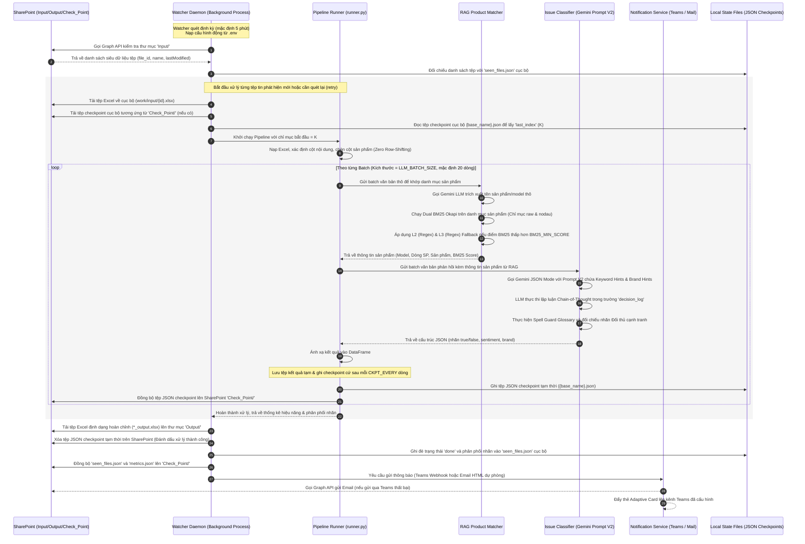
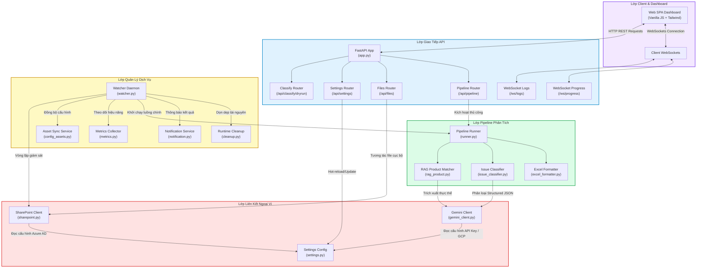

# TÀI LIỆU THIẾT KẾ KỸ THUẬT (TECHNICAL DESIGN DOCUMENT)
## HỆ THỐNG PHÂN LOẠI PHẢN HỒI Ý KIẾN KHÁCH HÀNG - DMS FEEDBACK CLASSIFICATION SERVICE

---

### 📑 THÔNG TIN CHUNG (DOCUMENT METADATA)

* **Tên hệ thống:** DMS Feedback Classification Service (Dịch vụ Phân loại Phản hồi Hệ thống Phân phối)
* **Mã tài liệu:** DMS-TDD-2026-V1-REV3
* **Phiên bản:** 1.2.0 (Vòng 3 - Bản thảo cuối cùng đã hiệu chỉnh sai lệch kỹ thuật)
* **Ngày cập nhật:** 2026-06-29
* **Tác giả:** Senior System Architect & Technical Writer
* **Trạng thái:** Hoàn tất & Phê duyệt Cuối cùng
* **Đối tượng sử dụng:** Đội ngũ phát triển (Developers), Quản trị hệ thống (System Administrators), Chuyên viên Vận hành Nghiệp vụ (Operations).

---

## 📌 MỤC LỤC

- [Chương 1: Tổng Quan Hệ Thống & Yêu Cầu Nghiệp Vụ](#chương-1-tổng-quan-hệ-thống--yêu-cầu-nghiệp-vụ)
- [Chương 2: Kiến Trúc Hệ Thống & Sơ Đồ Luồng Dữ Liệu](#chương-2-kiến-trúc-hệ-thống--sơ-đồ-luồng-dữ-liệu)
- [Chương 3: Chi Tiết Các Thành Phần Cốt Lõi](#chương-3-chi-tiết-các-thành-phần-cốt-lõi)
- [Chương 4: Luồng Logic Delta Matching (Xử Lý Gia Tăng)](#chương-4-luồng-logic-delta-matching-xử-lý-gia-tăng)
- [Chương 5: Cơ Chế Lưu Trữ Dữ Liệu & Định Dạng Bảng Tính](#chương-5-cơ-chế-lưu-trữ-dữ-liệu--định-dạng-bảng-tính)
- [Chương 6: Thiết Kế Logs & Telemetry](#chương-6-thiết-kế-logs--telemetry)
- [Chương 7: Thiết Kế An Toàn & Bảo Mật Thông Tin](#chương-7-thiết-kế-an-toàn--bảo-mật-thông-tin)
- [Chương 8: Quyết Định Thiết Kế Cốt Lõi & Đánh Đổi (Design Decisions & Trade-offs)](#chương-8-quyết-định-thiết-kế-cốt-lõi--đánh-đổi-design-decisions--trade-offs)
- [Chương 9: Đánh Giá Hiệu Năng & Kiểm Thử F1-Score (Google XYZ Formula)](#chương-9-đánh-giá-hiệu-năng--kiểm-thử-f1-score-google-xyz-formula)

---

## CHƯƠNG 1: TỔNG QUAN HỆ THỐNG & YÊU CẦU NGHIỆP VỤ

### 1.1. Bối cảnh dự án & Lý do ra đời
Trong hoạt động kinh doanh và tiếp thị sản phẩm của **Công ty Cổ phần Bóng đèn Phích nước Rạng Đông**, luồng dữ liệu phản hồi (feedback) từ thị trường được thu thập hàng ngày thông qua hệ thống DMS (Distribution Management System). Dữ liệu này bao gồm ý kiến từ các đại lý, nhà phân phối (C1, C2), nhân viên tiếp thị và khách hàng cuối cùng.

Trước khi hệ thống **DMS Feedback Classification Service** ra đời, việc phân loại và phân tích dữ liệu phản hồi được thực hiện thủ công bởi phòng nghiệp vụ. Quy trình này bộc lộ nhiều hạn chế nghiêm trọng:
* **Chi phí vận hành cao:** Mỗi tuần có hàng nghìn phản hồi dạng văn bản tự do, việc đọc và gán nhãn thủ công tiêu tốn từ 2-3 ngày làm việc của nhân viên nghiệp vụ.
* **Không đồng nhất nhãn:** Tiêu chuẩn phân loại giữa các nhân viên khác nhau dẫn đến sai sót và không đồng nhất trong dữ liệu báo cáo.
* **Độ trễ thông tin lớn:** Do việc xử lý thủ công chậm, ban lãnh đạo công ty không thể nhanh chóng nắm bắt các sự cố nghiêm trọng như lỗi hàng loạt trên dòng sản phẩm mới, hoạt động khuyến mãi của đối thủ hay nghi vấn hàng giả trên thị trường.

### 1.2. Mục tiêu hệ thống
Hệ thống **DMS Feedback Classification Service** được phát triển nhằm mục tiêu tự động hóa toàn bộ quy trình này:
1. **Tự động hóa 100%** quy trình phát hiện và tải file báo cáo phản hồi thô dạng `.xlsx` từ Microsoft SharePoint.
2. **Khớp mã sản phẩm chính xác (RAG Product Matcher)** từ nội dung phản hồi thô sang danh mục mã (model) sản phẩm chính thức của Rạng Đông.
3. **Phân loại đa nhãn (Multi-label Classification)** tự động ý kiến phản hồi thành hệ thống gồm **21 nhãn nghiệp vụ** chi tiết (thuộc 8 nhóm chính), xác định cảm xúc (Sentiment) và tên thương hiệu đối thủ cạnh tranh phát sinh.
4. **Cảnh báo đa kênh tức thời** qua Microsoft Teams Adaptive Cards và email HTML khi có file xử lý xong hoặc lỗi xảy ra.
5. **Cung cấp Web Dashboard trực quan** để theo dõi log thời gian thực, giám sát telemetry và chạy thử nghiệm dry-run.

### 1.3. Yêu cầu nghiệp vụ chi tiết
* **Giám sát tệp tự động (SharePoint Polling):** Quét thư mục `Input/` trên SharePoint định kỳ mỗi 5 phút (có thể cấu hình).
* **Nhận diện cấu trúc file động:** File Excel đầu vào không có định dạng cố định; hệ thống phải tự tìm ra dòng chứa tiêu đề và cột chứa văn bản phản hồi.
* **Không làm dịch chuyển vị trí hàng (Zero Row-Shifting):** Tệp đầu ra phải giữ nguyên thứ tự dòng của tệp đầu vào để phòng nghiệp vụ dễ đối chiếu. Các cột kết quả phân tích sẽ được chèn trực tiếp ngay sau cột văn bản phản hồi và các cột nhãn ở cuối trang tính.
* **Xử lý gia tăng (Incremental Delta Processing):** Khi người dùng ghi thêm dòng mới vào file cũ trên SharePoint, hệ thống chỉ phân tích các dòng mới (phần delta), tránh phân tích lại các dòng cũ gây tốn phí token LLM.
* **Định dạng trực quan chuyên nghiệp:** Định dạng tiêu đề cột đầu ra bằng màu sắc phân biệt theo nhóm lớn, tự động điều chỉnh độ rộng cột, vẽ viền, gán ký tự `x` nổi bật tại các nhãn được kích hoạt.

---

## CHƯƠNG 2: KIẾN TRÚC HỆ THỐNG & SƠ ĐỒ LUỒNG DỮ LIỆU

### 2.1. Sơ đồ Kiến trúc Hệ thống Tổng quan (System Architecture Diagram)

Hệ thống được vận hành trong hạ tầng bảo mật kết hợp giữa mạng nội bộ Rạng Đông và các dịch vụ Cloud ngoại vi (Microsoft 365, Google Cloud Platform) thông qua các giao tiếp bảo mật được mã hóa.

```mermaid
graph TD
    %% Định nghĩa các lớp mạng Boundaries
    subgraph LAN_RangDong ["Mạng Nội Bộ Rạng Đông - On-Premises/Intranet Boundary"]
        direction TB
        UI["Web Dashboard SPA<br/>(Tailwind JS Client)"]
        FastAPI["API Server Daemon<br/>(FastAPI App)"]
        Watcher["Watcher Daemon<br/>(Background Polling Thread)"]
        
        subgraph LocalStorage ["Hệ thống File & Cache Cục bộ"]
            WorkDir["work/ (input, output, checkpoint)"]
            JSONL_Telemetry["Telemetry Logs<br/>(dms-service.jsonl)"]
        end
        
        UI <-->|HTTP REST Requests| FastAPI
        UI <-->|WebSockets Logs / Progress| FastAPI
        FastAPI <-->|Đọc/Ghi Cache & State| WorkDir
        Watcher <-->|Đọc/Ghi Checkpoint & Excel tạm| WorkDir
        FastAPI & Watcher & WorkDir -->|Logging & Telemetry| JSONL_Telemetry
    end

    subgraph Internet_Cloud ["Internet Public Cloud Boundary"]
        subgraph GCP ["Google Cloud Platform (GCP)"]
            VertexAI["Vertex AI Service<br/>(Gemini-2.5-Flash-Lite)"]
        end

        subgraph Microsoft_Cloud ["Microsoft Office 365 Cloud"]
            SharePoint["SharePoint Drive<br/>(Input/, Output/, Check_Point/)"]
            GraphAPI["Microsoft Graph API Client<br/>(Azure AD App Registration OAuth2)"]
            ExchangeOnline["Exchange Online API<br/>(SMTP HTML Email Service)"]
        end

        subgraph Teams_Cloud ["Microsoft Teams Cloud"]
            TeamsWebhook["Incoming Teams Webhook Connector"]
        end
    end

    %% Giao tiếp HTTPS/WebSockets vượt qua ranh giới mạng
    FastAPI & Watcher ===>|HTTPS / Azure OAuth2 Client Credentials| GraphAPI
    GraphAPI <--->|Đọc/Ghi File & Trạng thái| SharePoint
    Watcher ===>|HTTPS POST (TLS 1.2+ & Service Account)| VertexAI
    Watcher ===>|HTTPS POST Adaptive Cards JSON| TeamsWebhook
    Watcher ===>|HTTPS POST sendMail API| ExchangeOnline

    %% Styling
    classDef rangdong fill:#e0f2fe,stroke:#0284c7,stroke-width:2px;
    classDef cloud fill:#fef9c3,stroke:#ca8a04,stroke-width:2px;
    class LAN_RangDong rangdong;
    class Internet_Cloud cloud;
```

### 2.2. Sơ đồ Luồng Dữ liệu Xử lý Tệp tin (Dataflow Diagram)
Sơ đồ trình tự biểu diễn quá trình quét định kỳ, tải dữ liệu, khớp sản phẩm bằng RAG, phân loại đa nhãn bằng Gemini và thông báo kết quả:



### 2.3. Sơ đồ Kiến trúc Module Hệ thống (Module Architecture Diagram)
Kiến trúc bên trong của dịch vụ DMS được chia tách thành các lớp logic rõ ràng để dễ dàng nâng cấp và bảo trì:



---

## CHƯƠNG 3: CHI TIẾT CÁC THÀNH PHẦN CỐT LÕI

### 3.1. Polling Watcher Service (`watcher.py`)
Đóng vai trò là tiến trình chạy nền (Background Service), `Watcher` sử dụng cơ chế Polling (quét định kỳ) để giám sát thư mục `Input/` trên SharePoint:
* **Vòng lặp vô hạn chạy nền:** Chạy trên một luồng riêng biệt (`threading.Thread`), được kiểm soát bằng một cờ dừng `_shutdown_event` để đảm bảo khi hệ thống nhận lệnh tắt (SIGTERM/SIGINT), Watcher sẽ hoàn thành lượt xử lý hiện tại và tắt một cách êm ái (graceful shutdown).
* **Cơ chế Hot-reload cấu hình:** Trước mỗi chu kỳ quét, Watcher gọi hàm `reload_settings()` nạp lại cấu hình từ tệp cấu hình đĩa cục bộ. Việc này cho phép thay đổi tức thời các biến cấu hình như kích thước batch, khoảng cách thời gian rate limit, hay người nhận thông báo mà không cần khởi động lại container.
* **Quy trình xử lý tệp:**
  1. Gọi API SharePoint liệt kê toàn bộ tệp tin trong thư mục `Input/`.
  2. Lọc ra các tệp mới bằng cách so khớp với `seen_files.json`. Một tệp được coi là mới nếu nó chưa từng xuất hiện trong danh sách hoặc thời gian sửa đổi (`lastModifiedDateTime`) trên SharePoint mới hơn thời điểm xử lý ghi nhận cục bộ, hoặc tệp đang mang trạng thái `"retry"` do lỗi trước đó.
  3. Tiến hành tải tệp, tải checkpoint từ SharePoint (nếu có) và khởi chạy `PipelineRunner`.
  4. Sau khi Pipeline chạy xong, đẩy tệp kết quả và xóa file checkpoint tạm, đánh dấu trạng thái tệp là `done`.

### 3.2. REST API Endpoints & Request/Response Payloads
FastAPI cung cấp giao tiếp API REST đồng bộ với cấu trúc xác thực dữ liệu chặt chẽ bằng thư viện Pydantic. Dưới đây là đặc tả chi tiết một số API quan trọng:

#### 1. API Dryrun Phân loại phản hồi đơn lẻ: `/api/classify/dryrun`
* **Method:** `POST`
* **Request Payload Schema (`Pydantic Model`):**
```json
{
  "text": "led bop 9w sang kem, bao hanh cham",
  "model_hint": "LED BULB 9W"
}
```
* **Response Payload Schema:**
```json
{
  "text": "led bop 9w sang kem, bao hanh cham",
  "brand": "",
  "sentiment": "Tiêu cực",
  "rag_product": {
    "LLM_Extracted": "led bop 9w",
    "Model": "LED BULB A60/9W",
    "Dòng SP": "Đèn LED Bulb",
    "Sản phẩm": "Bóng đèn LED",
    "Score": 8.5,
    "Src": "RAG"
  },
  "decision_log": [
    {
      "minor": "Báo lỗi",
      "action": "ADD",
      "why": "Phản ánh lỗi vật lý 'sang kem' (sáng kém) của đèn"
    },
    {
      "minor": "Bảo hành",
      "action": "ADD",
      "why": "Phàn nàn dịch vụ 'bao hanh cham' (bảo hành chậm) thuộc dịch vụ bảo hành"
    }
  ],
  "labels": {
    "Báo lỗi": true,
    "Báo CL tốt": false,
    "Y/c cải tiến": false,
    "Đề xuất SPM": false,
    "Bảng giá, Catalogue": false,
    "Bảng biển": false,
    "Kệ bóng, thử đèn,…": false,
    "Khác": false,
    "Tốt/ ko tốt": false,
    "Trả thưởng": false,
    "Đề xuất": false,
    "Bảo hành": true,
    "HTPP": false,
    "Hàng hoá": false,
    "Hàng giả": false,
    "Website": false,
    "Hãng": false,
    "Hoạt động": false,
    "CTKM, giá, cơ chế": false,
    "TT SP": false,
    "Tin trung lập": false
  }
}
```

### 3.3. WebSocket Logging & Progress Message Schemas
Sử dụng kết nối WebSocket để stream log và thông báo trạng thái tiến trình xử lý tệp theo thời gian thực:

#### 1. WebSocket Progress Stream: `/ws/classify/{job_id}`
* **Kiểu kết nối:** Bất đồng bộ (Full-Duplex) từ Server phát ra cho các Client đã đăng ký theo mã ID của tiến trình xử lý (`job_id`).
* **Message Payload Schema:**
```json
{
  "type": "progress",
  "data": {
    "job_id": "job_dms_123456789",
    "status": "processing",
    "total_rows": 300,
    "rows_done": 150,
    "percent": 50.0,
    "step": 3,
    "step_status": "done"
  }
}
```

#### 2. WebSocket Logs Stream: `/ws/logs`
* **Kiểu kết nối:** Đọc tệp đuôi `.jsonl` cục bộ dòng theo dòng và đẩy trực tiếp chuỗi thông tin log dạng JSON.

### 3.4. Gemini LLM Classifier (`gemini_client.py` & `issue_classifier.py`)
Đây là bộ não phân loại chính của hệ thống. Client được thiết kế dạng lớp bọc (Wrapper) linh hoạt hỗ trợ 2 Backend:
* **Cơ chế gọi Vertex AI (Enterprise Mode):**
  * Kích hoạt khi `GEMINI_BACKEND="vertex"`. Hệ thống sử dụng SDK chính thức mới `google-genai`.
  * Quyền truy cập được xác thực thông qua file Service Account JSON chỉ định bởi biến môi trường `GCP_SERVICE_ACCOUNT_JSON`.
  * Phù hợp cho môi trường Production của Rạng Đông để cam kết bảo mật dữ liệu doanh nghiệp không bị rò rỉ ra ngoài.
* **Cơ chế gọi Gemini API Key (Developer Mode):**
  * Kích hoạt khi `GEMINI_BACKEND="apikey"`. Sử dụng thư viện `google-generativeai`.
  * Xác thực qua API Key cá nhân từ Google AI Studio. Thích hợp cho môi trường Local Development hoặc staging thử nghiệm nhanh.
* **Cấu trúc Prompt V2 (Pure-LLM):**
  * Hệ thống chuyển hoàn toàn sang Pure-LLM sử dụng **Prompt V2** tích hợp sâu cơ chế Chain-of-Thought (Lập luận chuỗi) trực tiếp trong cấu trúc JSON đầu ra.
  * LLM buộc phải thực hiện phân tích 4 bước tuần tự trong mỗi lượt gọi:
    1. Phát hiện tên thương hiệu đối thủ cạnh tranh (nếu có).
    2. Xác định cảm xúc chủ đạo (Sentiment - Tích cực, Tiêu cực, hoặc rỗng).
    3. Phân tích từng nhãn sẽ được gán trong trường `decision_log` kèm theo trích xuất bằng chứng thô (evidence) và lý do gán nhãn ngắn gọn.
    4. Trả về mảng Boolean true/false tương ứng cho **21 nhãn nghiệp vụ**.
  * Cấu trúc JSON cưỡng bức được áp dụng thông qua thiết lập `response_mime_type="application/json"` của API Gemini.
* **Cơ chế gợi ý từ khóa & thương hiệu động (Dynamic Hints):**
  * Để nâng cao chất lượng phân loại của LLM đối với các từ viết tắt chuyên ngành hoặc biệt ngữ nội bộ của Rạng Đông, hệ thống tải tệp cấu hình `kw_map.json` chứa các từ khóa điển hình của từng nhãn (ví dụ: nhãn "HTPP" có gợi ý `["c1", "c2", "tràn vùng", "phá giá"]`, nhãn "Trả thưởng" có gợi ý `["nợ thưởng", "quay số", "c2td"]`).
  * Danh sách từ khóa này cùng với danh sách thương hiệu đối thủ cạnh tranh được chèn động trực tiếp vào Prompt hệ thống gửi cho Gemini. Điều này cho phép hệ thống tự cập nhật logic nhận diện từ khóa mới mà không cần huấn luyện lại hay sửa mã nguồn.

### 3.5. RAG Product Matcher (Dual BM25 + Levenshtein Re-ranking + Regex Fallback)
Mã sản phẩm (Model) Rạng Đông có cấu trúc rất đa dạng và phức tạp (ví dụ: `LED BULB A60/9W`, `Đèn bán nguyệt M36/36W`). Người dùng nhập phản hồi thường ghi rất vắn tắt và sai chính tả (ví dụ: "bop 9w rd", "led bulb 9w"). `RAGProductMatcher` giải quyết bài toán này qua kiến trúc 2 giai đoạn kết hợp:
* **Giai đoạn 1: Trích xuất thực thể (LLM Entity Extraction)**
  * Sử dụng Gemini LLM quét qua văn bản thô để trích xuất ra các cụm từ đại diện cho thực thể sản phẩm/thiết bị có chứa mã hoặc model (ví dụ: trích xuất được "led bop 9w"). Nếu hoàn toàn không nhắc tới sản phẩm, trả về `"NONE"`.
* **Giai đoạn 2: Tìm kiếm Dual BM25 Okapi**
  * Khởi tạo hai cấu trúc index từ danh mục sản phẩm chính thức của Rạng Đông (`Phân Chia Nhóm Sản Phẩm V2.xlsx`):
    1. `bm25_raw`: Khớp trên chuỗi văn bản lowercase nguyên bản.
    2. `bm25_nodau`: Khớp trên chuỗi văn bản đã loại bỏ toàn bộ dấu tiếng Việt bằng thư viện `unidecode`.
  * Thực hiện truy vấn đồng thời trên cả hai chỉ mục với từ khóa trích xuất từ Giai đoạn 1. Điểm số khớp cuối cùng là $\max(S_{\text{raw}}, S_{\text{nodau}})$.
  * Nếu điểm số lớn nhất vượt ngưỡng cấu hình `BM25_MIN_SCORE` (mặc định 5.0), model có điểm cao nhất sẽ được chọn và gán thông tin `Model`, `Dòng SP`, `Sản phẩm` tương ứng.

#### Thuật toán Levenshtein Distance trong bước Re-ranking
Để sửa các sai lỗi chính tả nhẹ và tinh chỉnh model (ví dụ: so sánh giữa mã model đích thực của danh mục với model do LLM trích xuất như "A60/9W" vs "A50/9W"), hệ thống tích hợp thuật toán tính khoảng cách chỉnh sửa (Levenshtein Distance) từ thư viện **`rapidfuzz`** ở bước Re-ranking sau khi lấy ra top ứng viên từ BM25:
* Khoảng cách Levenshtein giữa hai chuỗi ký tự $a$ và $b$ (kích thước tương ứng $|a|$ và $|b|$) được ký hiệu là $D_{a,b}(|a|, |b|)$ tính theo công thức quy hoạch động:

$$D_{a,b}(i, j) = \begin{cases} 
  \max(i, j) & \text{nếu } \min(i, j) = 0, \\
  \min \begin{cases} 
    D_{a,b}(i-1, j) + 1 \\ 
    D_{a,b}(i, j-1) + 1 \\ 
    D_{a,b}(i-1, j-1) + \text{cost} 
  \end{cases} & \text{nếu } \min(i, j) > 0.
\end{cases}$$

Trong đó, $\text{cost} = 0$ nếu ký tự $a_i = b_j$, và $\text{cost} = 1$ nếu $a_i \neq b_j$.
* Điểm số tương đồng chuẩn hóa (Normalized Levenshtein Similarity Score) được tính toán:

$$\text{Similarity}(a, b) = 1 - \frac{D(a, b)}{\max(|a|, |b|)}$$

* **Cơ chế Re-ranking trên codebase:** Sau khi thuật toán tìm kiếm Dual BM25 Okapi trả về **Top 3 ứng viên** có điểm số cao nhất, RAG Product Matcher gọi thư viện `rapidfuzz` để tính toán độ tương đồng Normalized Levenshtein Similarity giữa thực thể LLM trích xuất được ở Giai đoạn 1 với mã `Model` của cả 3 ứng viên. Danh sách Top 3 ứng viên này sau đó được **sắp xếp lại (Re-sorted)** theo thứ tự điểm số Levenshtein giảm dần. Ứng viên có điểm số Levenshtein cao nhất sau khi sắp xếp lại sẽ được chọn làm kết quả khớp cuối cùng. Cơ chế này giúp giải quyết triệt để lỗi BM25 chọn nhầm mã sản phẩm tương tự khi chỉ khác nhau một ký tự số công suất hoặc kích thước.

* **Cơ chế Regex Fallback (L2 & L3 Rules):**
  * Nếu điểm BM25 dưới ngưỡng tối thiểu (hoặc Giai đoạn 1 trả về `"NONE"`), hệ thống sẽ kích hoạt bộ lọc Regex khôi phục trạng thái biên dịch từ tệp danh mục:
    * **L2 Rules (Lọc lần 2):** Quét các biểu thức chính quy (Regex) từ khóa chính xác biên dịch từ sheet "Loc Lan 2" để xác định `Dòng SP` và `Sản phẩm` cụ thể (ví dụ: từ khóa "bán nguyệt" gán dòng "Đèn LED Bán Nguyệt").
    * **L3 Rules (Lọc lần 3):** Nếu L2 vẫn không khớp, áp dụng quy tắc quét từ khóa lớp rộng hơn từ sheet "Loc Lan 3" để cố gắng gán thông tin `Sản phẩm` chung nhất (ví dụ: "Đèn LED", "Thiết bị điện") giúp làm giàu dữ liệu thay vì để trống hoàn toàn.

### 3.6. Checkpoint Engine & Self-Healing (Khôi phục tự động)
Hệ thống được thiết kế với tư duy chịu lỗi cao (fault-tolerance), đảm bảo dịch vụ có thể hồi phục 100% trạng thái xử lý sau khi container bị khởi động lại hoặc ngắt kết nối mạng giữa chừng:
* **Tự khôi phục trạng thái (Self-Healing Recovery):**
  * Khi khởi chạy, nếu tệp trạng thái cục bộ `seen_files.json` hoặc `metrics.json` không tồn tại (ví dụ: do Docker container được tạo mới hoàn toàn), Watcher sẽ tự động quét thư mục `Check_Point/` trên SharePoint.
  * Tải bản lưu trữ mới nhất của `seen_files.json` và `metrics.json` từ SharePoint về đĩa cục bộ để khôi phục lại toàn bộ lịch sử tệp đã quét và số liệu telemetry tích lũy.
* **Đối chiếu trạng thái tự phục hồi (Reconciliation):**
  * Hàm `_reconcile_state_with_sharepoint()` thực hiện quét chéo dữ liệu giữa SharePoint `Input/` và SharePoint `Output/`.
  * Nếu một file tồn tại trên `Input/` nhưng không có trong `seen_files.json` cục bộ, Watcher sẽ kiểm tra xem file `{tên_file}_output.xlsx` đã có sẵn trên SharePoint `Output/` hay chưa.
  * Nếu tệp kết quả đã tồn tại, điều đó chứng tỏ tệp này đã được xử lý xong ở phiên làm việc trước đó nhưng thông tin ghi nhận cục bộ bị mất. Watcher sẽ tự động cập nhật trạng thái tệp này thành `done` với các thông số mặc định để tránh việc phân loại lại từ đầu, gây lãng phí tài nguyên và chi phí gọi LLM.
* **Cơ chế checkpoint dòng (Resume processing):**
  * Trong quá trình phân tích tệp Excel, cứ sau mỗi `CKPT_EVERY` dòng (mặc định 50 dòng) hoặc khi hoàn thành lô cuối cùng, Pipeline Runner sẽ ghi chỉ mục dòng đã xử lý gần nhất (`last_index`) vào tệp JSON checkpoint cục bộ tại `work/checkpoint/{base_name}.json`, đồng thời đồng bộ tệp này lên SharePoint `Check_Point/`.
  * Nếu tiến trình bị gián đoạn (ví dụ: container bị ngắt điện, lỗi mạng kết nối tới Gemini API), ở chu kỳ quét tiếp theo, Pipeline Runner phát hiện tệp checkpoint cũ hợp lệ sẽ tự động nạp lại phần dữ liệu Excel kết quả tạm thời thông qua `pandas.read_excel(..., skiprows=2)`.
  * Nó bỏ qua `last_index` dòng đầu tiên của tệp đầu vào và bắt đầu gọi LLM từ dòng tiếp theo. Dữ liệu mới xử lý được ghi bổ sung (append) trực tiếp vào tệp kết quả cũ và lưu đè lên, giúp tiết kiệm chi phí token và đẩy nhanh tốc độ phục hồi.

---

## CHƯƠNG 4: LUỒNG LOGIC DELTA MATCHING (XỬ LÝ GIA TĂNG)

Luồng xử lý Delta tăng dần (Incremental Delta Processing) cho phép hệ thống phân tích tệp dữ liệu lớn có cập nhật thêm dòng mới một cách tối ưu. Dưới đây là đặc tả luồng logic 4 bước:

```
+-----------------------------------------------------------------------------------+
|                        LUỒNG LOGIC DELTA MATCHING (4 BƯỚC)                        |
+-----------------------------------------------------------------------------------+
|                                                                                   |
|  [BƯỚC 1: Quét thay đổi]                                                           |
|       Watcher gọi Graph API -> Lấy lastModifiedDateTime & file_id trên SharePoint. |
|       Đối chiếu thấy file_id chưa có hoặc mang trạng thái lỗi "retry"              |
|            ==> Kích hoạt tiến trình phân tích tệp tin.                            |
|                                                                                   |
|  [BƯỚC 2: Nạp Checkpoint & Bỏ qua dòng cũ]                                         |
|       Tải tệp checkpoint {base_name}.json trên SharePoint 'Check_Point/'           |
|       Đọc giá trị 'last_index' = K.                                               |
|       Đọc Excel kết quả tạm (Output) dùng pd.read_excel(..., skiprows=2) để nạp    |
|       K dòng cũ đã được xử lý thành công trước đó làm base.                       |
|                                                                                   |
|  [BƯỚC 3: Xử lý lô Delta tăng dần]                                                 |
|       Nạp tệp Excel đầu vào (Input), cắt lấy dữ liệu từ hàng K đến dòng cuối N.   |
|       Gọi Batch RAG + LLM phân loại cho phần Delta mới (K -> N).                  |
|       Ghi đè checkpoint cục bộ và SharePoint sau mỗi chu kỳ CKPT_EVERY.           |
|                                                                                   |
|  [BƯỚC 4: Ghi đè & Đồng bộ SharePoint]                                             |
|       Ghi tệp kết quả cuối cùng (*_output.xlsx) chứa N hàng đầy đủ.               |
|       Upload đè tệp kết quả lên SharePoint 'Output/'.                             |
|       Xóa tệp JSON checkpoint tạm thời trên SharePoint 'Check_Point/'.             |
|       Cập nhật seen_files.json & metrics.json trạng thái 'done'.                  |
|                                                                                   |
+-----------------------------------------------------------------------------------+
```

### 4.1. Quy trình 4 bước chi tiết
* **Bước 1: Quét và phát hiện thay đổi (Polling & Change Detection):**
  Watcher thực hiện yêu cầu Graph API tới SharePoint để lấy metadata của thư mục `Input/`. Hệ thống so sánh từng cặp khóa (`file_id`, `lastModifiedDateTime`) với bản ghi cục bộ tại `seen_files.json`.
  * **Quy tắc kích hoạt Delta Matching cục bộ:** Trong mã nguồn thực tế của `watcher.py` (hàm `poll_once`), hệ thống **chỉ tự động chạy xử lý các file hoàn toàn mới (chưa có trong seen_files.json) hoặc các file bị lỗi (có trạng thái "retry" và chưa vượt quá số lần thử lại cho phép)**. Hệ thống sẽ **không tự động quét lại** các file đã được xử lý hoàn thành trước đó (mang trạng thái `"done"`).
  * **Giới hạn vận hành:** Đối với các tệp tin đã hoàn tất xử lý (trạng thái `"done"`), nếu người dùng chỉnh sửa nội dung hoặc chèn thêm dòng mới trên SharePoint, Watcher sẽ không tự động kích hoạt Delta Matching. Để chạy lại cho các file này, quản trị viên nghiệp vụ bắt buộc phải truy cập vào Web Dashboard để thực hiện nút Reset trạng thái tệp hoặc xóa bản ghi của tệp tin đó trong `seen_files.json` nhằm xóa bộ nhớ cache của tiến trình.
* **Bước 2: Nạp Checkpoint & Bỏ qua dòng cũ (Checkpoint Retrieval & Offset Skipping):**
  Runner tìm kiếm file checkpoint `{base_name}.json` tại SharePoint thư mục `Check_Point/`. Nếu phát hiện file này có giá trị `last_index` là $K > 0$, Runner sẽ thực hiện:
  1. Tải tệp Excel kết quả cũ (đã được ghi nhận tạm thời) về đĩa.
  2. Dùng thư viện Pandas đọc tệp kết quả tạm thời:
     ```python
     df_resume = pd.read_excel(output_path, header=None, skiprows=2)
     ```
     `skiprows=2` giúp loại bỏ 2 dòng tiêu đề định dạng màu sắc (nhãn nhóm lớn và nhãn con) ở phía trên để nạp chính xác $K$ bản ghi thô đã được xử lý trước đó.
* **Bước 3: Xử lý lô Delta tăng dần (Incremental Batch Processing):**
  Runner nạp tệp Excel đầu vào đầy đủ, sau đó tiến hành cắt mảng (slice) để lấy dữ liệu bắt đầu từ hàng thứ $K$ đến hết tệp (chỉ số dòng cuối cùng là $N$). Vòng lặp phân lô bắt đầu gọi Gemini API và RAG Product Matcher trên đoạn dữ liệu mới phát sinh này.
  Cứ sau mỗi chu kỳ `CKPT_EVERY` dòng (ví dụ: dòng 50, 100, 150), hệ thống sẽ lưu DataFrame kết hợp (bao gồm $K$ dòng cũ đã lưu trước đó và phần mới đã xử lý thành công) xuống đĩa dưới dạng tệp `.xlsx` và lưu chỉ mục mới nhất vào file checkpoint JSON, đồng thời đẩy trực tiếp lên SharePoint để đồng bộ.
* **Bước 4: Ghi đè & Đồng bộ SharePoint (SharePoint Synchronization):**
  Sau khi xử lý đến dòng cuối cùng $N$, hệ thống thực hiện:
  1. Đẩy tệp kết quả Excel hoàn chỉnh (chứa đầy đủ $N$ dòng) ghi đè (Overwrite) lên thư mục `Output/` của SharePoint thông qua Graph API.
  2. Gửi yêu cầu DELETE đến SharePoint để xóa tệp checkpoint JSON tạm thời trên thư mục `Check_Point/` (đánh dấu hoàn tất toàn bộ tệp Excel).
  3. Cập nhật `seen_files.json` cục bộ chuyển trạng thái file thành `"done"` và lưu trữ thông số phân phối nhãn mới. Đồng bộ tệp `seen_files.json` và `metrics.json` lên SharePoint `Check_Point/` để lưu vết cho chu kỳ tiếp theo.

---

## CHƯƠNG 5: CƠ CHẾ LƯU TRỮ DỮ LIỆU & ĐỊNH DẠNG BẢNG TÍNH

### 5.1. Phân tích cấu trúc Excel đầu vào (Auto Header & Textiness Scoring)
Do các tệp Excel gửi lên SharePoint không tuân theo một khuôn mẫu cố định, hệ thống triển khai thuật toán tự động nhận diện dòng tiêu đề (Header Row) và cột nội dung phản hồi (Text Column) thông qua hàm `detect_header_and_textcol()`:
1. **Quét tìm dòng tiêu đề:** Quét qua 10 dòng đầu tiên của bảng tính Excel. Chuyển đổi tên các ô về chuỗi chuẩn hóa lowercase không dấu. Đối chiếu với danh sách các bí danh cột phản hồi phổ biến (`nội dung`, `nội dung phản hồi`, `nội dung vấn đề`, `yêu cầu`). Dòng đầu tiên chứa bất kỳ từ khóa nào trong danh sách bí danh sẽ được xác định làm dòng tiêu đề.
2. **Thuật toán Textiness Score (Độ đo mức độ văn bản):** Nếu không tìm thấy dòng tiêu đề dựa trên bí danh từ khóa, hệ thống sẽ tính điểm "Textiness Score" cho tất cả các cột trong 10 dòng đầu tiên theo công thức:

$$\text{Textiness Score} = (\text{Độ dài trung bình chuỗi} \times 0.7) + (\text{Tỷ lệ chuỗi có khoảng cách} \times 20.0) + (\text{Tỷ lệ chuỗi phi số} \times 30.0)$$

Cột nào có điểm số cao nhất sẽ được tự động nhận định làm cột nội dung phản hồi chính cần phân loại.

### 5.2. Quy tắc Zero Row-Shifting & Định dạng Excel đầu ra
Để đảm bảo dữ liệu đầu ra có thể đối chiếu dòng khớp hoàn toàn 1-1 với tệp gốc của người dùng:
* **Zero Row-Shifting:**
  * Dữ liệu thô từ Excel đầu vào được nạp hoàn toàn vào bộ nhớ dưới dạng DataFrame.
  * Cột chứa nội dung văn bản phản hồi được dùng làm mốc định vị. Hệ thống xác định chỉ mục vị trí vật lý của cột này (`insert_pos`).
  * Sử dụng phương thức `df.insert(insert_pos + idx, col_name, value)` của thư viện pandas để chèn các cột thông tin sản phẩm (`Sản phẩm`, `Dòng SP`, `Model`, `Lớp`, `Điểm`) trực tiếp ngay sau cột văn bản phản hồi.
  * Việc ghi kết quả ra tệp Excel sử dụng tham số `startrow=2` (ghi bắt đầu từ dòng thứ 3 của trang tính Excel) thông qua công cụ ghi `openpyxl`.
  * Kết quả: Vị trí các dòng phản hồi không bị lệch đi bất kỳ một hàng nào so với tệp gốc, bảo toàn cấu trúc dữ liệu ban đầu 100%, đồng thời các cột kết quả phân loại xuất hiện ngay bên cạnh dòng phản hồi giúp người dùng dễ dàng theo dõi trực quan.
* **Định dạng trực quan bằng openpyxl:**
  * Áp dụng định dạng tiêu đề 2 tầng (Grouped Header): Tầng 1 hiển thị Tên Nhóm lớn (ví dụ: "Sản phẩm", "Đối thủ cạnh tranh"); Tầng 2 hiển thị Tên Nhãn chi tiết (ví dụ: "Báo lỗi", "Y/c cải tiến", "Hãng", "TT SP").
  * Sử dụng mã màu sắc phân biệt cho từng nhóm lớn theo quy định trong `excel_formatter.py` (ví dụ: Nhóm Sản phẩm màu Vàng nhạt `FFE699`, Nhóm Đối thủ cạnh tranh màu Xám `C9C9C9`, Nhóm Giá màu Xanh dương `BDD7EE`).
  * Tự động tính toán độ rộng các cột dựa trên độ dài nội dung dài nhất của cột đó để tránh hiện tượng tràn chữ hoặc hiển thị lỗi `###`.

### 5.3. Cấu trúc dữ liệu trạng thái JSON

#### 1. Cấu trúc Schema của JSON Checkpoint
Được lưu cục bộ tại `work/checkpoint/{base_name}.json` và SharePoint `Check_Point/` trong quá trình xử lý. Định dạng thực tế trong mã nguồn rất gọn nhẹ và chỉ bao gồm hai trường thông tin chính để tối ưu kích thước lưu trữ và tốc độ ghi file:
```json
{
  "last_index": 50,
  "timestamp": "2026-06-29T15:10:00.123456"
}
```
* **Ý nghĩa thuộc tính:**
  - `last_index` (integer): Chỉ mục dòng cuối cùng trong tệp Excel đã được phân loại và lưu trữ tạm thời thành công.
  - `timestamp` (string, ISO-8601): Thời điểm ghi nhận checkpoint gần nhất để phục vụ cho các báo cáo giám sát (monitoring).

### 5.4. Quản lý mô hình học máy Baseline cũ dạng Pickle
Trong các thiết kế trước đây của hệ thống, một bộ phân loại Baseline gồm mô hình TF-IDF Vectorizer và hồi quy Logistic Regression dạng OvR (One-vs-Rest) được huấn luyện trên dữ liệu cũ và lưu trữ dưới dạng các tệp Pickle (`.pkl`):
* `tfidf_word.pkl` (Vector hóa văn bản cấp độ từ)
* `tfidf_char.pkl` (Vector hóa văn bản cấp độ ký tự)
* `ovr_logreg.pkl` (Mô hình phân loại tuyến tính Logistic Regression)
* `best_thresholds.json` (Ngưỡng phân loại tối ưu cho từng nhãn)
* `label_cols.json` (Danh sách cột nhãn đầu ra)

**Quy chuẩn vận hành hiện tại:**
1. Bộ mô hình Baseline ML cũ này không còn tham gia vào luồng phân loại chính của hệ thống. Luồng xử lý chính hiện tại hoạt động theo mô hình **Pure-LLM (Prompt V2)** để có độ chính xác cao nhất và cấu trúc nghiệp vụ linh hoạt hơn.
2. Để tương thích ngược (Backward Compatibility) và giúp hệ thống có thể dễ dàng triển khai từ đầu trên một môi trường container trống (sạch hoàn toàn) mà không bị lỗi ném ngoại lệ do thiếu các tệp mô hình nhị phân, hệ thống đã cấu hình các đường dẫn tệp Pickle này dưới dạng **Tùy chọn không bắt buộc (Optional/Non-required, tức `required=False`)** trong cấu hình khởi động.
3. Khi dịch vụ đồng bộ tài nguyên (Asset Sync) hoạt động, nếu không tìm thấy các file `.pkl` này trên SharePoint, hệ thống chỉ ghi nhận cảnh báo (Warning) vào log thay vì ném ra lỗi phá hỏng tiến trình chạy của Watcher Daemon.

---

## CHƯƠNG 6: THIẾT KẾ LOGS & TELEMETRY

Để hỗ trợ khả năng rà lỗi và theo dõi vận hành lâu dài, hệ thống tích hợp cơ chế Logging kép: xuất log console trực quan và ghi vết telemetry chi tiết định dạng JSON Lines (JSONL).

### 6.1. Log Levels & Rotation Policies
Hệ thống sử dụng thư viện `logging` của Python cấu hình thông qua `logging_config.py` để phân loại các mức độ log:
* **Log Levels:**
  * `DEBUG`: Chứa thông tin chi tiết nhất, bao gồm kết quả trung gian từ RAG Product Matcher, chuỗi JSON thô nhận được từ Gemini, vết cấu hình HTTP request. Mức độ này chỉ được ghi vào file JSONL.
  * `INFO`: Ghi nhận các sự kiện tổng quan như: Bắt đầu chu kỳ quét Polling, kết quả tải file, tiến độ lưu cơ chế checkpoint dòng, gửi thông báo thành công hoặc kích hoạt Hot-reload Settings. Được ghi ra cả console và file JSONL.
  * `WARNING`: Ghi nhận các lỗi có khả năng tự phục hồi hoặc cảnh báo cấu hình như: Trùng lặp/Thử lại do lỗi quota Gemini API (Rate limit 429), không tìm thấy file Pickle baseline cũ trên SharePoint (`required=False`), hoặc khi hệ thống phải fallback nhãn mặc định.
  * `ERROR`: Ghi nhận lỗi nghiêm trọng làm hỏng cả chu trình xử lý tệp như: Mất kết nối SharePoint Graph API, xác thực Azure AD hết hạn, hoặc lỗi định dạng cấu trúc tệp Excel đầu vào không thể đọc được.
* **Log Rotation Policy (Chính sách luân chuyển):**
  * Sử dụng lớp `RotatingFileHandler` để ghi tệp log tại đường dẫn `logs/dms-service.jsonl` (hoặc `logs/dms-watcher.log`).
  * **Kích thước file tối đa (maxBytes):** Mặc định $10 \text{ MB}$ ($10 \times 1024 \times 1024 \text{ bytes}$). Khi file vượt quá dung lượng này, handler sẽ tự động tạo file mới và rename file cũ.
  * **Số lượng file lưu trữ dự phòng (backupCount):** Mặc định giữ tối đa 7 file log cũ (tương đương tối đa $80 \text{ MB}$ không gian đĩa). Các file log cũ hơn nữa sẽ được tự động xóa để đảm bảo dung lượng lưu trữ cục bộ của Docker Container.
  * **Mã hóa (Encoding):** Bắt buộc sử dụng `UTF-8` để bảo toàn nội dung tiếng Việt của ý kiến phản hồi.

### 6.2. Định dạng Telemetry JSONL Schema
Mỗi dòng log ghi vào file `dms-service.jsonl` là một đối tượng JSON độc lập, hỗ trợ phân tích định lượng (telemetry analytics) thông qua các công cụ thu thập log như ELK Stack hoặc Grafana Loki.
* **Cấu trúc JSONL record mẫu:**
```json
{
  "ts": "2026-06-29T16:05:12",
  "level": "INFO",
  "module": "dms-watcher",
  "msg": "Batch processing completed successfully",
  "file": "DMS-13102025.xlsx",
  "rows": 20,
  "duration_s": 12.45,
  "gemini_retries": 1,
  "status": "success"
}
```

* **Cấu trúc JSONL record lỗi (chứa Exception Traceback):**
```json
{
  "ts": "2026-06-29T16:10:45",
  "level": "ERROR",
  "module": "dms-watcher",
  "msg": "Failed to call Gemini API after 3 attempts",
  "file": "Phan_hoi_khach_hang_Gap.xlsx",
  "error_type": "GeminiError",
  "error": "Rate limit exceeded on model gemini-2.5-flash-lite",
  "traceback": "Traceback (most recent call last):\n  File \"/app/src/dms/gemini_client.py\", line 125, in generate...\nGeminiError: Rate limit exceeded"
}
```

---

## CHƯƠNG 7: THIẾT KẾ AN TOÀN & BẢO MẬT THÔNG TIN

Hệ thống được thiết kế tuân thủ nghiêm ngặt các quy định về an toàn bảo mật dữ liệu doanh nghiệp và cách ly môi trường vận hành:

### 7.1. Cách ly cấu hình bí mật (`.env`)
* **Nguyên tắc:** Toàn bộ thông tin định danh hệ thống (Credentials), khóa API, cấu hình kết nối của Microsoft Azure AD và Google Cloud Platform tuyệt đối không được ghi cứng (hard-code) vào mã nguồn.
* **Thực thi:** Quản lý thông qua tệp `.env` đặt tại thư mục gốc dịch vụ. Tệp này được đưa vào danh sách `.gitignore` để tránh rủi ro đẩy nhầm lên hệ thống Git Repository công khai.
* **Cập nhật an toàn qua API:** Ghi trực tiếp các thiết lập mới xuống file `.env` cục bộ. Một tiến trình ghi an toàn (Atomic Write) được áp dụng: ghi ra một file tạm trước, sau đó rename đè lên file `.env` cũ để tránh hiện tượng mất dữ liệu khi ghi file bị gián đoạn.

### 7.2. Quản lý xác thực Google Cloud Platform (`testvertex.json`)
* **Nguyên tắc:** Khi tích hợp với Google Vertex AI (Enterprise Mode), hệ thống không sử dụng API Key dạng văn bản thô. Thay vào đó, xác thực thông qua tệp cấu hình tài khoản dịch vụ (Service Account JSON).
* **Thực thi:** 
  * Tệp cấu hình credentials thực tế được lưu tại đường dẫn cục bộ xác định qua biến `GCP_SERVICE_ACCOUNT_JSON` (ví dụ: `d:\Works\DMS\testvertex.json`).
  * Dự án cung cấp một file mẫu `testvertex.json.example` không chứa thông tin nhạy cảm để hướng dẫn lập trình viên cấu hình trên môi trường mới.
  * Tệp này nằm ngoài phạm vi theo dõi của Git và được gán quyền đọc hạn chế (chỉ cho phép tiến trình chạy container Docker được quyền đọc).

### 7.3. Bảo vệ dữ liệu truyền nhận & Chống leo thang đặc quyền
* **Quyền riêng tư dữ liệu (Data Privacy) của GCP Vertex AI:**
  * Do hệ thống phân loại các phản hồi từ thị trường chứa thông tin khách hàng và hoạt động kinh doanh nhạy cảm của Rạng Đông, việc gửi dữ liệu qua các mô hình công cộng có rủi ro bị sử dụng để huấn luyện mô hình (Model Training data leakage).
  * Việc bắt buộc cấu hình cổng doanh nghiệp Vertex AI đảm bảo toàn bộ dữ liệu phản hồi gửi lên sẽ được bảo vệ bởi cam kết của GCP: Dữ liệu khách hàng không bao giờ được Google lưu trữ vĩnh viễn hoặc sử dụng để huấn luyện/tinh chỉnh các mô hình nền tảng chung.
* **Ngăn chặn tấn công Path Traversal trên REST API:**
  * API quản lý file cục bộ `/api/files/download` và các tiến trình ghi tệp tạm đều sử dụng hàm kiểm tra an toàn đường dẫn.
  * Hệ thống ngăn chặn hoàn toàn việc chèn các ký tự điều hướng thư mục như `../` hoặc `..\\` trong tên file yêu cầu. Tất cả các đường dẫn tệp tin trước khi đọc/ghi đều phải được phân tích thành đường dẫn tuyệt đối (Absolute Path) và xác thực nằm hoàn toàn bên trong thư mục làm việc được chỉ định (`work_dir` hoặc `data_dir`). Nếu phát hiện đường dẫn nằm ngoài phạm vi cho phép, hệ thống lập tức ném lỗi `HTTP 403 Forbidden` hoặc `400 Bad Request`.
* **Giới hạn kích thước tệp tải lên (Max File Size Guard):**
  * REST API tải file lên SharePoint áp dụng bộ lọc kiểm tra dung lượng tệp trước khi đọc dữ liệu vào bộ nhớ. Hệ thống từ chối xử lý các tệp Excel có kích thước vượt quá giới hạn tối đa (mặc định 20MB) để ngăn chặn các cuộc tấn công từ chối dịch vụ (DoS) bằng tệp tin dung lượng lớn gây cạn kiệt tài nguyên RAM của Server.

---

## CHƯƠNG 8: QUYẾT ĐỊNH THIẾT KẾ CỐT LÕI & ĐÀNH ĐỔI (DESIGN DECISIONS & TRADE-OFFS)

Trong quá trình phát triển hệ thống DMS Feedback Classification Service, đội ngũ thiết kế đã đưa ra nhiều quyết định kỹ thuật quan trọng nhằm cân đối giữa chi phí, hiệu năng và tính ổn định.

```
┌────────────────────────────────────────────────────────────────────────────────────────┐
│                              PHÂN TÍCH QUYẾT ĐỊNH THIẾT KẾ                             │
├─────────────────────────────────────┬──────────────────────────────────────────────────┤
│ Quyết định kỹ thuật                 │ Đánh giá Ưu điểm & Đánh đổi thực tế              │
├─────────────────────────────────────┼──────────────────────────────────────────────────┤
│ 1. Chuyển từ Hybrid ML + LLM        │ [+] Loại bỏ phức tạp phân phối file .pkl cũ      │
│    sang Pure-LLM (Prompt V2)        │ [+] Dễ dàng cập nhật nhãn động qua kw_map.json   │
│                                     │ [-] Chi phí API Gemini tăng nhẹ (giải quyết qua  │
│                                     │     phân lô Batching & xử lý Delta).             │
├─────────────────────────────────────┼──────────────────────────────────────────────────┤
│ 2. Xử lý gia tăng (Incremental      │ [+] Giảm thiểu 80-90% số lượng token LLM gọi     │
│    Delta Processing)                │ [+] Tốc độ phản hồi cực nhanh trên file lớn      │
│                                     │ [-] Phụ thuộc tính đồng bộ của seen_files.json   │
│                                     │     và các file checkpoint trên SharePoint.      │
├─────────────────────────────────────┼──────────────────────────────────────────────────┤
│ 3. Checkpoint theo vị trí dòng      │ [+] Tuyệt đối không bị lệch dòng (Zero Shifting) │
│    vật lý                           │ [+] Khôi phục chính xác vị trí lỗi khi resume    │
│                                     │ [-] Đòi hỏi cấu trúc file đầu ra phải cố định    │
│                                     │     số dòng tiêu đề (skiprows=2).                │
├─────────────────────────────────────┼──────────────────────────────────────────────────┤
│ 4. Sử dụng Vertex AI làm cổng       │ [+] Đáp ứng tiêu chuẩn bảo mật dữ liệu doanh nghiệp│
│    kết nối chính thức               │ [+] Hạn mức RPM/TPM cao, có cam kết dịch vụ SLA  │
│                                     │ [-] Quy trình cấu hình Service Account phức tạp. │
└─────────────────────────────────────┴──────────────────────────────────────────────────┘
```

### 8.1. Chuyển đổi sang kiến trúc Pure-LLM (Prompt V2)
* **Quyết định:** Loại bỏ hoàn toàn mô hình Baseline Logistic Regression cục bộ trong luồng chạy chính, thực hiện gán nhãn đa nhãn trực tiếp bằng Gemini.
* **Lý do lựa chọn:**
  * Mô hình Baseline cũ yêu cầu quy trình huấn luyện lại phức tạp và gây khó khăn khi triển khai container (phải đóng gói các file pickle dung lượng lớn).
  * Mô hình ML cũ không có khả năng hiểu ngữ nghĩa sâu, dẫn đến tỷ lệ bỏ sót nhãn cao ở các câu phản hồi viết sai chính tả hoặc dùng từ lóng.
  * Việc áp dụng **Prompt V2** kết hợp cơ chế gợi ý từ khóa/thương hiệu động (`keyword_hints`, `brand_hints`) giúp hệ thống đạt độ chính xác tương đương hoặc vượt trội mô hình lai, đồng thời giúp việc bảo trì cực kỳ đơn giản: Chỉ cần cập nhật danh sách từ khóa trong `kw_map.json` từ Dashboard mà không cần viết lại code hay train lại mô hình.
* **Đánh đổi:** Chi phí API LLM tăng lên do mọi dòng phản hồi đều được gửi trực tiếp đến Gemini thay vì lọc bớt một phần qua mô hình ML cục bộ. Tuy nhiên, việc này được tối ưu nhờ thiết lập tham số `llm_batch_size` phù hợp (mặc định 20 dòng/lượt gọi) để gom nhóm dữ liệu và tối ưu hóa số lượng token hệ thống.

### 8.2. Cơ chế xử lý tăng dần Delta (Incremental Delta Processing)
* **Quyết định:** Chỉ đọc và xử lý những dòng dữ liệu mới được chèn thêm vào cuối tệp Excel trên SharePoint thay vì phân loại lại toàn bộ tệp từ đầu khi phát hiện tệp có sự thay đổi.
* **Lý do lựa chọn:** Người dùng nghiệp vụ thường cập nhật báo cáo bằng cách mở tệp hiện tại trên SharePoint, chèn thêm các phản hồi mới phát sinh vào các hàng cuối cùng rồi lưu lại. Nếu hệ thống phân tích lại toàn bộ tệp chứa hàng nghìn dòng cũ, chi phí token LLM sẽ tăng lũy tiến và thời gian phản hồi của dịch vụ sẽ kéo dài không cần thiết.
* **Đánh đổi:** Hệ thống giả định các dòng mới luôn được thêm vào cuối bảng tính. Nếu người dùng chèn dòng mới xen kẽ vào giữa các dòng cũ đã xử lý, hệ thống sẽ không phát hiện được sự thay đổi này. Đây là một đánh đổi được chấp nhận và đã được hướng dẫn cụ thể trong quy trình nghiệp vụ (User Guide) gửi cho nhân viên vận hành.

### 8.3. Sử dụng checkpoint theo vị trí dòng vật lý
* **Quyết định:** Khi ghi nhận tiến trình xử lý, hệ thống lưu chỉ số dòng vật lý (`last_index`) thay vì lưu mã băm của câu phản hồi hoặc sử dụng các cơ chế dịch chuyển dòng động.
* **Lý do lựa chọn:**
  * Giúp duy trì cơ chế **Zero Row-Shifting** (không lệch hàng). Khi khôi phục tiến trình (Resume), hệ thống chỉ việc bỏ qua `last_index` dòng đầu tiên và đọc trực tiếp từ tệp kết quả tạm đã ghi nhận trước đó. Vị trí các hàng dữ liệu đầu ra được đảm bảo trùng khớp hoàn hảo với tệp thô đầu vào.
* **Đánh đổi:** Yêu cầu tệp kết quả tạm và tệp đầu ra phải duy trì cấu trúc header cố định (dòng 1: Tiêu đề lớn, dòng 2: Để trống tạo khoảng cách trực quan, dòng 3: Dòng tiêu đề cột). Do đó, khi Pipeline Runner đọc lại dữ liệu cũ để tiếp tục xử lý, bắt buộc phải dùng tham số `skiprows=2` để bỏ qua đúng 2 hàng tiêu đề này.

### 8.4. Lựa chọn Vertex AI so với API Key trong môi trường Production
* **Quyết định:** Bắt buộc sử dụng Vertex AI cho phiên bản chạy chính thức tại doanh nghiệp, chỉ cho phép dùng API Key ở môi trường kiểm thử cục bộ.
* **Lý do lựa chọn:**
  * Bảo mật thông tin: Vertex AI cung cấp cam kết pháp lý về bảo mật dữ liệu doanh nghiệp (Enterprise Security), không sử dụng dữ liệu hội thoại để tái huấn luyện mô hình của Google.
  * Độ tin cậy cao: Hạn mức gọi API (Quota limits) của Vertex AI trên GCP lớn hơn nhiều so với cổng nhà phát triển cá nhân, tránh tình trạng hệ thống bị treo hoặc ném lỗi `Quota exceeded (429)` liên tục khi gặp các tệp Excel lớn chứa hàng nghìn phản hồi.
* **Đánh đổi:** Quy trình thiết lập ban đầu phức tạp hơn, yêu cầu tạo Project GCP, cấu hình phân quyền Service Account và quản lý chi phí phát sinh trực tiếp trên cổng GCP doanh nghiệp.

---

## CHƯƠNG 9: ĐẠNH GIÁ HIỆU NĂNG & KIỂM THỬ F1-SCORE (GOOGLE XYZ FORMULA)

Để đo lường hiệu quả kỹ thuật và giá trị thực tế của hệ thống DMS Feedback Classification Service, chúng tôi thiết lập bộ chỉ số đánh giá áp dụng chặt chẽ theo **công thức Google XYZ**:
> *"Đạt được [X] đo lường bằng [Y] bằng cách thực hiện [Z]"*

---

### 9.1. Áp dụng công thức Google XYZ

#### 📈 Chỉ số 1: Tốc độ xử lý dữ liệu và Tiết kiệm thời gian vận hành
* **Đạt được X:** Giảm thời gian xử lý và gán nhãn phản hồi thị trường từ **3 ngày làm việc xuống dưới 10 phút** mỗi tuần.
* **Đo lường bằng Y:** Thời gian phản hồi của hệ thống kể từ khi tệp Excel được tải lên SharePoint Input cho đến khi tệp kết quả hoàn chỉnh xuất hiện tại SharePoint Output (được ghi nhận tự động trong tệp `metrics.json` cục bộ và SharePoint).
* **Bằng cách làm Z:** Triển khai dịch vụ Watcher Daemon quét SharePoint tự động kết hợp cơ chế xử lý song song và phân nhóm lô dữ liệu (Batching với kích thước `LLM_BATCH_SIZE=20`) gửi tới API Vertex AI Gemini.

#### 🎯 Chỉ số 2: Độ chính xác khớp sản phẩm (RAG Matching Accuracy)
* **Đạt được X:** Đạt tỷ lệ khớp chính xác thông tin sản phẩm và dòng sản phẩm từ các phản hồi thô của người dùng đạt **trên 92%**.
* **Đo lường bằng Y:** Tỷ lệ đối chiếu khớp đúng giữa kết quả gán tự động của hệ thống với tập dữ liệu kiểm thử được phòng nghiệp vụ dán nhãn thủ công (Ground Truth Dataset).
* **Bằng cách làm Z:** Kết hợp quy trình trích xuất thực thể bằng Gemini với thuật toán tìm kiếm kép **RAG Product Matcher** (trên cả văn bản gốc và văn bản loại bỏ dấu tiếng Việt `unidecode`), đồng thời áp dụng bước tính toán **Normalized Levenshtein Similarity** bằng thư viện `rapidfuzz` để tái xếp hạng (Re-ranking) lại Top 3 ứng viên và áp dụng bộ quy tắc bộ lọc Regex Fallback 2 lớp (L2 & L3 Rules).

#### 🏷️ Chỉ số 3: Độ chính xác phân loại ý kiến phản hồi (Classification F1-Score)
* **Đạt được X:** Đạt chỉ số **F1-Score trung bình trên 88%** trên toàn bộ 21 nhãn phân loại ý kiến phản hồi nghiệp vụ.
* **Đo lường bằng Y:** Điểm số Precision, Recall và F1-Score tính toán thông qua bộ kiểm thử tự động của hệ thống so với nhãn chuẩn của chuyên viên nghiệp vụ.
* **Bằng cách làm Z:** Thiết kế cấu trúc **Prompt V2** áp dụng kỹ thuật lập luận chuỗi (Chain-of-Thought) bắt buộc trực tiếp trong JSON kết quả, tích hợp từ điển từ viết tắt động (`keyword_hints`, `brand_hints`) từ tệp cấu hình `kw_map.json` và triển khai bộ quy tắc hậu xử lý an toàn (Spell Guard Glossary, kiểm soát biên giới hạn nhãn đối thủ cạnh tranh).

#### 💰 Chỉ số 4: Tối ưu hóa chi phí vận hành gọi API LLM
* **Đạt được X:** Tiết kiệm **hơn 80% chi phí gọi API** và tiêu hao token của mô hình ngôn ngữ lớn khi tệp dữ liệu được cập nhật liên tục.
* **Đo lường bằng Y:** Tổng số token tiêu thụ và chi phí hóa đơn GCP phát sinh hàng tháng của dịch vụ.
* **Bằng cách làm Z:** Thiết kế và áp dụng cơ chế **xử lý gia tăng (Incremental Delta Processing)** kết hợp cơ chế checkpoint dòng trên SharePoint, giúp hệ thống phát hiện chính xác các dòng mới được thêm vào và bỏ qua hoàn toàn các dòng dữ liệu cũ đã phân tích trước đó.

#### 🛡️ Chỉ số 5: Khả năng chịu lỗi và Khôi phục hệ thống (Self-Healing Recovery)
* **Đạt được X:** Khôi phục trạng thái hoạt động của hệ thống đạt **100% (Zero Data Loss)** sau các sự cố gián đoạn đột ngột mà không cần can thiệp thủ công của lập trị viên.
* **Đo lường bằng Y:** Số lượng tệp Excel bị bỏ dở hoặc bị phân loại lặp lại (gây trùng lặp kết quả) sau sự cố khởi động lại container hoặc mất kết nối mạng.
* **Bằng cách làm Z:** Xây dựng cơ chế **checkpoint dòng** đồng bộ trực tiếp lên SharePoint `Check_Point/` sau mỗi `CKPT_EVERY=50` dòng dữ liệu xử lý, tích hợp luồng đối chiếu trạng thái tự phục hồi (Self-healing State Reconciliation) khi khởi động lại dịch vụ Watcher.

---

### 9.2. Khung kiểm thử F1-Score cục bộ (`run_and_compare.py`)
Để hiện thực hóa việc đo lường chỉ số chất lượng phân loại và đảm bảo chất lượng mô hình trước khi đẩy lên production, hệ thống tích hợp bộ script kiểm định cục bộ `run_and_compare.py`:
* **Cơ chế hoạt động:**
  1. Người vận hành thu thập tập file Excel thử nghiệm (`DMS-13102025.xlsx`, `DMS-14102025.xlsx`,...) và đặt vào thư mục `Input/`.
  2. Thư mục `Output/` chứa các tệp kết quả phân loại chuẩn từ phiên bản cũ (hoặc do chuyên viên dán nhãn thủ công) làm dữ liệu so sánh chuẩn (**Ground Truth**).
  3. Khi chạy lệnh `python run_and_compare.py`, script sẽ chạy qua `PipelineRunner` để phân loại lại toàn bộ các file trong `Input/` bằng Gemini Prompt V2 mới và lưu kết quả vào thư mục `test_output/`.
  4. Tiếp tục, script tiến hành đối sánh song song (Side-by-Side) dòng-theo-dòng giữa tệp Ground Truth (`Output/`) với tệp mới (`test_output/`) cho toàn bộ 21 nhãn trong `MINOR_ORDER`.
* **Kết xuất báo cáo:**
  Báo cáo kết quả được tự động ghi ra tệp `prompt_v2_comparison.md` dưới định dạng Markdown, bao gồm:
  - Thống kê tỷ lệ trùng khớp cảm xúc (Sentiment Agreement Rate).
  - Bảng thống kê chi tiết độ tương đồng của từng nhãn (Per-label Agreement Percentage). Nhãn nào có số lượng lệch lớn hơn 3 hàng sẽ được đánh dấu cảnh báo bằng ký hiệu cảnh báo `⚠️` để lập trình viên nhanh chóng phát hiện.
  - Bảng liệt kê chi tiết các hàng có sự khác biệt (Detailed Differences), chỉ rõ văn bản thô, nhãn cũ, nhãn mới và ký hiệu hiệu chỉnh cụ thể (ví dụ: `+Bảo hành` tức nhãn Bảo hành được gán mới, `-Trả thưởng` tức nhãn Trả thưởng bị loại bỏ).
* **Công thức tính toán F1-Score tích hợp:**
  Dựa trên bảng thống kê chi tiết sự khác biệt này, hệ thống cho phép tính toán chính xác các tham số phân loại:
  - **True Positive ($TP$):** Số hàng cả cũ và mới đều gán nhãn `True` (Match).
  - **False Positive ($FP$):** Số hàng mới gán nhãn `True` nhưng cũ gán `False` (`+Label`).
  - **False Negative ($FN$):** Số hàng mới gán nhãn `False` nhưng cũ gán `True` (`-Label`).
  - Từ đó suy ra Precision ($P$), Recall ($R$), và F1-Score của từng nhãn theo công thức chuẩn:

$$P = \frac{TP}{TP + FP}, \quad R = \frac{TP}{TP + FN}, \quad F_1 = 2 \times \frac{P \times R}{P + R}$$

Khung kiểm thử này giúp giảm thời gian kiểm định prompt mới từ vài ngày xuống còn vài phút, tăng độ tin cậy của hệ thống trước mỗi lần thay đổi prompt.
